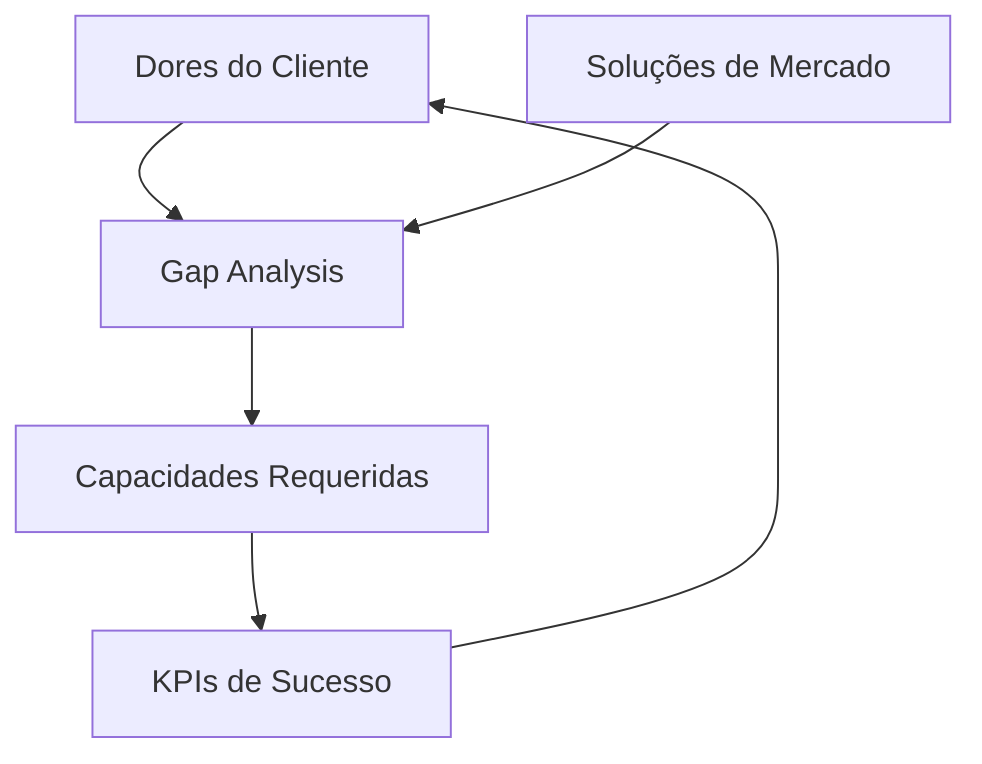

# Benchmarking e Análise Competitiva

> **Objetivo**: Mapear as dores do cliente, as soluções existentes no mercado, os indicadores de sucesso e as capacidades que o sistema deve oferecer para se diferenciar.

> **Responsável**: Product Owner (PO), com apoio do Board e stakeholders.

---

## 1. Mapa de Dores

Identifique as principais dores do cliente, priorizadas por impacto e frequência.

| # | Dor | Impacto (Alto/Médio/Baixo) | Frequência (Diária/Semanal/Mensal) | Quem sofre |
|---|-----|:---:|:---:|---|
| D1 | *Descreva a dor* | | | *Perfil(is) afetado(s)* |
| D2 | *Descreva a dor* | | | *Perfil(is) afetado(s)* |
| D3 | *Descreva a dor* | | | *Perfil(is) afetado(s)* |

> **Dica**: Priorize as dores por impacto no negócio. Dores de alto impacto e alta frequência devem ser resolvidas primeiro.

---

## 2. Matriz de Benchmarking

Compare as soluções de mercado existentes em relação às capacidades esperadas do sistema.

| Capacidade / Produto | Produto A | Produto B | Produto C | Nosso Sistema |
|---|:---:|:---:|:---:|:---:|
| *Capacidade 1* | | | | **Previsto** |
| *Capacidade 2* | | | | **Previsto** |
| *Capacidade 3* | | | | **Previsto** |

**Legenda**: *Sim* = resolve completamente | *Parcial* = resolve com limitações | *Não* = não oferece

### Produtos Analisados

Para cada produto, registre uma breve ficha:

**Produto A** — *Nome do produto*

- **Tipo**: Comercial / Open Source / Acadêmico
- **Público-alvo**: *Quem usa*
- **Pontos fortes**: *O que faz bem*
- **Pontos fracos**: *Onde falha*
- **Referência**: *URL ou fonte*

**Produto B** — *Nome do produto*

- **Tipo**: Comercial / Open Source / Acadêmico
- **Público-alvo**: *Quem usa*
- **Pontos fortes**: *O que faz bem*
- **Pontos fracos**: *Onde falha*
- **Referência**: *URL ou fonte*

**Produto C** — *Nome do produto*

- **Tipo**: Comercial / Open Source / Acadêmico
- **Público-alvo**: *Quem usa*
- **Pontos fortes**: *O que faz bem*
- **Pontos fracos**: *Onde falha*
- **Referência**: *URL ou fonte*

---

## 3. KPIs de Sucesso

Defina indicadores mensuráveis vinculados às dores do cliente. Bons KPIs são **SMART** — específicos, mensuráveis, atingíveis, relevantes e com prazo definido.

| KPI | Dor relacionada | Situação atual | Meta | Como medir |
|-----|:---:|---|---|---|
| *Nome do indicador* | D1 | *Valor atual (se conhecido)* | *Valor alvo* | *Método de medição* |
| *Nome do indicador* | D2 | *Valor atual (se conhecido)* | *Valor alvo* | *Método de medição* |
| *Nome do indicador* | D3 | *Valor atual (se conhecido)* | *Valor alvo* | *Método de medição* |

> **Dica**: Os KPIs definidos aqui devem ser usados para validar o sucesso do projeto nas entregas futuras.

---

## 4. Gap Analysis (Lacunas)

Identifique as lacunas entre o que o mercado oferece e o que o cliente precisa. Cada lacuna gera uma **capacidade requerida** do sistema.

| Lacuna identificada | Dor relacionada | O que o mercado oferece | Capacidade requerida |
|---|:---:|---|---|
| *Descreva a lacuna* | D1 | *Como o mercado resolve (ou não)* | *O que o sistema deve fazer* |
| *Descreva a lacuna* | D2 | *Como o mercado resolve (ou não)* | *O que o sistema deve fazer* |
| *Descreva a lacuna* | D3 | *Como o mercado resolve (ou não)* | *O que o sistema deve fazer* |

---

## 5. Visão Geral

O diagrama abaixo ilustra como os quatro componentes se conectam:

> O ciclo se retroalimenta: as capacidades implementadas são validadas pelos KPIs, que medem se as dores foram de fato resolvidas.

---

## 6. Conclusão

*Resuma os principais achados: quantas dores foram mapeadas, quais lacunas são críticas, quais capacidades são diferenciais competitivos e quais KPIs devem ser acompanhados desde o primeiro Sprint.*
