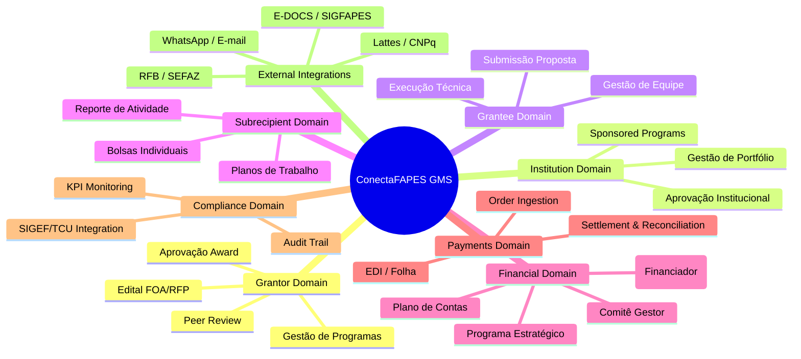
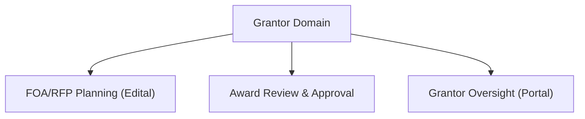
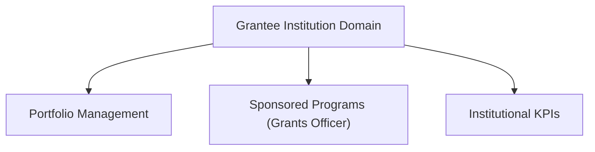
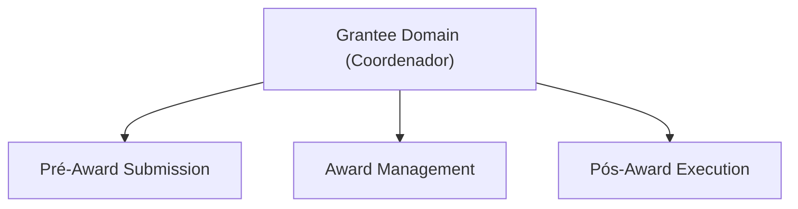
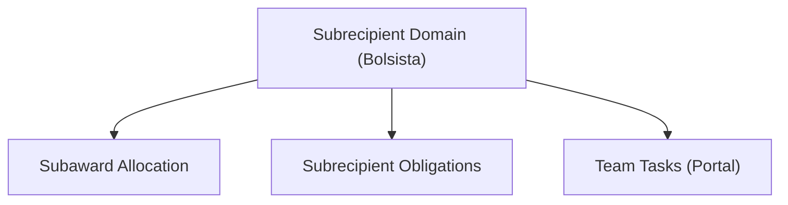
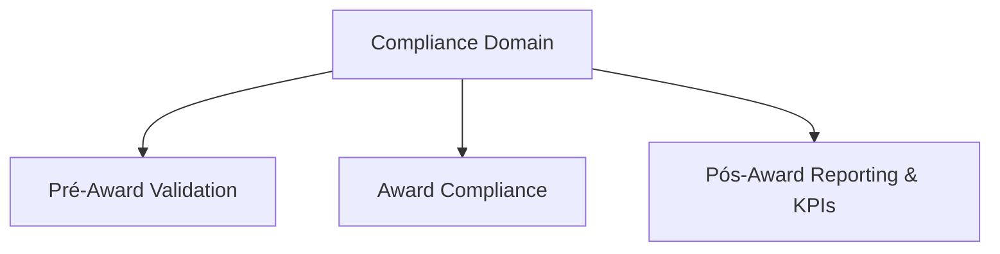
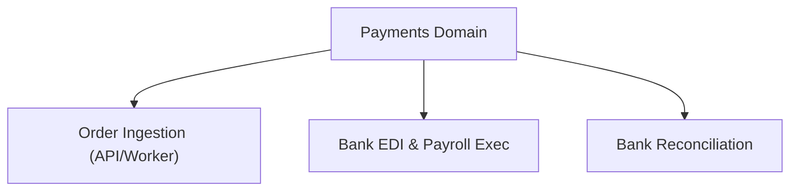
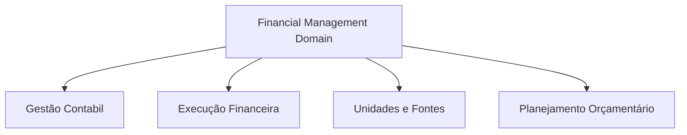
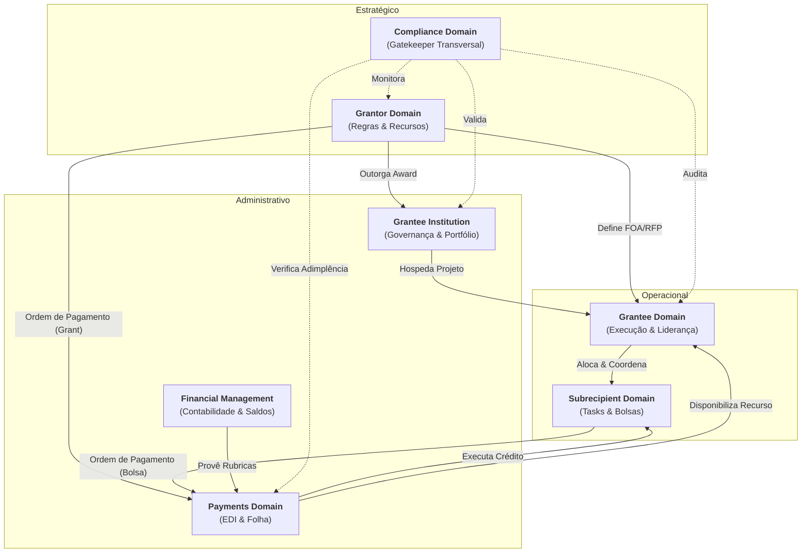

## 1. Mapa de Dominio

Abaixo segue uma relação dos domínios presentes em um Grant Management System.

---

## 2. Domínios
Domínios mapeados diretamente aos papéis:

- **[Grantor Domain](domains/grantor.md)** - **Grantor** gerencia **FOA/RFP (Edital)**, aprovações (**Award**) e supervisão no **Grantor Portal**.

- **[Grantee Institution Domain](domains/grantee-institution.md)** - **Grantee Institution** e **Sponsored Programs Manager/Grants Officer** com visão agregada de portfólio e **KPI** institucionais.

- **[Grantee Domain](domains/grantee.md)** - **Grantee/Recipient** (**Coordenador**) gerencia projeto aprovado no **Applicant Portal** (**Award** e **Pós-Award**).

- **[Subrecipient Domain](domains/subrecipient.md)** - **Subrecipient** e **Bolsista** executam tarefas específicas sob **Coordenador** no **Applicant Portal**.

- **[Financial Management](domains/financial-management.md)** - Gestão de alto nível (Sponsor, Programa, Comitê e Contas).

- **[Payments Domain](domains/payments.md)** - **Payment Gateway** que executa o pagamento técnico (EDI, PIX, TED) de forma agnóstica a partir de ordens de pagamento.

- **[Compliance Domain](domains/compliance.md)** - Transversal para auditoria e conformidade regulatória.

- **[External Integrations](domains/external-integrations.md)** - Gateway técnico para sistemas externos (Lattes, SIGEF, WhatsApp).

## 3. Subdomínios

### 3.1 Grantor Domain

- **Planning (FOA/Edital)**: Criação estratégica de chamadas públicas, alocação orçamentária e definição de critérios. Inclui FOA Builder para gerar editais TCU-compliant automaticamente.

- **Review & Approval**: Avaliação peer-review, scoring automatizado e workflow de aprovação hierárquica (comitê → diretor).

- **Oversight**: Monitoramento em tempo real de KPIs de portfólio, alertas de risco e dashboards estratégicos.

### 3.2 Grantee Institution Domain

- **Portfolio Management**: Visão consolidada de todos os grants da instituição, cross-project analytics e alocação de overhead.

- **Sponsored Programs**: Console para gestores de programas patrocinados, com views departamentais e aprovações internas.

- **Institutional Reporting**: Relatórios executivos agregados (reitor/pro-reitor), KPIs institucionais e exportação para sistemas acadêmicos.

### 3.3 Grantee Domain (Coordenador)

- **Proposal Submission**: Portal do proponente para submissão de propostas, formulários dinâmicos e pré-validações (Lattes).

- **Award Management**: Após aprovação, gerencia termos do award, plano orçamentário e modificações contratuais.

- **Project Execution**: Tracking de milestones, log de despesas, relatórios de progresso e requests de desembolsos.

### 3.4 Subrecipient Domain (Bolsista)

- **Scholarship Management**: Dashboard de bolsas individuais, histórico de obrigações e visualizador de pagamentos.

- **Subrecipient Allocation**: Gerenciamento de subawards para bolsistas/parceiros, incluindo alocação automática por perfil.

- **Team Collaboration**: Chat interno, compartilhamento de documentos e assignment de tarefas por projeto.

### 3.5 Compliance Domain

- **Financial Tracking**: Integração SIGEF nativa, engine de desembolsos e validador de acúmulo de bolsas CNPq/FAPES.

- **Reporting Engine**: Geração automática de relatórios TCU, templates pré-configurados e submissão programática.

- **Audit Trail**: Log imutável de todas as ações, checker de compliance e alertas proativos de riscos.

### 3.6 Payments Domain

- **Order Ingestion**: Recebimento e validação de ordens de pagamento provenientes de outros domínios (Bolsas, Concessão).
- **Payment Execution**: Processamento técnico via arquivos EDI bancários, integração com gateways de pagamento ou folha de pagamento.
- **Settlement & Reconciliation**: Confirmação de liquidação financeira e reporte de sucesso/erro para o domínio de origem.

### 3.7 Financial Management Domain

- **Accounting**: Manutenção do plano de contas, rubricas (diárias, material, serviços) e associações com editais.
- **Execution**: Monitoramento de saldos em tempo real e tracking de empenhos (Orçado x Empenhado x Pago).
- **Resource Units**: Gestão de Management Units (UGs), subcontas e registro das origens do fomento (Tesouro, Emendas).
- **Budget Planning**: Elaboração de Allocation Plans, cronogramas de desembolso e relatórios de fluxo de caixa.

## 4. Componentes por Subdomínio

| Domínio | Subdomínio | Componentes (Termos Glossário) |
|---------|------------|-------------------------------|
| **Grantor** | FOA/RFP Planning | FOA Builder, Edital Generator (**FOA/RFP**) |
| **Grantor** | Award Review | Scoring Engine, Approval Workflow (**Award**) |
| **Grantee Institution** | Portfolio | Institution Dashboard, KPI Analytics (**Sponsored Programs Manager**) |
| **Grantee** | Pré-Award | Proposal Submission, Applicant Portal (**Applicant**) |
| **Grantee** | Pós-Award | Award Dashboard, Execution Tracker (**Grantee/Recipient**) |
| **Subrecipient** | Bolsista | Bolsa Viewer, Obligation Tracker (**Bolsista**) |
| **Financial** | Accounting | Chart of Accounts, Rubricas (diárias, material, etc.) |
| **Financial** | Execution | Real-time Balance, Dashboards |
| **Financial** | Resource Units | Management Units, Sources, Initial Balance |
| **Financial** | Budget Planning | Allocation Plans, Cash Flow Report |
| **Payments** | Ingestion | Order Registry, Payload Validation |
| **Payments** | Execution | EDI Service (@-EDI), Payroll Generator |
| **Payments** | Reconciliation | Settlement Confirmation, Bank Extratos |
| **Compliance** | Reporting | KPI Monitor, Compliance Checker (**Pós-Award**) |

## 5. Eventos de Integração (Domain Events)

| Evento | Origem | Destino | Descrição | Fase |
|--------|--------|---------|-----------|------|
| **`FOA/RFP Published`** | **Grantor** | **Grantee Institution** | Edital disponível, inicia **Pré-Award** | Pré-Award |
| **`Proposal Submitted`** | **Grantee** (**Applicant**) | **Grantor**, **Institution** | Proposta validada via **Applicant Portal** | Pré-Award |
| **`Award Approved`** | **Grantor** | **Grantee**, **Institution**, **Subrecipient** | Transição **Award**, ativa dashboards | Award |
| **`Award Accepted`** | **Institution** | **Grantee**, **Compliance** | Inicia **Pós-Award** execução | Award → Pós |
| **`Subaward Allocated`** | **Grantee** (**Coordenador**) | **Subrecipient** (**Bolsista**) | Alocação bolsas individuais | Pós-Award |
| **`Payment Order Issued`** | **Grantor** / **Subrecipient** | **Payments** | Envio de ordem para processamento financeiro | Pós-Award |
| **`Payment Executed`** | **Payments** | **Compliance**, **Financial**, Origem | Confirmação de liquidação bancária | Pós-Award |
| **`Disbursement Requested`** | **Grantee/Subrecipient** | **Compliance**, **Financial** | Valida **SIGEF** e saldo antes da ordem | Pós-Award |
| **`Budget Allocated`** | **Financial** | **Grantor**, **Payments** | Recurso disponível para empenho | Pós-Award |
| **`Compliance Report Generated`** | **Compliance** | Todos | **KPI** final, arquiva ciclo | Pós → Fechamento |

## 6. Relacionamento entre Domínios

Este diagrama ilustra as interdependências de alto nível entre os domínios durante o ciclo de vida do fomento.

