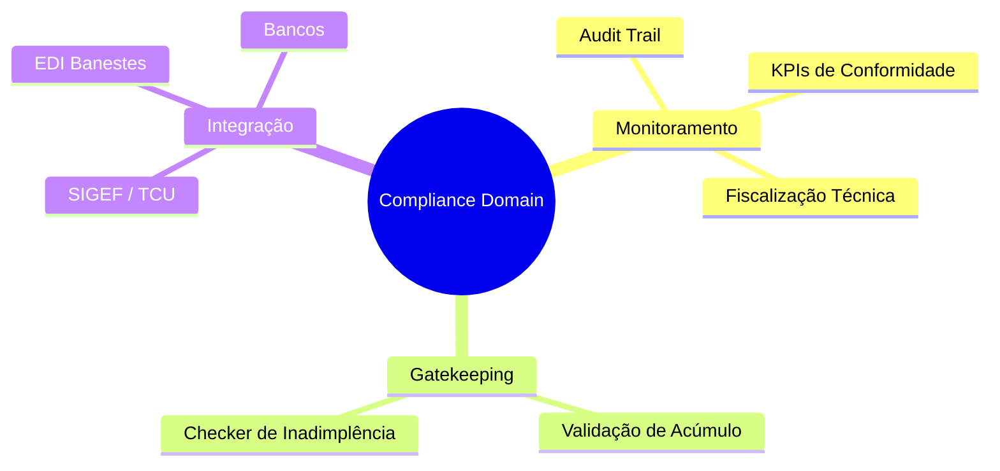
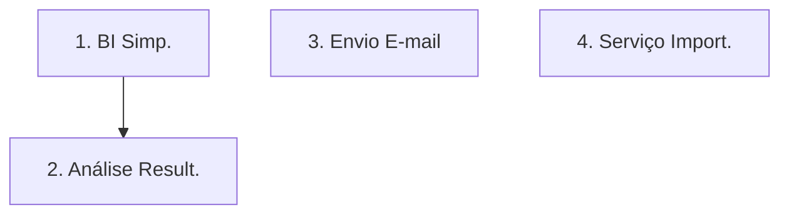
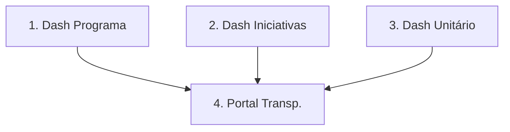
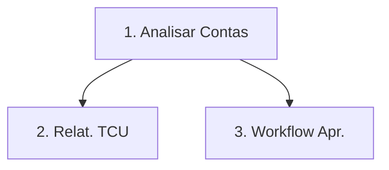
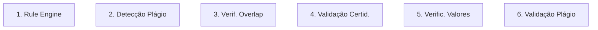
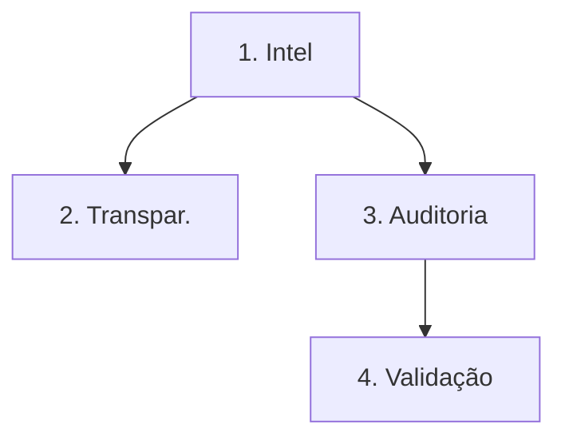
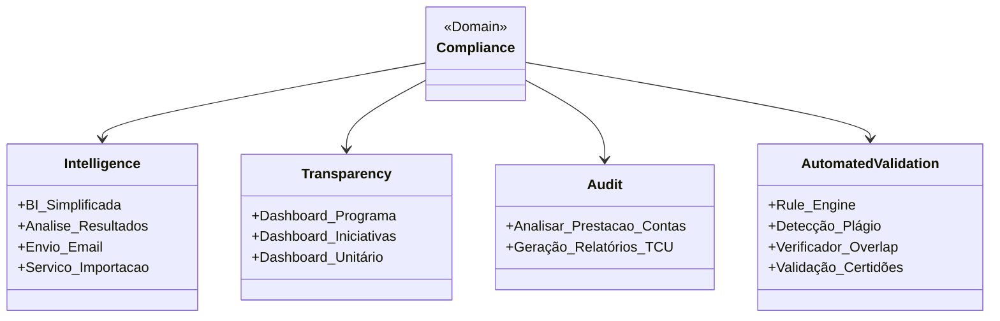
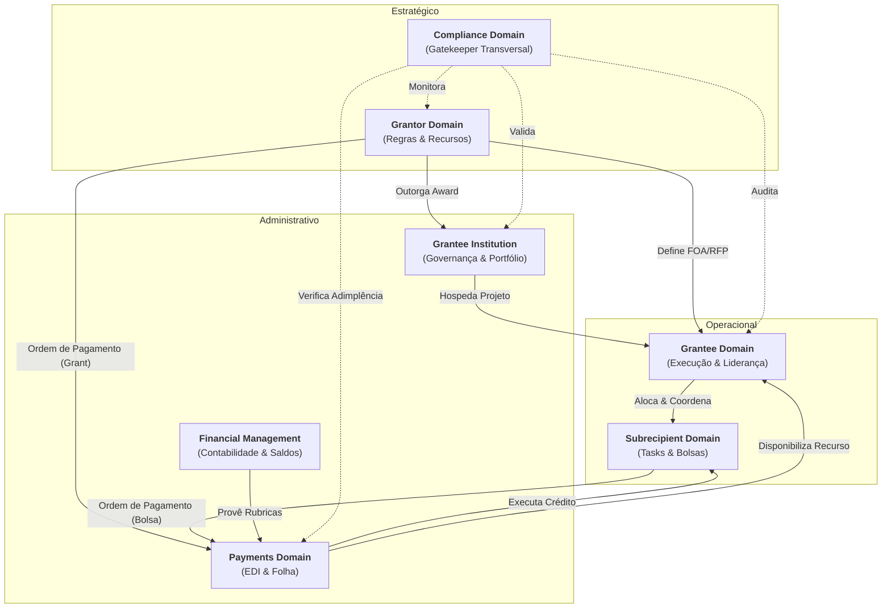

# Compliance Domain (Regulatório)

## 1. Visão Geral
Este é um domínio transversal que atua como o "Gatekeeper" de todas as transações. Ele garante que as regras de negócio Grant Management e as leis federais/estaduais sejam respeitadas em cada etapa.

### 1.1 Mapa Mental do Domínio

## 2. Papel no Ciclo de Vida
Atua em todas as fases, do planejamento ao fechamento.

*   **Pré-Award**: Validação de elegibilidade (impedimentos legais do Applicant).
*   **Award**: Verificação de dotação orçamentária e conformidade jurídica.
*   **Pós-Award**: Monitoramento de pagamentos, auditoria em tempo real e geração de relatórios regulatórios (SIGEF).

## 3. Subdomínios e Gatekeeping
Estes subdomínios agrupam as funcionalidades detalhadas no [Backlog (#6)](#6-funcionalidades-detalhadas-backlog):

- **Suporte e Inteligência**: BI, análise de resultados e ferramentas de suporte (e-mail, importação).

- **Transparência e Dashboards**: Visibilidade institucional através de dashboards de programas e iniciativas.

- **Reporting (Audit View)**: Auditoria técnica, análise documental e reporting regulatório (TCU/SIGEF).

- **Automated Validation**: Rule engine para remanejamentos, detecção de plágio e verificação de acúmulo de fomento.

## 4. KPIs Transversais
- **Taxa de Conformidade**: % de processos aprovados sem ressalvas na auditoria.
- **Economicidade**: Otimização do uso dos recursos.
- **ROI Geral (Impacto)**: Relação investimento vs. objetivos alcançados no fechamento.

## 5. Interface e Integrações
- **Grantor Portal (Compliance Module)**: Módulos de auditoria e monitoramento regulatório.
- **Relatórios**: Geração de documentos para o sistema do governo (SIGEF/TCU).

## 6. Funcionalidades Detalhadas (Backlog)

### Suporte e Inteligência
| Funcionalidade | Papel | Descrição |
| :--- | :--- | :--- |
| BI (versao simplificada) | Grant Management | Painéis de Business Intelligence para suporte à tomada de decisão. |
| Analise de Resultados | Grant Management | Ferramenta de cruzar metas propostas versus resultados alcançados. |
| Envio de email | Sistema | Motor de notificações transacionais e alertas automáticos. |
| Servico de Importacao | Sistema | Script de migração de dados históricos do sistema legado (SIGFAPES). |

**Mini-DSM: Dependências Inteligência**

| Funcionalidade | 1 | 2 | 3 | 4 |
| :--- | :---: | :---: | :---: | :---: |
| **1. BI Simplificada**  | - | | | |
| **2. Análise Result.**  | X | - | | |
| **3. Envio E-mail**     | | | - | |
| **4. Serviço Import.**  | | | | - |

### Transparência e Dashboards
| Funcionalidade | Papel | Descrição |
| :--- | :--- | :--- |
| Dashboard do Programa | Grantor | Visibilidade pública e interna da execução financeira por programa. |
| Dashboard de Iniciativas | Grantor | Mapa de calor e progresso de todos os grants ativos no estado. |
| Dashboard Unitário | Grantor | Visão detalhada de compliance e saúde financeira de um grant específico. |
| Portal de Transparência | Público | Disponibilização de dados de fomento para a sociedade (Open Data). |

**Mini-DSM: Dependências Transparência**

| Funcionalidade | 1 | 2 | 3 | 4 |
| :--- | :---: | :---: | :---: | :---: |
| **1. Dash Programa**    | - | | | |
| **2. Dash Iniciativas** | | - | | |
| **3. Dash Unitário**    | | | - | |
| **4. Portal Transp.**   | X | X | X | - |

### Reporting (Audit View)
| Funcionalidade | Papel | Descrição |
| :--- | :--- | :--- |
| Analisar prestacao contas | Grant Management | Módulo de conferência técnica e financeira final dos projetos. |
| Geração de relatórios TCU | Grant Management | Exportação de dados formatados para os órgãos de controle externo. |
| Workflow de Aprovação | Auditor | Encaminhamento para instâncias superiores em caso de irregularidades graves. |

**Mini-DSM: Dependências Auditoria**

| Funcionalidade | 1 | 2 | 3 |
| :--- | :---: | :---: | :---: |
| **1. Analisar Contas**  | - | | |
| **2. Relatórios TCU**  | X | - | |
| **3. Workflow Apr.**    | X | | - |

### Automated Validation
| Funcionalidade | Papel | Descrição |
| :--- | :--- | :--- |
| Rule Engine | Sistema | Bloqueio automático de remanejamentos proibidos por lei ou edital. |
| Detecção de Plágio | Sistema | Verificação de originalidade de propostas e relatórios técnicos. |
| Verificador de Overlap | Sistema | Alerta de acúmulo indevido de bolsas em diferentes projetos. |
| Validação de certidões | Sistema | Checagem automática de adimplência em bases federais e estaduais. Bloqueio de pagamentos em caso de certidão negativa vencida. |
| Verificação de valores | Sistema | Double-check algorítmico para evitar disparidade de valores na folha. |
| Validação de Plágio | Sistema | Algoritmo de verificação de similaridade em relatórios técnicos enviados. |

**Mini-DSM: Dependências Validação**

| Funcionalidade | 1 | 2 | 3 | 4 | 5 | 6 |
| :--- | :---: | :---: | :---: | :---: | :---: | :---: |
| **1. Rule Engine**      | - | | | | | |
| **2. Detecção Plágio**  | | - | | | | |
| **3. Verif. Overlap**   | | | - | | | |
| **4. Validação Certid.**| | | | - | | |
| **5. Verific. Valores** | | | | | - | |
| **6. Validação Plágio** | | | | | | - |

### 6.4 Visão Consolidada do Domínio (DSM)

| Funcs | INT | TRA | AUD | VAL |
| :--- | :---: | :---: | :---: | :---: |
| **1. Intel** | - | | | |
| **2. Transpar.** | X | - | | |
| **3. Auditoria** | X | | - | |
| **4. Validação** | | | X | - |

**Legenda de Dependência:**

- **2 → 1**: Dashboards de transparência dependem dos motores de inteligência e cruzamento de dados.

- **3 → 1**: A análise de prestação de contas (audit) utiliza os insights gerados pela inteligência.

- **4 → 3**: Validações automáticas de auditoria dependem do status da prestação de contas.

### 6.5 Grafo de Execução (Ordem Topológica)

## 7. Diagrama de Domínio

## 8. Relacionamento com outros Domínios

