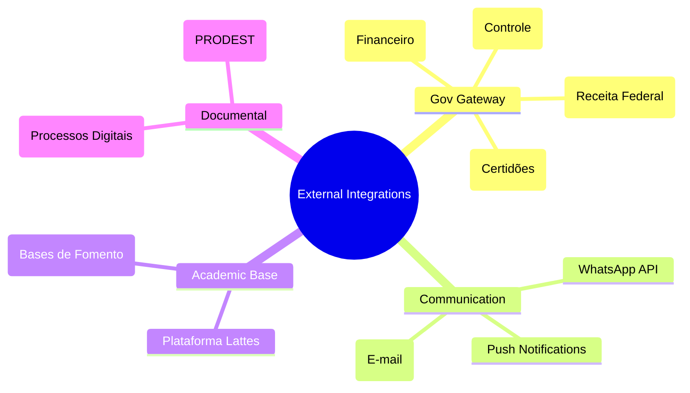
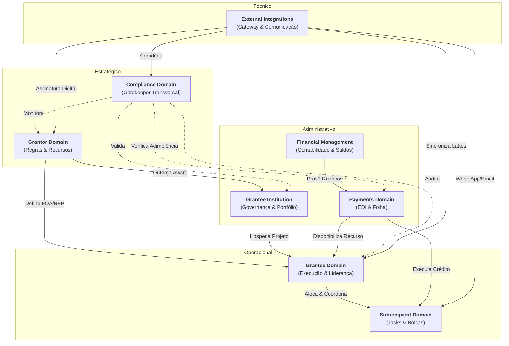

# External Integrations Domain

## 1. Visão Geral
Este domínio gerencia as "fronteiras" do ConectaFAPES, atuando como o hub de comunicação com sistemas legados, bases governamentais e serviços de terceiros. Sua função é abstrair a complexidade técnica de APIs externas para os demais domínios.

### 1.1 Mapa Mental do Domínio

## 2. Subdomínios e Componentes

- **Gov Gateway**: Integração com sistemas estruturantes do estado e união para validação de adimplência e envio de dados orçamentários.
- **Communication Hub**: Orquestração de mensagens transacionais via múltiplos canais para Grantees e Bolsistas.
- **Academic Connector**: Sincronização automática de currículos e histórico de fomento de pesquisadores.
- **Document Services**: Gestão de processos digitais e protocolos de assinatura eletrônica.

## 3. Relacionamento com outros Domínios

