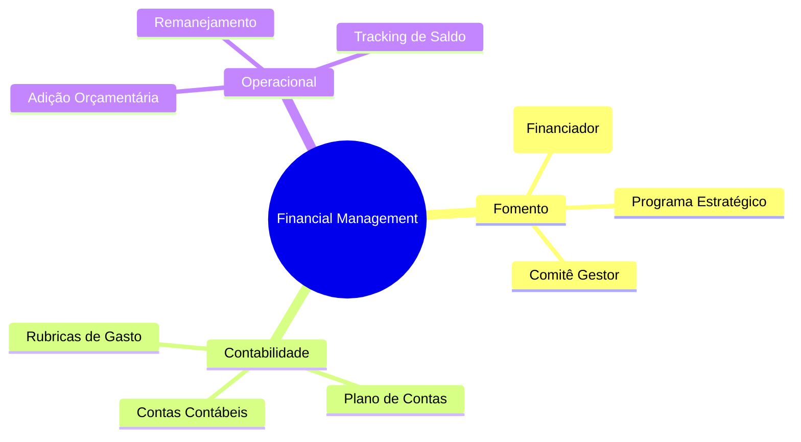
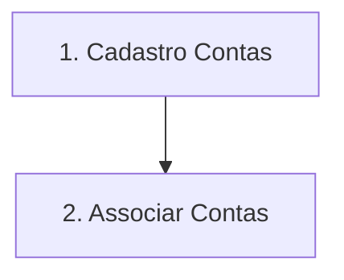
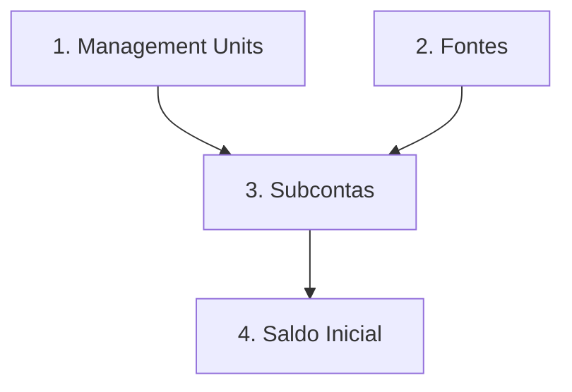
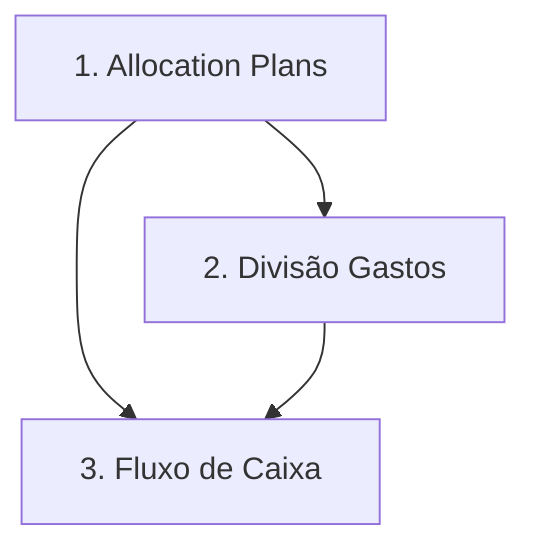
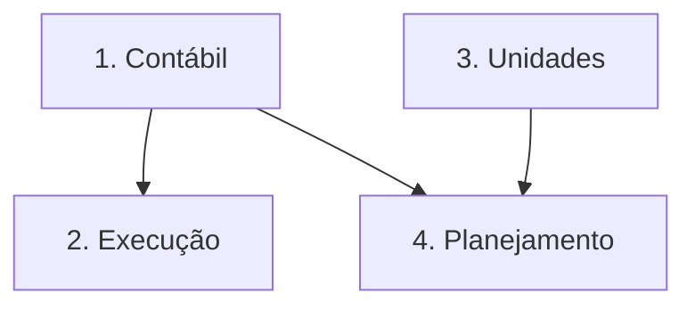
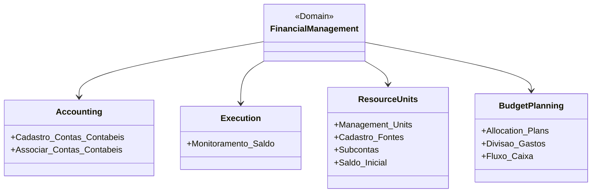
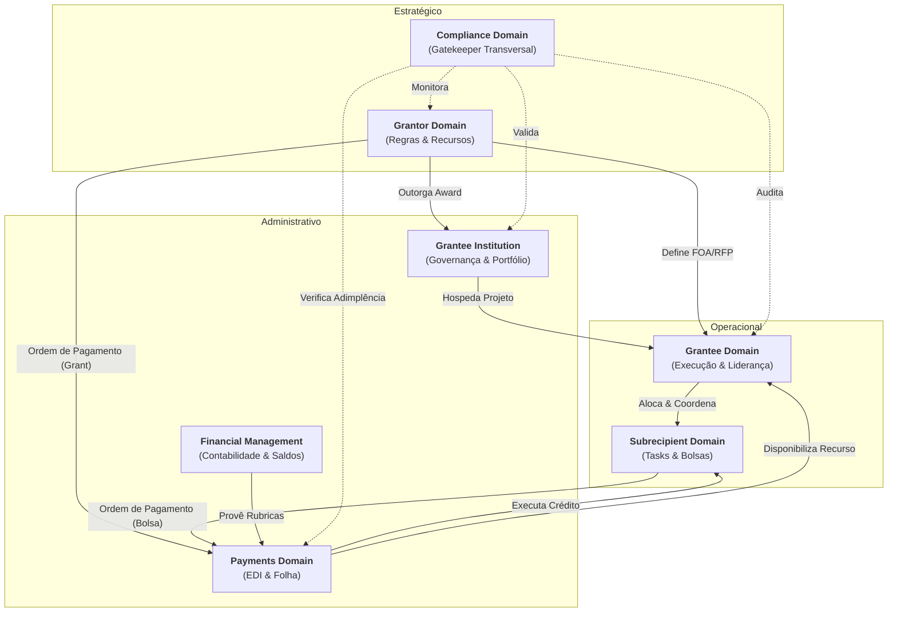

# Financial Management Domain

## 1. Visão Geral
Este domínio gerencia o ciclo de vida financeiro dos projetos, desde a origem do recurso até a alocação técnica em contas contábeis e rubricas.

### 1.1 Mapa Mental do Domínio

## 2. Subdomínios e Componentes
Estes subdomínios agrupam as funcionalidades detalhadas no [Backlog (#3)](#3-funcionalidades-detalhadas-backlog):

- **Gestão Contabil**: Manutenção do plano de contas e associações com iniciativas/orçamentos.

- **Execução Financeira**: Tracking de saldos em tempo real e empenhos.

- **Unidades e Fontes de Recurso**: Controle de Management Units (UGs), subcontas e origens de fomento.

- **Planejamento Orçamentário**: Planos de aplicação e fluxos de caixa.

## 3. Entidades Principais

### 2.1 Sponsor (Financiador)

Entidade soberana que provê os recursos. Pode ser a própria Grant Management ou parceiros (CAPES, CNPq, MEC, Grantee Institution).
- **Atributos**: CNPJ, Nome, Convênios Associados.

### 2.2 Programa
Contexto estratégico sob o qual os recursos são liberados (ex: Programa de Extensão, Programa de Apoio a Grantee).
- **Atributos**: Vigência, Eixo Estratégico, Orçamento Global.

### 2.3 Comitê (Committee)
Instância de governança responsável por aprovar liberações de recursos, alterações orçamentárias e fechamentos financeiros.
- **Atributos**: Membros, Atas de Votação, Alçada de Decisão.

### 2.4 Contas Contábeis (Chart of Accounts)
Estrutura de rubricas onde o recurso é alocado (ex: Material de Consumo, Diárias, Serviços de Terceiros).
- **Atributos**: Código da Rubrica, Saldo Disponível, Teto Orçamentário.

## 3. Funcionalidades Detalhadas (Backlog)

### Gestão Contabil
| Funcionalidade | Papel | Descrição |
| :--- | :--- | :--- |
| Cadastro de Contas-Contabeis | Admin | Criação e manutenção do plano de rubricas (diárias, material, serviços). |
| Associar Contas-Contabeis | Admin | Vinculação obrigatória das rubricas aos editais e convênios ativos. |

**Mini-DSM: Dependências Contábil**

| Funcionalidade | 1 | 2 |
| :--- | :---: | :---: |
| **1. Cadastro Contas-Contábeis** | - | |
| **2. Associar Contas-Contábeis**  | X | - |

### Execução Financeira
| Funcionalidade | Papel | Descrição |
| :--- | :--- | :--- |
| Monitoramento de Saldo | Gestor | Dashboard de saldo real-time (Orçado x Empenhado x Pago). |

**Mini-DSM: Dependências Execução**

| Funcionalidade | 1 |
| :--- | :---: |
| **1. Monitoramento de Saldo** | - |

### Unidades e Fontes de Recurso
| Funcionalidade | Papel | Descrição |
| :--- | :--- | :--- |
| Cadastro de Management Units | Gerente Financeiro | Definição operacional de células de gestão e fluxos de caixa distintos. |
| Cadastro de Fontes | Gerente Financeiro | Registro das origens do fomento (Tesouro, FUNCITEC, Emendas). |
| Subcontas | Gerente Financeiro | Divisão granular do recurso por finalidade dentro da UG. |
| Cadastro de saldo inicial | Gerente Financeiro | Lançamento dos aportes financeiros originais em cada subconta. |

**Mini-DSM: Dependências Unidades**

| Funcionalidade | 1 | 2 | 3 | 4 |
| :--- | :---: | :---: | :---: | :---: |
| **1. Cadastro Management Units** | - | | | |
| **2. Cadastro de Fontes**       | | - | | |
| **3. Subcontas**               | X | X | - | |
| **4. Cadastro Saldo Inicial**  | | | X | - |

### Planejamento Orçamentário
| Funcionalidade | Papel | Descrição |
| :--- | :--- | :--- |
| Cadastro de Allocation Plans | Grant Management | Definição do cronograma de desembolso previsto no Award. |
| Divisão de gastos | Grant Management | Parametrizador de limites e tetos por modalidade e fonte. |
| Relatório de Fluxo de Caixa | Financeiro | Projeção e tracking de entradas e saídas consolidadas. |

**Mini-DSM: Dependências Planejamento**

| Funcionalidade | 1 | 2 | 3 |
| :--- | :---: | :---: | :---: |
| **1. Cadastro Allocation Plans** | - | | |
| **2. Divisão de Gastos**        | X | - | |
| **3. Relatório Fluxo de Caixa**  | X | X | - |

### 3.4 Visão Consolidada do Domínio (DSM)

| Funcionalidades | CON | EXE | UNI | PLA |
| :--- | :---: | :---: | :---: | :---: |
| **1. Contábil** | - | | | |
| **2. Execução** | X | - | | |
| **3. Unidades** | | | - | |
| **4. Planejamento** | X | | X | - |

**Legenda de Dependência:**

- **2 → 1**: Execução monitora saldo baseado em contas contábeis.

- **4 → [1, 3]**: Planejamento orçamentário requer Plano de Contas e definição de Unidades (UGs).

### 3.5 Grafo de Execução (Ordem Topológica)

## 5. Diagrama de Domínio

## 5. Relacionamento com outros Domínios

