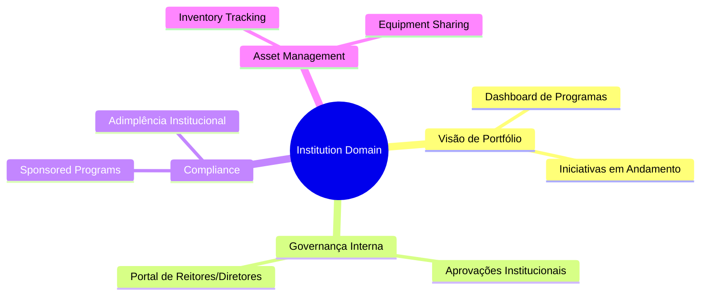
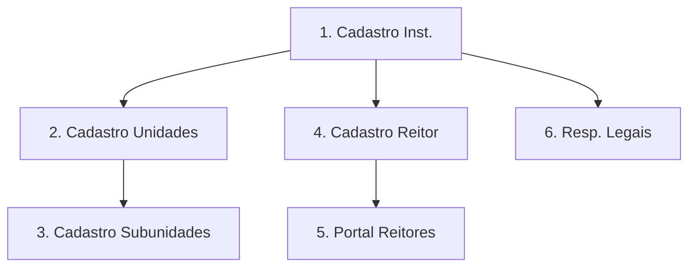
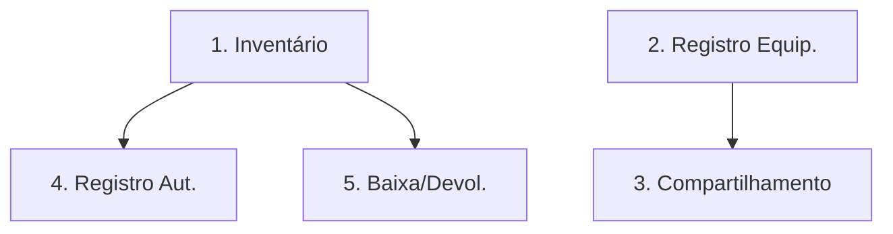
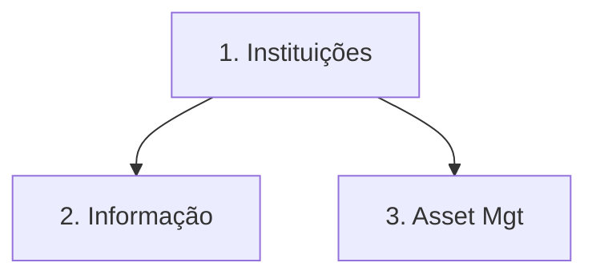
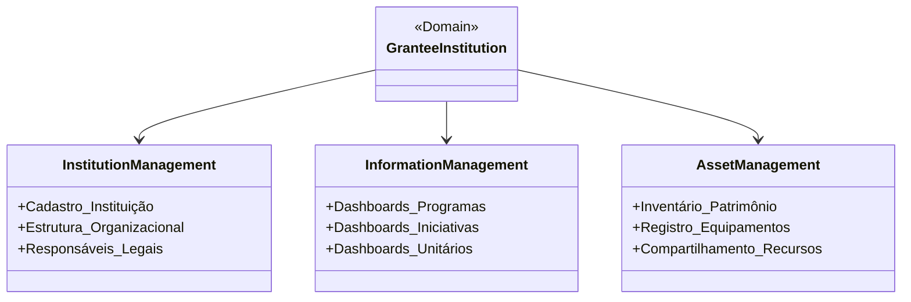
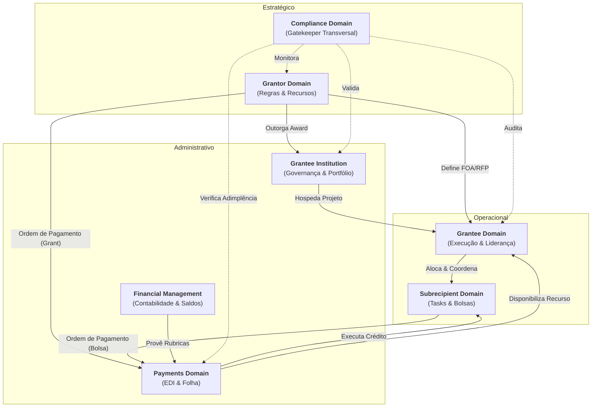

# Grantee Institution Domain (UVV/UFES)

## 1. Visão Geral
Este domínio representa a entidade jurídica (Grantee Institution (University or Research Center)) que recebe o **Award** do **Grantor**. Sua função é prover a infraestrutura administrativa e garantir a governança institucional sobre múltiplos projetos.

### 1.1 Mapa Mental do Domínio

## 2. Papel no Ciclo de Vida
Atua como o hub central de compliance e alocação.

*   **Award**: Aceitação formal do financiamento e registro institucional.
*   **Pós-Award**: Supervisão interna, gestão de Sponsored Programs e suporte ao Grantee.

## 2.1 Especializações de Grantee Institution

### 2.1.1 University (Academia)

Focada em pesquisa fundamental, pós-graduação e extensão.

- **Estrutura**: Reitoria → Centros → Departamentos → Laboratórios.

- **Governança**: Resoluções de conselhos superiores e gestão de infraestrutura de laboratórios multiúsuários.

- **Sponsored Programs**: Escritório dedicado à gestão de Grant e Reporting de grandes volumes de Grantee.

### 2.1.2 Company (Company / Private Sector)
Focada em P&D empresarial, inovação tecnológica e competitividade de mercado.

- **Estrutura**: Diretoria de Inovação → Gerência de Projetos R&I.

- **Governança**: Gestão de riscos corporativos e focada em resultados de mercado (patentes, protótipos, escalar produção).

- **Compliance Privado**: Diferenças tributárias e fiscais específicas para subvenção econômica empresarial.

## 3. Subdomínios e Dashboards
Estes subdomínios agrupam as funcionalidades detalhadas no [Backlog (#6)](#6-funcionalidades-detalhadas-backlog):

- **Gestão de Instituições**: Cadastro, estrutura organizacional e governança corporativa.

- **Gestão da Informação**: Dashboards de portfólio, programas e monitoramento institucional.

- **Asset Management / Inventory**: Controle de equipamentos adquiridos e ferramentas de compartilhamento.

## 4. KPIs da Instituição

- **Taxa de Retenção de Grantees**: Sucesso na manutenção de Grantee.

- **Eficiência Administrativa**: Tempo de processamento interno de requisições.

- **Regularidade Institucional**: Status de adimplência junto aos órgãos de controle (TCU/SIGEF).

## 5. Interface Principal

- **Grantor Portal (Admin View)**: Visão administrativa para gestores institucionais e reitores.

## 6. Funcionalidades Detalhadas (Backlog)

### Gestão de Instituições 
| Funcionalidade | Papel | Descrição |
| :--- | :--- | :--- |
| Cadastro de Grantee Institution | Grant Management | Registro legal da entidade sede (Universidades, Centros de Pesquisa ou Empresas). |
| Cadastro de Unidades | Grant Management | Definição da estrutura interna (Centros, Faculdades ou Departamentos). |
| Cadastro de Subunidades | Grant Management | Detalhamento de Seções, Laboratórios e subgrupos administrativos. |
| Cadastro de Reitor e Chefes | Grant Management | Identificação dos responsáveis legais pela assinatura de acordos institucionais. |
| Portal de Reitores/Diretores | Reitor | Dashboard executivo para acompanhamento de todos os projetos da instituição. |
| Cadastro de Responsáveis Legais | Governança | Registro de reitores, diretores e gestores com poder de assinatura. |

**Mini-DSM: Dependências Cadastro**

| Funcionalidade | 1 | 2 | 3 | 4 | 5 | 6 |
| :--- | :---: | :---: | :---: | :---: | :---: | :---: |
| **1. Cadastro Grantee Institution** | - | | | | | |
| **2. Cadastro de Unidades**     | X | - | | | | |
| **3. Cadastro de Subunidades**  | | X | - | | | |
| **4. Cadastro de Reitor**       | X | | | - | | |
| **5. Portal Reitores**          | | | | X | - | |
| **6. Responsáveis Legais**      | X | | | | | - |

### Gestão da Informação
| Funcionalidade | Papel | Descrição |
| :--- | :--- | :--- |
| Dashboard do Programa | Gestor | Visão consolidada de indicadores de sucesso por programa de fomento. |
| Dashboard de Iniciativas | Gestor | Lista geral de projetos ativos, suspensos ou finalizados da instituição. |
| Dashboard Unitário | Gestor | Detalhamento técnico e financeiro de um projeto individual do portfólio. |

**Mini-DSM: Dependências Informação**

| Funcionalidade | 1 | 2 | 3 |
| :--- | :---: | :---: | :---: |
| **1. Dashboard Programa**   | - | | |
| **2. Dashboard Iniciativas** | | - | |
| **3. Dashboard Unitário**   | | | - |

### Asset Management / Inventory
| Funcionalidade | Papel | Descrição |
| :--- | :--- | :--- |
| Inventário de Patrimônio | Grant Management | Controle físico de bens adquiridos por IES, projeto e laboratório. |
| Registro de Equipamentos | Grant Management | Base de dados de equipamentos disponíveis para evitar compras redundantes. |
| Ferramenta de compartilhamento | Gestor | Workflow para solicitação de uso compartilhado de laboratórios e máquinas. |
| Registro automático | Sistema | Tombamento imediato do bem ao anexar a Nota Fiscal na prestação de contas. |
106: | Baixa e Devolução | Patrimônio | Fluxo de encerramento de vínculo do bem com o projeto. |

**Mini-DSM: Dependências Asset**

| Funcionalidade | 1 | 2 | 3 | 4 | 5 |
| :--- | :---: | :---: | :---: | :---: | :---: |
| **1. Inventário Patrimônio** | - | | | | |
| **2. Registro Equipamentos** | | - | | | |
| **3. Compartilhamento**       | | X | - | | |
| **4. Registro Automático**   | X | | | - | |
| **5. Baixa e Devolução**      | X | | | | - |

### 6.4 Visão Consolidada do Domínio (DSM)

| Funcionalidades | INS | INF | ASS |
| :--- | :---: | :---: | :---: |
| **1. Instituições** | - | | |
| **2. Informação** | X | - | |
| **3. Asset Mgt** | X | | - |

**Legenda de Dependência:**

- **2 → 1**: Dashboards de informação dependem do cadastro institucional.

- **3 → 1**: Gestão de patrimônio depende da identificação da instituição sede.

### 6.5 Grafo de Execução (Ordem Topológica)

## 7. Diagrama de Domínio

## 8. Relacionamento com outros Domínios

