# Grantee Domain (Grantee)

## 1. Visão Geral
Este é o domínio centrado no **Grantee do Projeto** (Grantee/Recipient). É aqui que o "trabalho de campo" acontece, desde a redação da Proposal até a entrega dos relatórios finais de Reporting.

### 1.1 Mapa Mental do Domínio
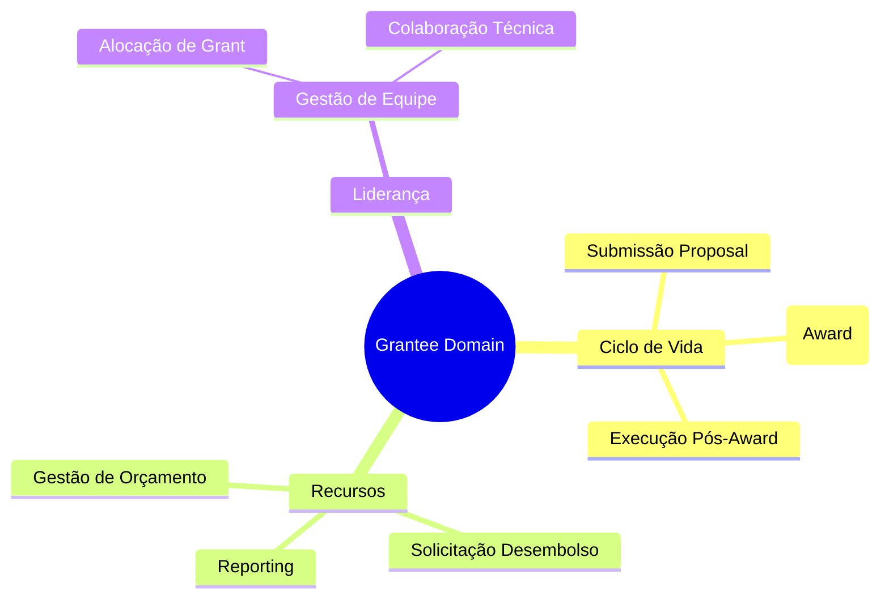

## 2. Papel no Ciclo de Vida
O **Grantee** é o motor do sistema no **Applicant Portal**.

*   **Pré-Award**: Atua como **Applicant**, submetendo a Proposal técnica e orçamentária.
*   **Award**: Aceita os termos e define o plano de trabalho detalhado.
*   **Pós-Award**: Líder da execução, aloca **Subrecipient** e gerencia o cronograma.

## 3. Subdomínios e Componentes Críticos
Estes subdomínios agrupam as funcionalidades detalhadas no [Backlog (#6)](#6-funcionalidades-detalhadas-backlog):

- **Gestão da Iniciativa (Post-Award)**: Formalização, outorga e acompanhamento inicial.

- **Gestão de Resultados**: Acompanhamento técnico, Milestone e mudanças.

- **Gestão de Recursos (Financeiro)**: Orçamento, contas contábeis e Reporting.

- **Gestão de Equipe**: Implementação e gestão de Subrecipient e voluntários.

- **Gestão de Lifecycle**: Estados do projeto (suspensão, finalização).

- **Global Experience & UX**: Multilanguage support, help systems, and mobile reporting.

## 4. KPIs do Grantee
- **Taxa de Desembolso**: % do orçamento executado conforme o planejado.
- **Nível de Atendimento de Milestone**: Progresso técnico do projeto.
- **Conformidade de Relatórios**: Pontualidade e aprovação das Reporting.

## 5. Interface Principal
- **Applicant Portal**: Portal self-service para submissão, tracking e gestão total do projeto.

## 6. Funcionalidades Detalhadas (Backlog)

### Gestão de Capitação (Pre-Award)

| Funcionalidade | Papel | Descrição |
| :--- | :--- | :--- |
| Submeter Proposal | Grantee | Envio eletrônico da proposta técnica, cronograma e orçamento. |
| Padronização de formulário | Grantee | Alinhamento entre campos do portal e documentos de diretrizes oficiais. |
| Alertas e validação real-time | Sistema | Feedback imediato sobre erros de preenchimento ou limites orçamentários. |
| Upload de anexos com labeling | Grantee | Organização obrigatória de documentos (PDFs, certidões) por categoria. |
| Consultar Status Proposal | Grantee | Acompanhamento real-time das etapas de avaliação de habilitação e mérito. |

**Mini-DSM: Dependências Capitação**

| Funcionalidade | 1 | 2 | 3 | 4 | 5 |
| :--- | :---: | :---: | :---: | :---: | :---: |
| **1. Submeter Proposal**   | - | | | | |
| **2. Padronização**       | X | - | | | |
| **3. Validação Real-time**| X | | - | | |
| **4. Upload Anexos**      | X | | | - | |
| **5. Consultar Status**   | X | | | | - |

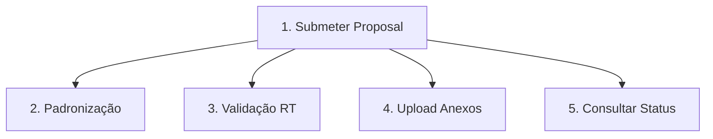

### Gestão da Iniciativa Contratada (Post-Award)
| Funcionalidade | Papel | Descrição |
| :--- | :--- | :--- |
| Overview das Iniciativas | Grantee | Dashboard central para acompanhamento de prazos, saldo e tarefas. |
| Assinar Award Agreement | Grantee | Assinatura digital do termo de outorga que oficializa o início do fomento. |
| Abrir conta do projeto | Grantee | Fluxo integrado para abertura de conta bancária isenta junto ao Banestes. |
| Ativar Projeto | Grant Management | Mudança de status para "Em Execução" após todas as assinaturas colhidas. |

**Mini-DSM: Dependências Iniciativa**

| Funcionalidade | 1 | 2 | 3 | 4 |
| :--- | :---: | :---: | :---: | :---: |
| **1. Overview Iniciativas**| - | | | |
| **2. Assinar Award**        | X | - | | |
| **3. Abrir Conta**          | | X | - | |
| **4. Ativar Projeto**       | | X | | - |

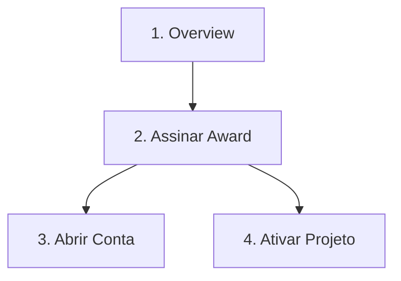

### Gestão de Resultados
| Funcionalidade | Papel | Descrição |
| :--- | :--- | :--- |
| Solicitar mudanças | Grantee | Pedidos formais de alteração em metas, prazos ou equipe técnica. |
| Submição dos resultados | Grantee | Envio dos produtos gerados (artigos, protótipos, relatórios) para avaliação. |
| Alerta de 60% de execução | Sistema | Notificação automática ao atingir gastos para planejamento de nova parcela. |
| Timeline visual | Grantee | Caminho gráfico das etapas vencidas e futuras no workflow do projeto. |
| Repositório de Documentos | Grantee | Arquivamento centralizado de notas fiscais, fotos e comprovantes técnicos. |

**Mini-DSM: Dependências Resultados**

| Funcionalidade | 1 | 2 | 3 | 4 | 5 |
| :--- | :---: | :---: | :---: | :---: | :---: |
| **1. Solicitar Mudanças**   | - | | | | |
| **2. Submissão Resultados** | X | - | | | |
| **3. Alerta 60%**           | | X | - | | |
| **4. Timeline Visual**      | | X | | - | |
| **5. Repositório Docs**     | | X | | | - |

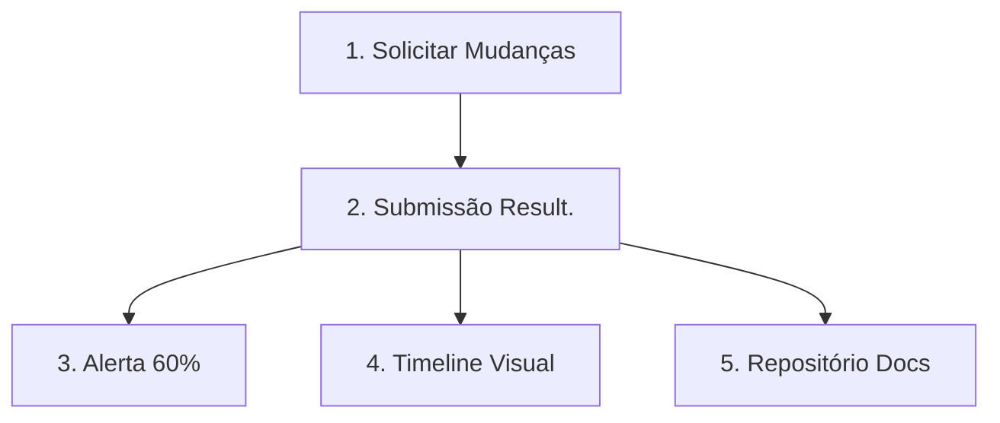

### Gestão de Recursos (Financeiro)
| Funcionalidade | Papel | Descrição |
| :--- | :--- | :--- |
| Solicitar adição orçamentaria | Grantee | Pedido justificado de recursos extras para o projeto. |
| Solicitar nova Conta Contabil | Grantee | Criação de rubricas específicas não previstas inicialmente no plano. |
| Remanejamento Orçamento | Grantee | Transferência de valores entre contas autorizadas (ex: diárias para serviços). |
| Leitura do extrado bancario | Sistema | Consulta automática de saldo e movimentações para conciliação. |
| Emitir Ordem (Recurso) | Grantee | Envio de ordem para o Domínio de Pagamentos para liberar rubricas. |
| Submição da Reporting | Grantee | Envio formal da prestação de contas (gastos vs metas). |
| Contestar Reporting | Grantee | Recurso administrativo contra glosas ou apontamentos da auditoria. |
| Assinatura Digital | Grantee | Autenticação eletrônica de documentos e relatórios financeiros. |
| Integração com App | Grantee | Upload de evidências (fotos/vídeos) via celular para relatórios técnicos. |
| Registro de Itens de Capital | Grantee | Inclusão de equipamentos e mobiliários no inventário do projeto. |

**Mini-DSM: Dependências Recursos**

| Funcionalidade | 1 | 2 | 3 | 4 | 5 | 6 | 7 | 8 | 9 |
| :--- | :---: | :---: | :---: | :---: | :---: | :---: | :---: | :---: | :---: |
| **1. Adição Orçamentária**  | - | | | | | | | | |
| **2. Nova Conta Contábil** | | - | | | | | | | |
| **3. Remanejamento**       | | | - | | | | | | |
| **4. Extrato Bancário**    | | | | - | | | | | |
| **5. Submissão Reporting** | | | X | X | - | | | | |
| **6. Contestar Reporting** | | | | | X | - | | | |
| **7. Assinatura Digital**  | | | | | X | | - | | |
| **8. Integração App**      | | | | | X | | | - | |
| **9. Itens de Capital**    | | | | | X | | | | - |

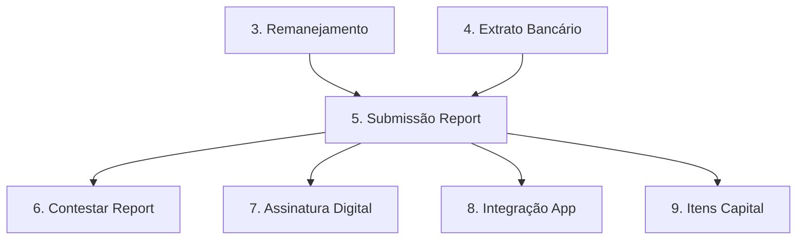

### Gestão de Equipe
| Funcionalidade | Papel | Descrição |
| :--- | :--- | :--- |
| Remanejar de Grant | Grantee | Alteração da alocação de tipos de bolsa dentro da equipe do projeto. |
| Solicitar Grant | Grantee | Cadastro de novos membros (Bolsistas) para receberem auxílio financeiro. |
| Criar Plano de Trabalho | Grantee | Definição das tarefas e metas específicas para cada bolsista/voluntário. |
| Cancelar solicitação | Grantee | Interrupção imediata de processo de indicação de membro ainda não assinado. |
| Supender solicitação | Grantee | Pausa em solicitações de bolsa durante períodos de análise ou transição. |
| Gerir Voluntário | Grantee | Controle de membros da equipe que atuam sem remuneração da FAPES. |
| Gerir Administrador | Grantee | Atribuição de permissões de gestão orçamentária para assistentes. |
| Workflow simplificado | Team | Interface direta para membros enviarem frequências e relatórios técnico. |
| Notificação automática | Sistema | Envio de e-mails/alertas para aceite de participação na equipe. |
| Consultar status bolsista | Grantee | Visualização de vigência, pagamentos e pendências de cada membro do time. |

**Mini-DSM: Dependências Equipe**

| Funcionalidade | 1 | 2 | 3 | 4 | 5 | 6 | 7 | 8 | 9 | 10 |
| :--- | :---: | :---: | :---: | :---: | :---: | :---: | :---: | :---: | :---: | :---: |
| **1. Remanejar Grant**   | - | | | | | | | | | |
| **2. Solicitar Grant**    | | - | | | | | | | | |
| **3. Plano de Trabalho**  | | X | - | | | | | | | |
| **4. Cancelar Solic.**    | | X | | - | | | | | | |
| **5. Suspender Solic.**   | | X | | | - | | | | | |
| **6. Gerir Voluntário**   | | | X | | | - | | | | |
| **7. Gerir Admin**        | | | | | | | - | | | |
| **8. Workflow Team**      | | | X | | | | | - | | |
| **9. Notificação Aut.**   | | X | | | | | | | - | |
| **10. Status Bolsista**   | | X | | | | | | | | - |

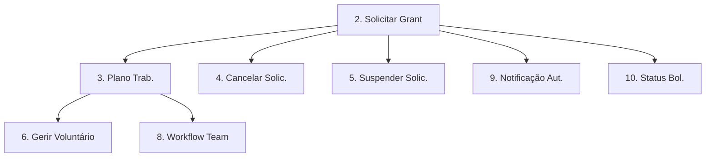

### Global Experience & UX
| Funcionalidade | Papel | Descrição |
| :--- | :--- | :--- |
| Alternar Idioma | Usuário | Tradução instantânea da interface para usuários internacionais. |
| Ajuda Contextual | Usuário | Guia interativo e dicas sobre como preencher os campos mais complexos. |
| Ajuda Geral | Usuário | Base de conhecimento e tutoriais em vídeo acessíveis por página. |
| Gestão de perfil | Usuário | Atualização de dados cadastrais, Lattes e recuperação de credenciais. |
| Notificações Push/Email | Sistema | Alertas sobre prazos de prestação de contas e marcos técnicos. |

**Mini-DSM: Dependências Experience**

| Funcionalidade | 1 | 2 | 3 | 4 | 5 |
| :--- | :---: | :---: | :---: | :---: | :---: |
| **1. Alternar Idioma**   | - | | | | |
| **2. Ajuda Contextual**  | | - | | | |
| **3. Ajuda Geral**       | | | - | | |
| **4. Gestão de Perfil**  | | | | - | |
| **5. Notificações**      | | | | | - |

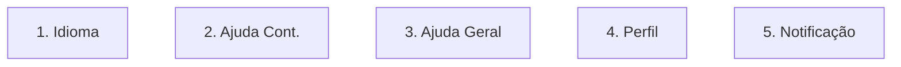

### Gestão de Lifecycle (Status)
| Funcionalidade | Papel | Descrição |
| :--- | :--- | :--- |
| Solicitar Suspender Projeto | Misto | Fluxo de interrupção temporária por motivos de força maior ou licença. |
| Cancelar suspensão | Misto | Reativação do cronograma e pagamentos após período de pausa. |
| Solicitar Finalizar Projeto | Misto | Procedimento de encerramento após entrega de todos os resultados. |
| Cancelar finalização | Misto | Reversão de encerramento caso haja necessidade de correções técnicas. |
| Relatório de Encerramento | Grantee | Guia passo-a-passo para finalização técnica e financeira do contrato. |

**Mini-DSM: Dependências Lifecycle**

| Funcionalidade | 1 | 2 | 3 | 4 | 5 |
| :--- | :---: | :---: | :---: | :---: | :---: |
| **1. Suspender Projeto**   | - | | | | |
| **2. Reativar Projeto**    | X | - | | | |
| **3. Finalizar Projeto**   | | | - | | |
| **4. Cancelar Finaliz.**   | | | X | - | |
| **5. Relatório Encerr.**   | | | X | | - |

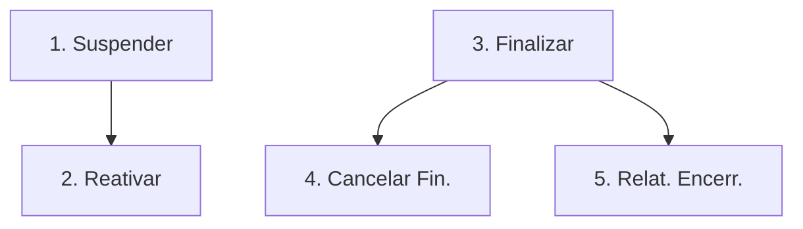

### 6.6 Visão Consolidada do Domínio (DSM)

| Funcs | PRE | PST | RES | RSC | TEA | Glb | LFC |
| :--- | :---: | :---: | :---: | :---: | :---: | :---: | :---: |
| **1. Pre-Award** | - | | | | | | |
| **2. Post-Award** | X | - | | | | | |
| **3. Resultados** | | X | - | | | | |
| **4. Recursos** | | X | X | - | | | |
| **5. Equipe** | | X | X | | - | | |
| **6. Experience**| | | | | | - | |
| **7. Lifecycle** | | | X | | | | - |

**Legenda de Dependência:**

- **2 → 1**: O início da execução depende da aprovação na submissão.

- **3 → 2**: Resultados técnicos são reportados após a assinatura do contrato.

- **4 → [2, 3]**: Gestão financeira depende do contrato ativo e das entregas técnicas.

- **5 → [2, 3]**: Alocação de bolsistas depende do contrato e do plano de trabalho (resultados).

- **7 → 3**: Mudanças de status (suspensão/encerramento) dependem do progresso dos resultados.

### 6.6 Grafo de Execução (Ordem Topológica)

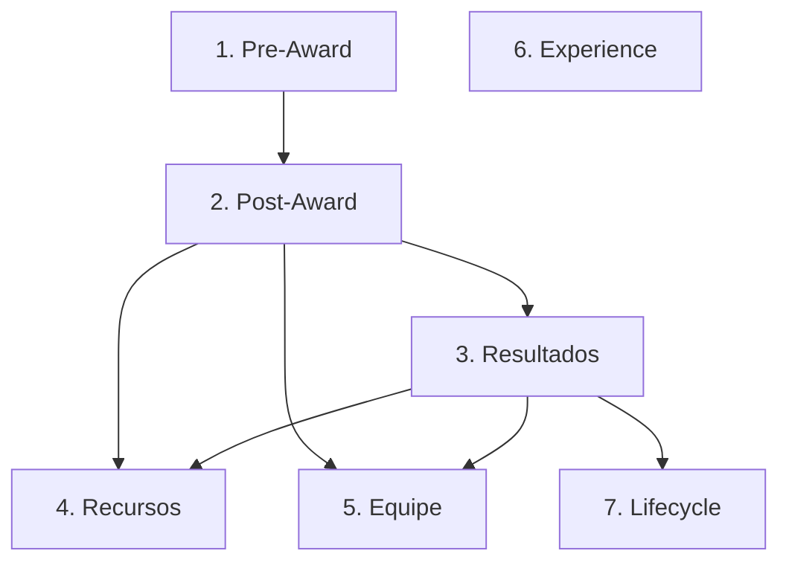

## 7. Diagrama de Domínio

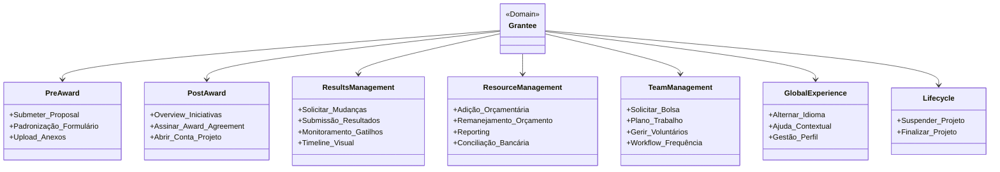

## 8. Relacionamento com outros Domínios

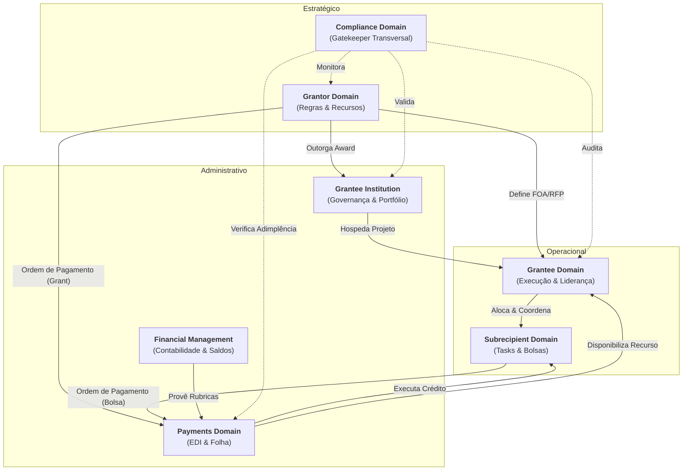
