# Grantor Domain (Grant Management)

## 1. Visão Geral
O **Grantor Domain** representa a autoridade financiadora (ex: Grant Management) que detém a governança sobre o ciclo de concessão. É o domínio responsável por definir "o que", "quem" e "quando" o fomento será disponibilizado.

### 1.1 Mapa Mental do Domínio
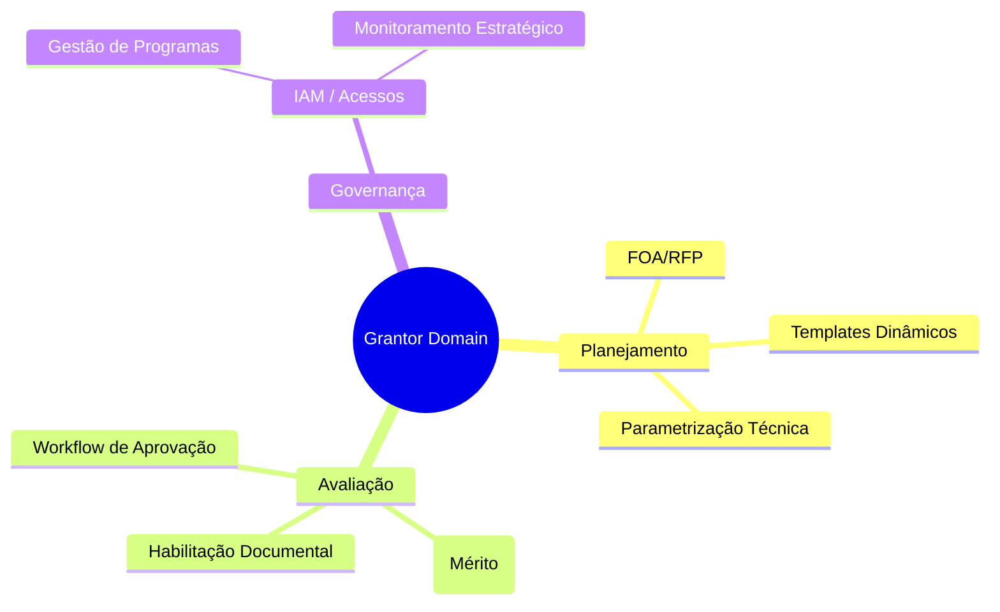

## 2. Papel no Ciclo de Vida
Este domínio é o protagonista nas fases de **Pré-Award** (planejamento) e **Award** (aprovação).

*   **Pré-Award**: Criação e publicação do **FOA/RFP**.
*   **Award**: Análise de mérito, elegibilidade e formalização do financiamento.
*   **Pós-Award**: Supervisão e auditoria dos resultados financeiros e científicos.

## 3. Subdomínios e Componentes Críticos
Estes subdomínios agrupam as funcionalidades detalhadas no [Backlog (#6)](#6-funcionalidades-detalhadas-backlog):

- **Gestão de Acesso (IAM)**: Autenticação via Acesso Cidadão e controle de perfis.

- **Gestão de Pessoa**: Ciclo de vida de usuários e Grantee.

- **Parâmetros Gerais**: Configurações geográficas e de áreas de conhecimento.

- **Gestão de Modalidade**: Parametrização de Grant e níveis.

- **Planejamento & Programas**: Estrutura de eixos, programas e comitês.

- **Capitação (Pre-Award)**: Gestão de editais, submissões e avaliações.

## 4. KPIs Principais do Grantor
- **Taxa de Sucesso de Aplicações**: % de Proposal que viram Awards.
- **Valor Total Awarded**: Orçamento total alocado.
- **Tempo Médio de Ciclo**: Dias entre o FOA/RFP e o primeiro desembolso.

## 5. Interface Principal

- **Grantor Portal**: Ambiente administrativo para revisão de editais, aprovações e relatórios regulatórios.

## 6. Funcionalidades Detalhadas (Backlog)

### Gestão de Acesso e Segurança (IAM)
| Funcionalidade | Papel | Descrição |
| :--- | :--- | :--- |
| Utilizacao de Acesso Cidadao | IAM | Integração com o provedor de identidade estadual (PRODEST) para login único. |
| Ambiente de acesso dos Usuarios | IAM | Portal interno para servidores e técnicos da FAPES. |
| Ambiente de acesso dos Grantee | IAM | Portal externo para proponentes e coordenadores de projetos. |
| Implementacao de conceitos PRODEST | IAM | Alinhamento com os padrões de UX/UI e segurança da tecnologia estadual. |
| Cadastro automatico Front-office | IAM | Criação automática de perfil de usuário ao primeiro login via Acesso Cidadão. |
| Cadastro automatico Back-office | IAM | Sincronização com o organograma estadual para atribuição de permissões internas. |

**Mini-DSM: Dependências IAM**

| Funcionalidade | 1 | 2 | 3 | 4 | 5 | 6 |
| :--- | :---: | :---: | :---: | :---: | :---: | :---: |
| **1. Acesso Cidadão**    | - | | | | | |
| **2. Portal Interno**    | X | - | | | | |
| **3. Portal Grantee**    | X | | - | | | |
| **4. Padrões UX/UI**     | | X | X | - | | |
| **5. Cadastro Front**    | X | | | | - | |
| **6. Cadastro Back**     | X | | | | | - |

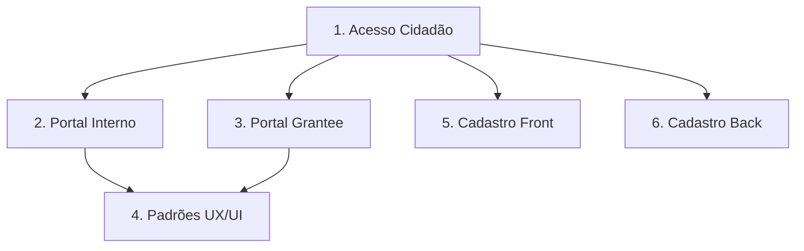

### Gestão de Pessoa
| Funcionalidade | Papel | Descrição |
| :--- | :--- | :--- |
| User Profile Registry | Admin | Base unificada de dados cadastrais de pesquisadores, bolsistas e revisores. |
| Suspend User Profile | Grant Management | Bloqueio de acesso para usuários inadimplentes ou com irregularidades. |

**Mini-DSM: Dependências Pessoa**

| Funcionalidade | 1 | 2 |
| :--- | :---: | :---: |
| **1. Profile Registry** | - | |
| **2. Suspend Profile**  | X | - |

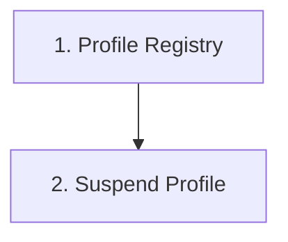

### Parâmetros Gerais
| Funcionalidade | Papel | Descrição |
| :--- | :--- | :--- |
| Casdastrar o Area Tecnica | Grant Management | Definição das diretorias ou departamentos responsáveis pelos processos. |
| Cadastro de Cidades | Grant Management | Gerenciamento da base de municípios para filtros regionais. |
| Cadastro de Regiões | Grant Management | Agrupamento de cidades para políticas de fomento regionalizado. |
| Cadastro de Areas de Conhecimento | Grant Management | Classificação segundo padrões CNPq/CAPES (Exatas, Saúde, etc.). |

**Mini-DSM: Dependências Parâmetros**

| Funcionalidade | 1 | 2 | 3 | 4 |
| :--- | :---: | :---: | :---: | :---: |
| **1. Área Técnica** | - | | | |
| **2. Cidades**      | | - | | |
| **3. Regiões**      | | X | - | |
| **4. Áreas Conhec.**| | | | - |

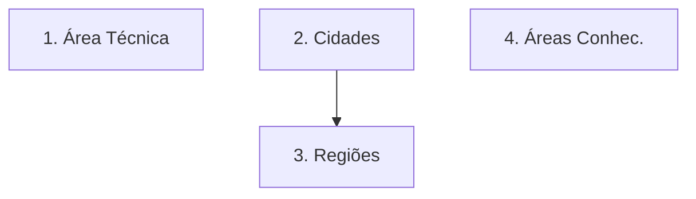

### Gestão de Modalidade (Grant)
| Funcionalidade | Papel | Descrição |
| :--- | :--- | :--- |
| Cadastro de Requisitos | Grant Management | Regras de elegibilidade (tempo de doutorado, vínculo, etc.) por nível. |
| Cadastro de Modalidade | Grant Management | Criação de tipos de fomento (Pesquisa, Extensão, Inovação). |
| Atualizar Valores | Grant Management | Ajuste de tabelas de valores de bolsas e auxílios. |
| Refatorando | Grant Management | Revisão periódica de nomenclaturas e regras de negócio. |
| Cadastro de Modalidades | Grant Management | Definição de níveis (Mestrado, Doutorado, PQ, etc.). |
| Cadastro de Resolucaoes | Grant Management | Vinculação de base legal a cada tipo de fomento gerido. |
| Cadastro Nivel | Grant Management | Especificação técnica de valores e durações por categoria. |

**Mini-DSM: Dependências Modalidade**

| Funcionalidade | 1 | 2 | 3 | 4 | 5 | 6 | 7 |
| :--- | :---: | :---: | :---: | :---: | :---: | :---: | :---: |
| **1. Cadastro Requisitos** | - | | | | | | |
| **2. Cadastro Modalidade** | X | - | | | | | |
| **3. Atualizar Valores**   | | X | - | | | | |
| **4. Refatorando**         | | | X | - | | | |
| **5. Níveis**              | X | X | | | - | | |
| **6. Resoluções**          | | | | | X | - | |
| **7. Cadastro Nível**      | | | X | | X | | - |

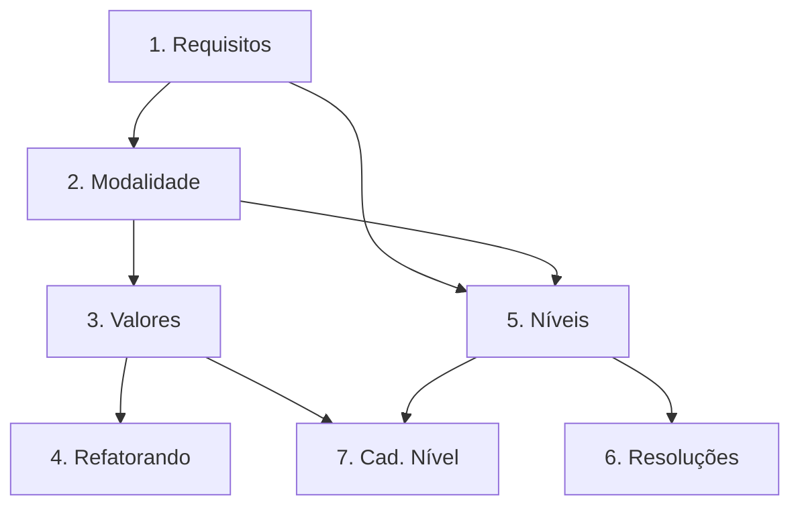

### Gestão de Planejamento Estratégico
| Funcionalidade | Papel | Descrição |
| :--- | :--- | :--- |
| Casdastrar o Plano Estratégico | Grant Management | Registro do plano quadrienal ou governamental vigente. |
| Casdastrar o Eixo Estratégico | Grant Management | Definição de pilares (ex: Sustentabilidade, IA, Saúde). |
| Registro de Objetivos Estratégicos | Grant Management | Metas específicas para cada modalidade vinculada ao eixo. |
| Configuração de Indicadores | Grant Management | Dashboards de impacto socioeconômico e científico dos projetos. |

**Mini-DSM: Dependências Planejamento**

| Funcionalidade | 1 | 2 | 3 | 4 |
| :--- | :---: | :---: | :---: | :---: |
| **1. Plano Estratégico** | - | | | |
| **2. Eixo Estratégico**  | X | - | | |
| **3. Objetivos Est.**    | | X | - | |
| **4. Indicadores**       | | | X | - |

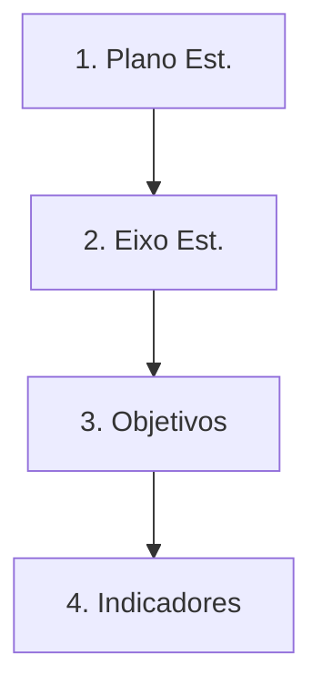

### Gestão do Programa
| Funcionalidade | Papel | Descrição |
| :--- | :--- | :--- |
| Casdastrar o Programa | Grant Management | Estrutura que agrupa diversos editais sob uma mesma temática. |
| Associar a Eixo Estratégico | Grant Management | Garantia de que todo programa responde a um pilar do governo. |
| Cadastro de Comitê Gestor | Grant Management | Definição dos responsáveis técnicos pela governança do programa. |
| Adicionar Recursos Financeiros | Grant Management | Aporte orçamentário específico para a execução dos editais. |
| Visualizar Captações | Grant Management | Monitoramento de volume de propostas recebidas por programa. |

**Mini-DSM: Dependências Programa**

| Funcionalidade | 1 | 2 | 3 | 4 | 5 |
| :--- | :---: | :---: | :---: | :---: | :---: |
| **1. Cadastro Programa**   | - | | | | |
| **2. Assoc. Eixo Est.**    | X | - | | | |
| **3. Comitê Gestor**      | X | | - | | |
| **4. Recursos Financeiros**| X | | | - | |
| **5. Visualizar Captações**| X | | | | - |

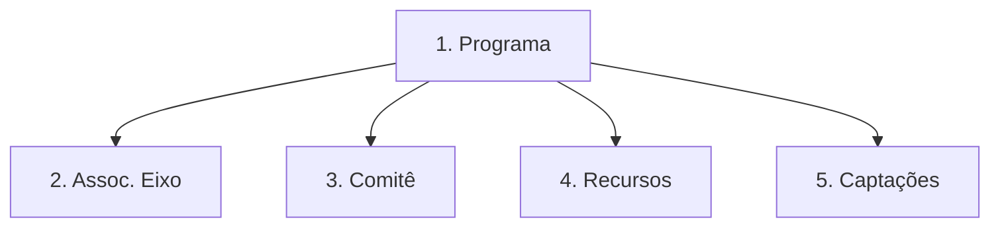

### Gestão de Capitação (Pre-Award)
| Funcionalidade | Papel | Descrição |
| :--- | :--- | :--- |
| Gestão de Templates | Grant Management | Criação dinâmica de formulários de submissão e fichas de avaliação. |
| Gestão de Revisores Ad Hoc | Grant Management | Cadastro e vinculação de consultores externos para pareceres. |
| Configurar Processo | Grant Management | Definição de datas, etapas e critérios de pontuação do edital. |
| Instanciar o Processo | Grant Management | Abertura oficial do edital para recebimento de propostas. |
| Associar chamada a programa | Grant Management | Vinculação orçamentária e estratégica obrigatória. |
| Associar regras (FOA/RFP) | Grant Management | Upload e vinculação do documento oficial de diretrizes. |
| Submeter Proposal | Grantee | Preenchimento e envio da proposta pelo portal do pesquisador. |
| Avaliacao de Habilitacao | Grant Management | Verificação técnica de documentos e requisitos de admissibilidade. |
| Avaliacao de Merito | Grant Management | Distribuição para consultores e recebimento de notas/pareceres. |
| Avaliar qualidade revisores | Revisor | Sistema de feedback sobre a profundidade e clareza dos pareceres. |
| Publicar Resultado | Grant Management | Divulgação da lista oficial de aprovados e suplentes. |
| Receber solicitações revisão | Grant Management | Gestão de recursos administrativos e pedidos de esclarecimento. |
| Gerar Award Agreement | Grant Management | Emissão automática do contrato/termo de outorga parametrizado. |
| Emitir Ordem (Grant) | Grant Management | Envio de ordem de pagamento para o Domínio de Pagamentos. |
| Mudar Status para Contratada | Grant Management | Ativação do projeto para o início da execução pós-assinatura. |
| Sugestão Ad-Hoc (Lattes) | Sistema | Algoritmo que sugere avaliadores por compatibilidade de keywords. |
| Gestão de Filas de Review | Grant Management | Painel de controle de prazos e carga de trabalho dos revisores. |

**Mini-DSM: Dependências Captação**

| Funcionalidade | 1 | 2 | 3 | 4 | 5 | 6 | 7 | 8 | 9 | 10 | 11 | 12 | 13 | 14 | 15 | 16 |
| :--- | :---: | :---: | :---: | :---: | :---: | :---: | :---: | :---: | :---: | :---: | :---: | :---: | :---: | :---: | :---: | :---: |
| **1. Templates**      | - | | | | | | | | | | | | | | | |
| **2. Revisores AC**   | | - | | | | | | | | | | | | | | |
| **3. Config. Processo**| X | X | - | | | | | | | | | | | | | |
| **4. Instanciar Proc** | | | X | - | | | | | | | | | | | | |
| **5. Assoc. Programa** | | | | X | - | | | | | | | | | | | |
| **6. Regras (FOA/RFP)**| | | | X | | - | | | | | | | | | | |
| **7. Submeter Proposal**| | | | X | | | - | | | | | | | | | |
| **8. Habilitação**     | | | | | | | X | - | | | | | | | | |
| **9. Mérito**          | | X | | | | | | X | - | | | | | | | |
| **10. Qualid. Revisores**| | | | | | | | | X | - | | | | | | |
| **11. Publicar Result.**| | | | | | | | | X | | - | | | | | |
| **12. Solicit. Revisão**| | | | | | | | | | | X | - | | | | |
| **13. Award Agreement** | | | | | | | | | | | X | X | - | | | |
| **14. Contratada**      | | | | | | | | | | | | | X | - | | |
| **15. Sugg (Lattes)**   | | X | | | | | X | | | | | | | | - | |
| **16. Fila Review**     | | X | | | | | | | X | | | | | | | - |

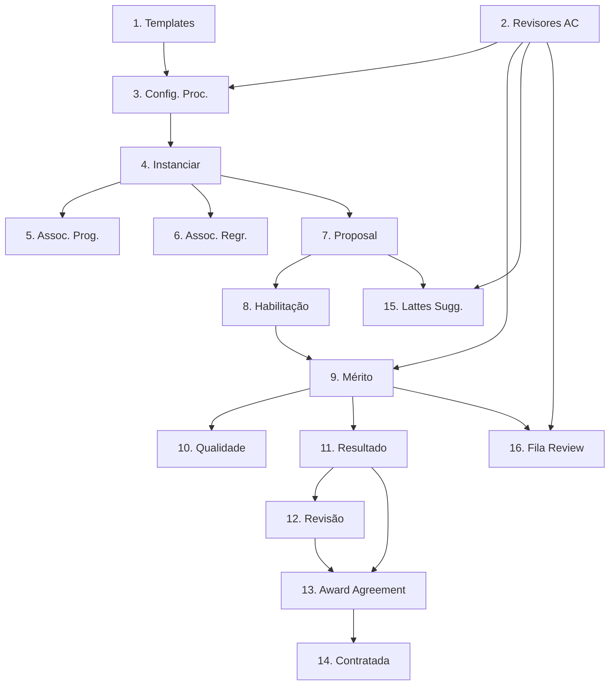

### Review Panels (Câmaras de Assessoramento)
| Funcionalidade | Papel | Descrição |
| :--- | :--- | :--- |
| Cadastro de Review Panels | Grant Management | Gestão dos comitês permanentes por áreas (Câmara de Saúde, etc.). |
| Vincular Membros e Histórico | Grant Management | Controle de mandatos, participações e produtividade dos membros. |
| Acesso a Fichas e Projetos | Reviewer | Visualização segura e digital de todos os proponentes sob julgamento. |
| Emissão de Certificados | Reviewer | Geração automática de comprovantes de participação em reuniões. |

**Mini-DSM: Dependências Review Panels**

| Funcionalidade | 1 | 2 | 3 | 4 |
| :--- | :---: | :---: | :---: | :---: |
| **1. Cadastro Panels**   | - | | | |
| **2. Vincular Membros**  | X | - | | |
| **3. Acesso Fichas**     | X | X | - | |
| **4. Emissão Certif.**   | | X | | - |

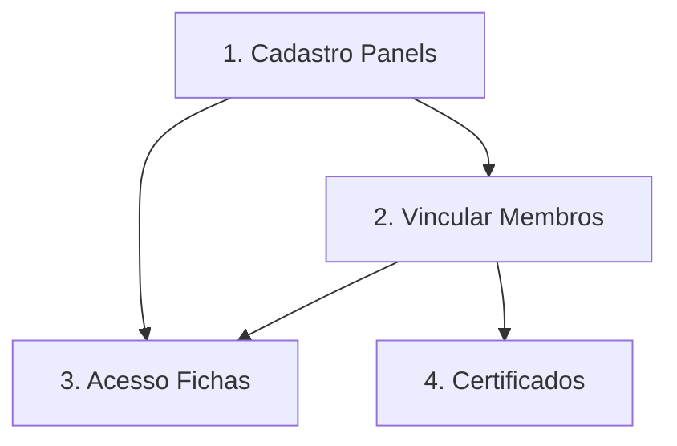

### 6.6 Visão Consolidada do Domínio (DSM)

| Funcionalidades | IAM | PES | PAR | MOD | PLA | PRO | CAP | REV |
| :--- | :---: | :---: | :---: | :---: | :---: | :---: | :---: | :---: |
| **1. IAM (Acesso)** | - | | | | | | | |
| **2. Pessoa** | | - | | | | | | |
| **3. Parâmetros** | | | - | | | | | |
| **4. Modalidade** | | | X | - | | | | |
| **5. Planejamento** | | | | | - | | | |
| **6. Programa** | | | | | X | - | | |
| **7. Captação** | X | X | | X | | X | - | |
| **8. Review Panels**| | X | | | | | X | - |

**Legenda de Dependência:**

- **4 → 3**: Modalidades dependem de parâmetros (áreas/cidades).

- **6 → 5**: Programas dependem do Plano Estratégico.

- **7 → [1, 2, 4, 6]**: Captação requer IAM, Pessoas, Regras de Modalidade e Programa.

- **8 → [2, 7]**: Painéis dependem de Pessoas (avaliadores) e processos de Captação.

### 6.7 Grafo de Execução (Ordem Topológica)

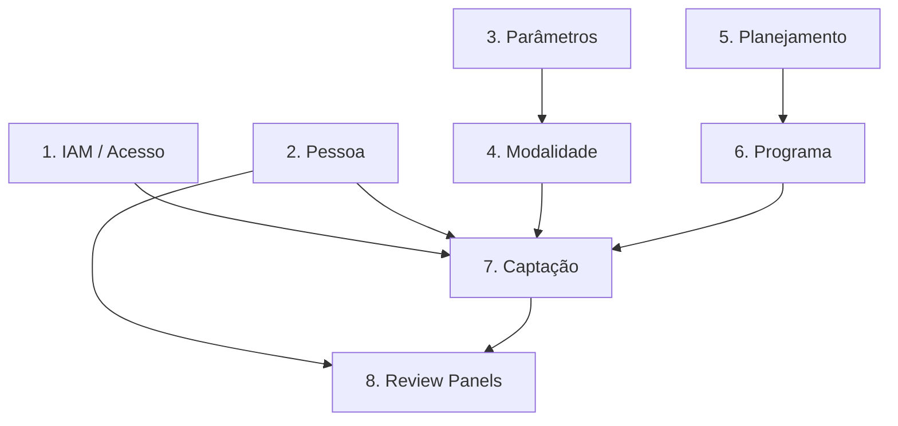

## 7. Diagrama de Domínio

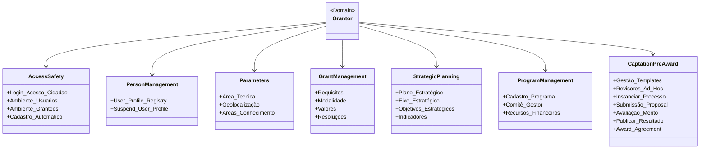

## 8. Relacionamento com outros Domínios

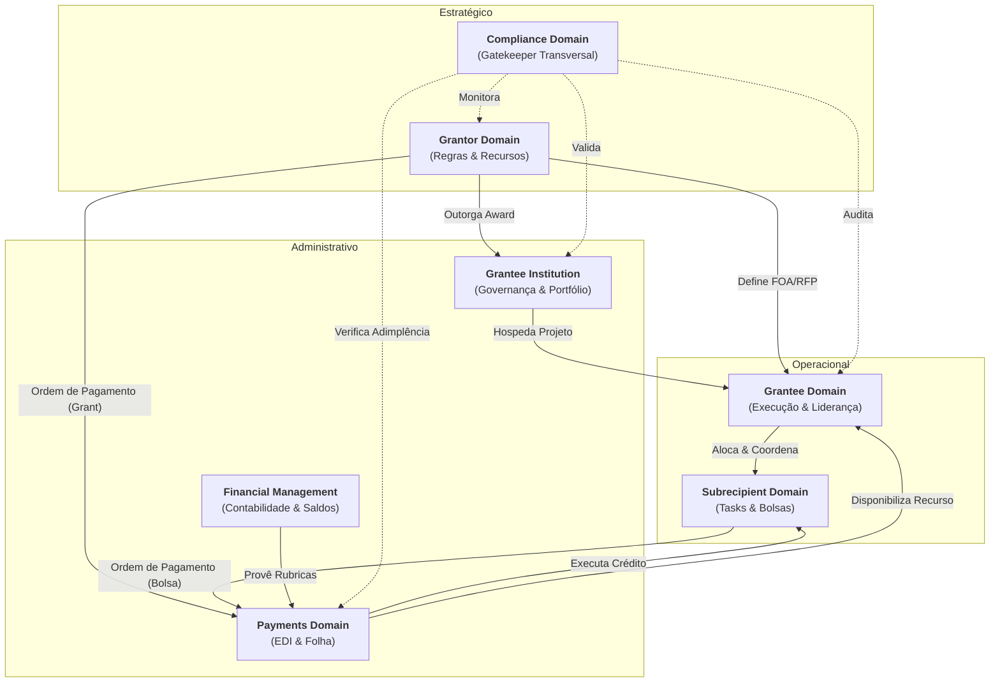
