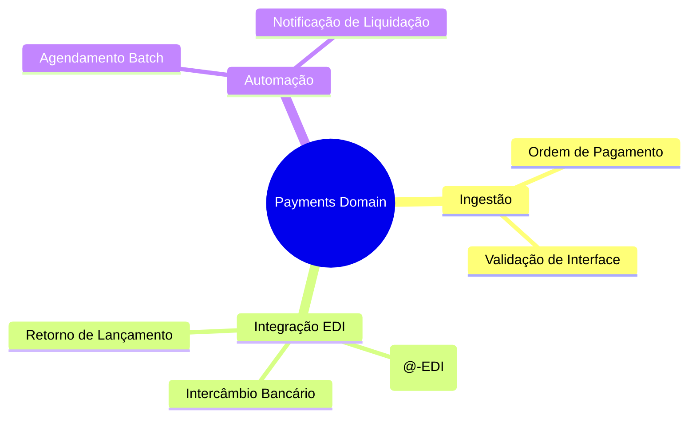
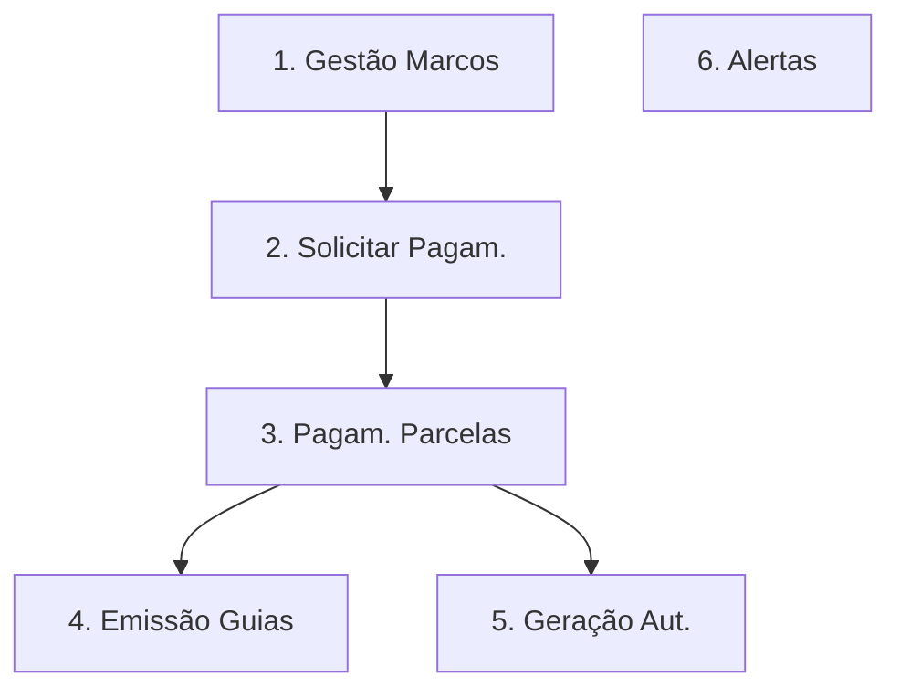
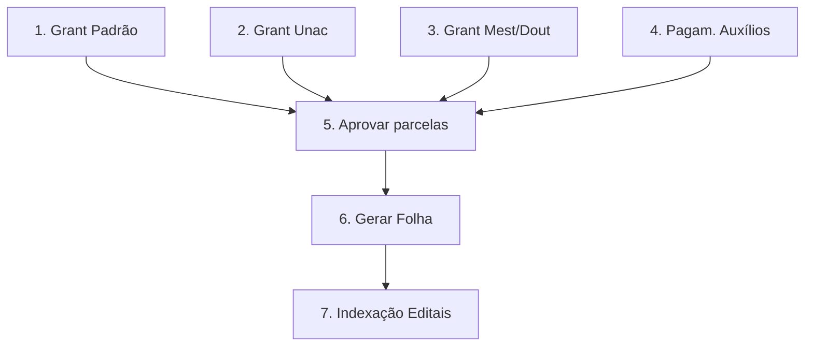
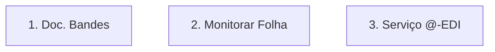
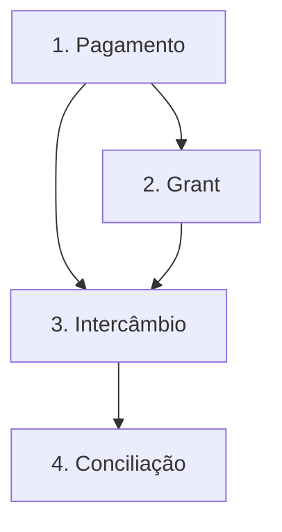
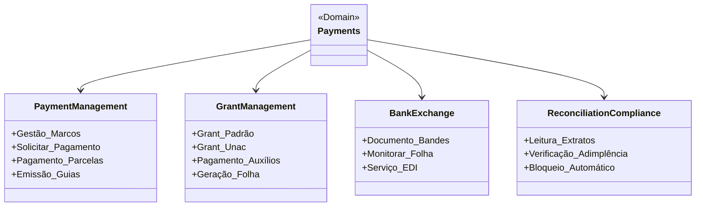
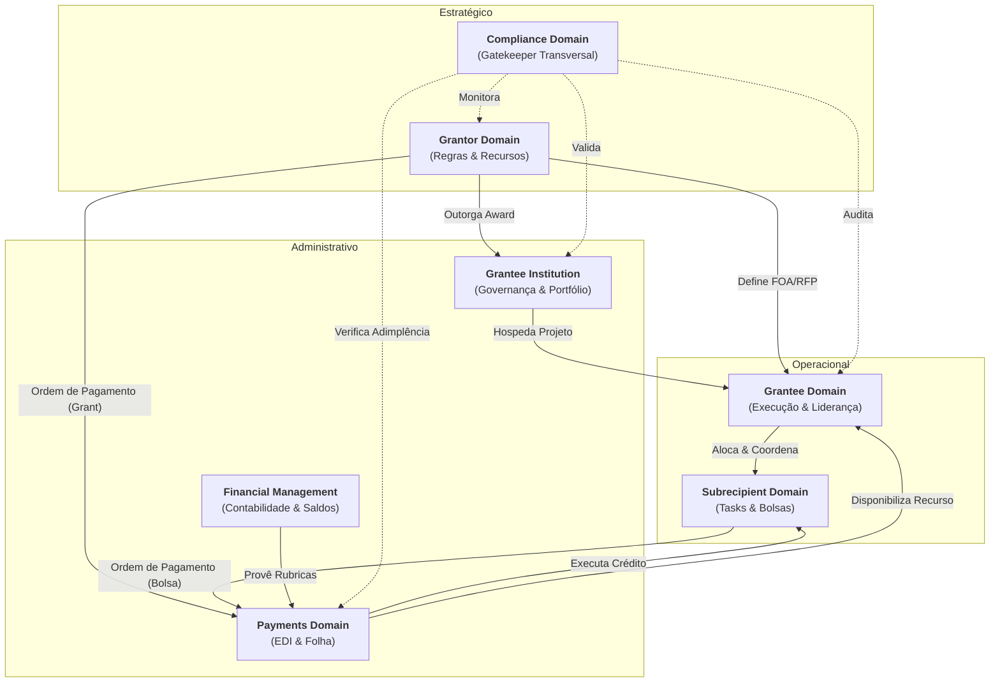

# Payments Domain (Payment Gateway & Execution)

## 1. Visão Geral
Este domínio técnico atua como um **Payment Gateway** agnóstico. Sua função é receber **Ordens de Pagamento** validadas de outros domínios (Concessão, Bolsas, Pesquisa) e executar a logística física de desembolso via integração bancária (Banestes/Bandes).

### 1.1 Mapa Mental do Domínio

## 2. Subdomínios e Componentes
Estes subdomínios agrupam as funcionalidades detalhadas no [Backlog (#3)](#3-funcionalidades-detalhadas-backlog):

- **Ingestão de Ordens**: Recebimento de solicitações de pagamento via API ou Message Bus.

- **Intercâmbio Bancário**: Integração técnica via @-EDI (Remessa/Retorno) com Banestes e Bandes.

- **Conciliação e Settlement**: Confirmação de liquidação financeira e reporte de sucesso/erro para o domínio de origem.

## 3. Fluxos Técnicos

### 2.1 EDI (Electronic Data Interchange)
Processamento de arquivos via padrão `@-EDI` para comunicação com o Banestes/Bandes.
- **Geração de Arquivo**: Cabeçalho de lote, registros de pagamento e trailer.
- **Protocolo**: Garantia de integridade e não-repúdio no envio das remessas.

### 2.2 Gestão de Marcos (Milestones)
Pagamentos condicionados à entrega técnica confirmada no domínio do Grantee.
- **Trigger**: Aprovação do relatório de progresso dispara a autorização de parcela.

## 3. Funcionalidades Detalhadas (Backlog)

### Gestão de Pagamentos
| Funcionalidade | Papel | Descrição |
| :--- | :--- | :--- |
| Ingerir Ordem | Sistema | Recebimento de payload de pagamento de domínios externos. |
| Validar Interface | Sistema | Checagem de integridade e rubricas antes do empenho bancário. |
| Pagamento Bancário | Financeiro | Execução orçamentária da liberação do recurso via EDI/Gateway. |
| Emissão de Comprovantes | Sistema | Geração de documentos de confirmação de transferência. |
| Geração automática | Sistema | Execução programada de ordens recorrentes (bolsas). |
| Alertas Antecipados | Sistema | Notificações sobre prazos de vigência e janelas de pagamento. |

**Mini-DSM: Dependências Pagamento**

| Funcionalidade | 1 | 2 | 3 | 4 | 5 | 6 |
| :--- | :---: | :---: | :---: | :---: | :---: | :---: |
| **1. Gestão Marcos**     | - | | | | | |
| **2. Solicitar Pagamento**| X | - | | | | |
| **3. Pagam. Parcelas**    | | X | - | | | |
| **4. Emissão de Guias**   | | | X | - | | |
| **5. Geração Automática** | | | X | | - | |
| **6. Alertas**           | | | | | | - |

### Gestão de Folha de Bolsas (Grant)
| Funcionalidade | Papel | Descrição |
| :--- | :--- | :--- |
| Grant Padrao | Sistema | Pagamento de bolsas com valor fixo e periodicidade mensal. |
| Grant Unac | Sistema | Auxílios pontuais em parcela única (e.g. participação em eventos). |
| Grant Mestrado/Doutorado | Sistema | Bolsas específicas de pós-graduação com regras CAPES/CNPq. |
| Pagamento de auxilios | Financeiro | Execução de ajudas de custo e diárias para pesquisadores. |
| Aprovar parcelas | Grant Management | Validação administrativa antes do envio para o banco. |
| Geração automática de Folha | Sistema | Consolidação mensal de todos os bolsistas para envio via EDI. |
| Indexação aos Editais | Sistema | Rastreabilidade do gasto total de bolsas por chamada pública. |

**Mini-DSM: Dependências Folha**

| Funcionalidade | 1 | 2 | 3 | 4 | 5 | 6 | 7 |
| :--- | :---: | :---: | :---: | :---: | :---: | :---: | :---: |
| **1. Grant Padrão**      | - | | | | | | |
| **2. Grant Unac**        | - | | | | | | |
| **3. Grant Mest/Dout**   | - | | | | | | |
| **4. Pagam. Auxílios**    | | | | - | | | |
| **5. Aprovar parcelas**   | X | X | X | X | - | | |
| **6. Gerar Folha**        | | | | | X | - | |
| **7. Indexação Editais** | | | | | | X | - |

### Intercâmbio Bancário
| Funcionalidade | Papel | Descrição |
| :--- | :--- | :--- |
| Documento para o Bandes | Sistema | Geração de arquivos de remessa para financiamentos via Bandes. |
| Monitorar Folha | Financeiro | Acompanhamento do status de processamento bancário das bolsas. |
| Servico @-EDI | Sistema | Motor de integração para envio e recepção de arquivos Banestes. |

### Bank Reconciliation & Compliance
| Funcionalidade | Papel | Descrição |
| :--- | :--- | :--- |
| Leitura real-time extratos | Sistema | Sincronização automática com a conta corrente do projeto. |
| Verificação de Adimplência | Sistema | Consulta automatizada a bases governamentais (SEFAZ/RFB). |
| Bloqueio automático | Sistema | Interrupção de pagamentos em caso de certidão negativa vencida. |
| Verificação de valores | Sistema | Double-check algorítmico para evitar disparidade de valores na folha. |

**Mini-DSM: Dependências Intercâmbio**

| Funcionalidade | 1 | 2 | 3 |
| :--- | :---: | :---: | :---: |
| **1. Doc. para Bandes**  | - | | |
| **2. Monitorar Folha**   | | - | |
| **3. Serviço @-EDI**    | | | - |

### 3.4 Visão Consolidada do Domínio (DSM)

| Funcs | PMT | GRN | BNK | REC |
| :--- | :---: | :---: | :---: | :---: |
| **1. Pagamento** | - | | | |
| **2. Grant** | X | - | | |
| **3. Intercâmbio**| X | X | - | |
| **4. Conciliação**| | | X | - |

**Legenda de Dependência:**

- **2 → 1**: Pagamentos de bolsas (Grant) dependem da gestão de marcos de pagamento.

- **3 → [1, 2]**: O envio de arquivos bancários depende do processamento prévio de pagamentos e bolsas.

- **4 → 3**: A conciliação depende do retorno dos arquivos do intercâmbio bancário.

### 3.5 Grafo de Execução (Ordem Topológica)

## 4. Diagrama de Domínio

## 5. Relacionamento com outros Domínios

