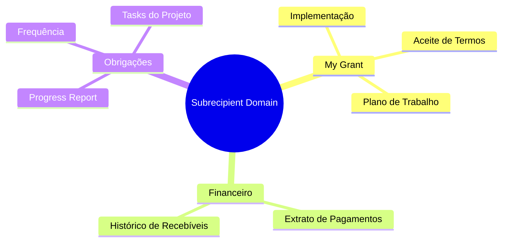
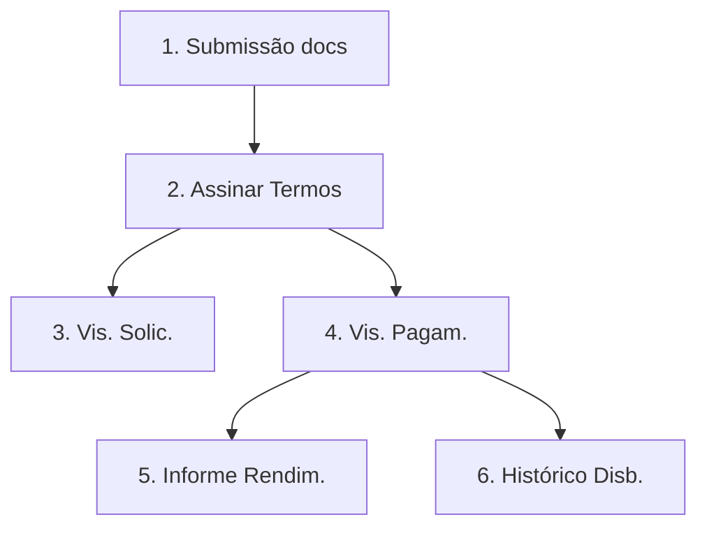
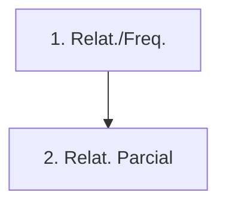
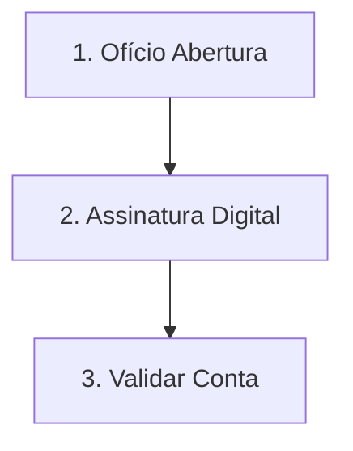
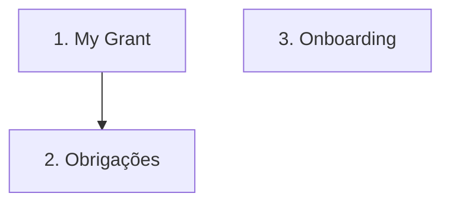
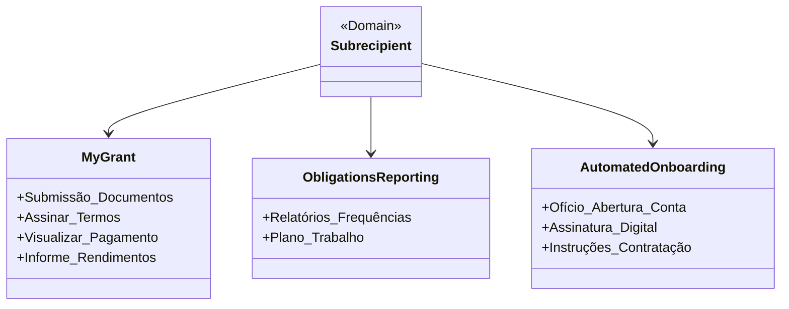
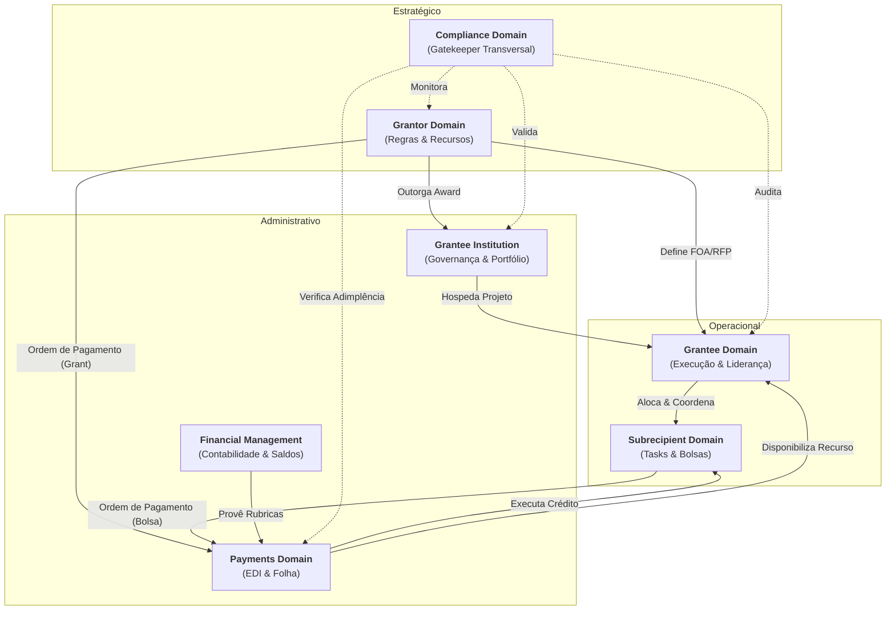

# Subrecipient Domain (Subrecipient)

## 1. Visão Geral
Representa o nível técnico operacional (Students, interns ou Junior researchers). Eles não gerenciam o projeto, mas executam tarefas específicas e recebem compensação financeira (Grant).

### 1.1 Mapa Mental do Domínio

## 2. Papel no Ciclo de Vida
Ativo principalmente na fase de **Pós-Award**.

*   **Pós-Award**: Vinculação ao projeto pelo **Grantee**, execução de tarefas, reporte de progresso e cumprimento de obrigações acadêmicas/técnicas.

## 3. Subdomínios e Componentes Críticos

Estes subdomínios agrupam as funcionalidades detalhadas no [Backlog (#6)](#6-funcionalidades-detalhadas-backlog):

- **My Grant (Subrecipient/Subrecipient)**: Implementação, Award Agreement e consultas de pagamento.

- **Obrigações e Reporte**: Envio de frequências e relatórios de atividades.

## 4. KPIs do Subrecipient

- **Taxa de Frequência**: Percentual de presença ou reporte de atividades em dia.

- **Entregas Técnicas**: Qualidade e pontualidade dos relatórios individuais.

## 5. Interface Principal
- **Applicant Portal (Subrecipient View)**: Visão self-service focada no acompanhamento da Grant e obrigações do projeto.

## 6. Funcionalidades Detalhadas (Backlog)

### My Grant (Subrecipient/Subrecipient)
| Funcionalidade | Papel | Descrição |
| :--- | :--- | :--- |
| Submissão de documentos | Subrecipient | Upload de dados pessoais e acadêmicos para implementação da bolsa. |
| Assinar Termos | Subrecipient | Aceite digital das obrigações e compromissos do bolsista. |
| Visualizar solicitação | Subrecipient | Acompanhamento do status da indicação feita pelo coordenador. |
| Visualizar Pagamento | Subrecipient | Consulta a datas e status de depósitos mensais da bolsa. |
| Informe de Rendimentos | Sistema | Emissão automática de documento para declaração de ajuste anual de IR. |
| Histórico de Disbursement | Subrecipient | Extrato consolidado de todas as parcelas recebidas no projeto. |

**Mini-DSM: Dependências My Grant**

| Funcionalidade | 1 | 2 | 3 | 4 | 5 | 6 |
| :--- | :---: | :---: | :---: | :---: | :---: | :---: |
| **1. Submissão docs**   | - | | | | | |
| **2. Assinar Termos**   | X | - | | | | |
| **3. Visualizar solic.**  | | X | - | | | |
| **4. Visualizar Pagam.** | | X | | - | | |
| **5. Informe Rendim.**  | | | | X | - | |
| **6. Histórico Disb.**  | | | | X | | - |

### Obrigações e Frequências
| Funcionalidade | Papel | Descrição |
| :--- | :--- | :--- |
| Relatórios e frequências | Subrecipient | Envio mensal de comprovação de atividades; dispara Ordem de Pagamento. |
| Relatório Técnico Parcial | Subrecipient | Envio periódico dos avanços científicos conforme cronograma. |

**Mini-DSM: Dependências Obrigações**

| Funcionalidade | 1 | 2 |
| :--- | :---: | :---: |
| **1. Relat. e Frequências** | - | |
| **2. Relat. Técnico Parcial**| X | - |

### Automated Onboarding
| Funcionalidade | Papel | Descrição |
| :--- | :--- | :--- |
| Ofício de abertura conta | Sistema | Emissão eletrônica de autorização para o banco criar conta isenta. |
| Assinatura digital | Subrecipient | Formalização do aceite da grant sem necessidade de deslocamento físico. |
| Validar Conta Bancária | Sistema | Verificação automática de agência e conta ativa para recebimento. |

**Mini-DSM: Dependências Onboarding**

| Funcionalidade | 1 | 2 | 3 |
| :--- | :---: | :---: | :---: |
| **1. Ofício de Abertura** | - | | |
| **2. Assinatura Digital** | X | - | |
| **3. Validar Conta**      | | X | - |

### 6.4 Visão Consolidada do Domínio (DSM)

| Funcs | MYG | OBL | ONT |
| :--- | :---: | :---: | :---: |
| **1. My Grant** | - | | |
| **2. Obrigações** | X | - | |
| **3. Onboarding** | | | - |

**Legenda de Dependência:**

- **2 → 1**: O envio de obrigações (frequências) depende do aceite da bolsa no My Grant.

### 6.4 Grafo de Execução (Ordem Topológica)

## 7. Diagrama de Domínio

## 8. Relacionamento com outros Domínios

