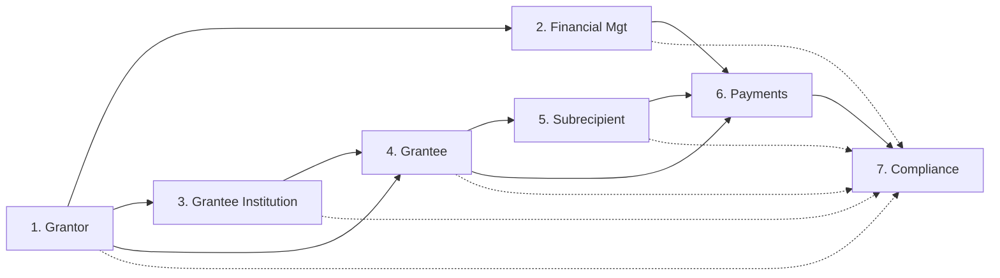

# Design Structure Matrix (DSM) - Domínios

Esta página documenta as dependências entre os domínios do sistema ConectaFAPES e a ordem de execução sugerida através de uma ordenação topológica.

## 1. Matriz de Estrutura de Design (DSM)

Na matriz abaixo, um **X** na intersecção da linha (Domínio Dependente) com a coluna (Fonte de Dependência) indica que o domínio da linha depende de informações ou processos do domínio da coluna.

| Domínios | 1 | 2 | 3 | 4 | 5 | 6 | 7 |
| :--- | :---: | :---: | :---: | :---: | :---: | :---: | :---: |
| **1. Grantor** | - | | | | | | |
| **2. Financial Management** | X | - | | | | | |
| **3. Grantee Institution** | X | | - | | | | |
| **4. Grantee** | X | | X | - | | | |
| **5. Subrecipient** | | | | X | - | | |
| **6. Payments** | | X | | X | X | - | |
| **7. Compliance** | X | X | X | X | X | X | - |

### Legenda:
- **X**: Dependência direta.
- **Linhas**: O que o domínio precisa para funcionar.
- **Colunas**: O que o domínio provê para os outros.

---

## 2. Lógica de Dependências

1.  **Grantor**: Base de tudo (Editais/FOA). Não possui dependências de outros domínios para sua definição estratégica inicial.
2.  **Financial Management**: Depende do **Grantor** para conhecer os programas, patrocinadores e limites orçamentários definidos nos editais.
3.  **Grantee Institution**: Depende do **Grantor** para a formalização do Award e aceite institucional.
4.  **Grantee**: Depende da **Grantee Institution** (entidade sede) e do **Grantor** (autoridade financiadora) para iniciar a gestão do projeto.
5.  **Subrecipient**: Depende do **Grantee** (Coordenador) para ser alocado na equipe e ter seu plano de trabalho definido.
6.  **Payments**: Depende do **Financial Management** (rubricas/contas), do **Grantee** (validação de marcos) and do **Subrecipient** (folha de pagamento de bolsas).
7.  **Compliance**: Domínio transversal que depende dos dados de execução de **todos** os outros para realizar auditoria e monitoramento (Gatekeeper).

---

## 3. Ordenação Topológica (Ordem de Execução)

Aplicando o algoritmo de ordenação topológica baseado nos in-degrees (número de dependências de entrada):

### Processo de Ordenação:
1.  **Grau 0**: Grantor (Entrada imediata).
2.  **Grau 1**: Financial Management, Grantee Institution (Dependem apenas do Grantor).
3.  **Grau 2**: Grantee (Depende de Grantor e Institution).
4.  **Grau 3**: Subrecipient (Depende de Grantee).
5.  **Grau 4**: Payments (Depende de Financial, Grantee e Subrecipient).
6.  **Grau 5**: Compliance (Consome dados de todos os anteriores para auditoria final).

### Ordem Final de Execução:

1.  **Grantor** (Planejamento)
2.  **Financial Management** & **Grantee Institution** (Estruturação)
3.  **Grantee** (Coordenação)
4.  **Subrecipient** (Execução Técnica)
5.  **Payments** (Fluxo Financeiro)
6.  **Compliance** (Encerramento/Auditoria)

---

## 4. Resumo de Funcionalidades por Domínio

| Domínio | Principais Funcionalidades / Módulos |
| :--- | :--- |
| **Grantor** | IAM (Login PRODEST), Gestão de Pessoas, Parâmetros Técnicos (CNPq), Modalidades de Bolsa, Planejamento Estratégico, Programas, Captação (Editais/Review Panels). |
| **Financial Mgt** | Gestão Contábil (Rubricas), Execução Financeira (Saldo Orçado x Pago), Gestão de UGs/Fontes, Planejamento Orçamentário. |
| **Institution** | Cadastro Institucional (IES/Empresas), Governança (Responsáveis Legais), Dashboards de Portfólio, Asset Management (Patrimônio). |
| **Grantee** | Submissão de Propostas (Pre-Award), Assinatura de Outorga (Post-Award), Gestão de Resultados/Metas, Remanejamento de Recursos, Gestão de Equipe, Lifecycle. |
| **Subrecipient** | My Grant (Aceite/Bolsa), Automated Onboarding (Conta Bancária), Envio de Frequências e Relatórios Técnicos. |
| **Payments** | Processamento de Marcos (Milestones), Automação de Folha de Bolsas, Intercâmbio Bancário (@-EDI), Conciliação e Compliance Bancário. |
| **Compliance** | BI e Inteligência, Dashboards de Transparência, Audit View (Prestação de Contas), Automated Validation (Plágio/Overlap de bolsas). |

---

## 5. Matrizes Funcionais (DSM por Fases)

Para permitir um desenvolvimento incremental e seguro, as funcionalidades foram agrupadas em matrizes de dependência por fase de entrega.

> [!NOTE]
> **Como ler a Ordem de Execução:**
> - `[A, B]`: Indica que as tarefas A e B são independentes entre si e podem ocorrer em **paralelo**.
> - `A → B`: Indica uma **dependência obrigatória**. B só pode iniciar após a conclusão de A.

### 5.1 Fase 1: Setup e Planejamento (Grantor & Financial Basis)
Nesta fase, as dependências são lineares e focadas em parametrização básica do ecossistema.

| Funcionalidades | G1 | G2 | G3 | F1 | F2 |
| :--- | :---: | :---: | :---: | :---: | :---: |
| **G1. IAM / Acesso Cidadão** | - | | | | |
| **G2. Parâmetros (Áreas/Cidades)** | | - | | | |
| **G3. Modalidades & Valores** | | | - | | |
| **F1. Plano de Contas / Rubricas** | | | X | - | |
| **F2. Fontes de Recurso / UGs** | | | | | - |

**Legenda:**

- **G1**: IAM / Acesso Segurança (Login PRODEST).
- **G2**: Parâmetros Gerais (Geolocalização e Áreas de Conhecimento).
- **G3**: Gestão de Modalidade (Regras de elegibilidade e níveis de bolsa).
- **F1**: Gestão Contábil (Plano de rubricas vinculadas a editais).
- **F2**: Unidades e Fontes (Cadastro de UGs e subcontas de fomento).

**Ordem**: G1 → G2 → G3 → F1 → F2.

### 5.2 Fase 2: Captação e Formalização (Pre-Award & Institution)
A instituição depende da definição do Grantor para hospedar o portfólio e formalizar parcerias.

| Funcionalidades | G.Pre | I.Reg | I.Gov | G.Post |
| :--- | :---: | :---: | :---: | :---: |
| **G.Pre: Editais & Templates** | - | | | |
| **I.Reg: Cadastro Institucional** | | - | | |
| **I.Gov: Responsáveis Legais** | | X | - | |
| **G.Post: Assinatura Award** | X | | X | - |

**Legenda:**

- **G.Pre**: Grantor Pre-Award (Criação de Editais e Templates de submissão).
- **I.Reg**: Institution Registry (Cadastro de IES/Empresas intervenientes).
- **I.Gov**: Institution Governance (Definição de Reitores e Chefias com poder de assinatura).
- **G.Post**: Grantee Post-Award (Assinatura do Termo de Outorga / Award Agreement).

**Ordem**: [G.Pre, I.Reg] → I.Gov → G.Post.

### 5.3 Fase 3: Operação e Execução (Grantee & Subrecipient)
O coração da execução técnica, onde as metas do projeto ditam a alocação de equipe.

| Funcionalidades | G.Res | G.Equ | S.MyG | S.Obl |
| :--- | :---: | :---: | :---: | :---: |
| **G.Res: Metas & Prazos** | - | | | |
| **G.Equ: Alocação de Bolsistas** | | - | | |
| **S.MyG: Implementação Bolsa** | | X | - | |
| **S.Obl: Relatórios Individuais** | X | | X | - |

**Legenda:**

- **G.Res**: Gestão de Resultados (Definição de metas, produtos e cronograma técnico).
- **G.Equ**: Gestão de Equipe (Solicitação e remanejo de bolsas no projeto).
- **S.MyG**: My Grant (Implementação da bolsa pelo bolsista: aceite de termos e conta bancária).
- **S.Obl**: Obrigações e Reporte (Envio de frequências e relatórios mensais de atividade).

**Ordem**: G.Res → G.Equ → S.MyG → S.Obl.

### 5.4 Fase 4: Fluxo Financeiro e Fechamento (Payments & Compliance)
A fase final que consome todos os dados transacionais para auditoria e prestação de contas.

| Funcionalidades | P.Mar | P.EDI | P.Rec | C.Aud | C.Val |
| :--- | :---: | :---: | :---: | :---: | :---: |
| **P.Mar: Liberação Parcelas** | - | | | | |
| **P.EDI: Remessa Bancária** | X | - | | | |
| **P.Rec: Conciliação/Extrato** | | X | - | | |
| **C.Aud: Análise Contas** | X | | X | - | |
| **C.Val: Rule Engine / Overlap** | | | | X | - |

**Legenda:**

- **P.Mar**: Gestão de Pagamentos (Processamento de marcos/milestones para liberação).

- **P.EDI**: Intercâmbio Bancário (Emissão de arquivos de remessa @-EDI).

- **P.Rec**: Bank Reconciliation (Leitura de retorno bancário e extratos em tempo real).

- **C.Aud**: Compliance Audit (Análise visual e cruzamento de metas vs resultados pagos).

- **C.Val**: Automated Validation (Rule engine para detecção de plágio e acúmulo de bolsas).

**Ordem**: P.Mar → P.EDI → P.Rec → C.Aud → C.Val.
