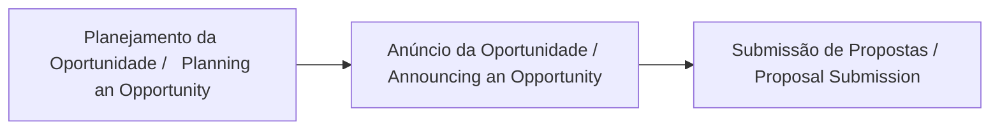
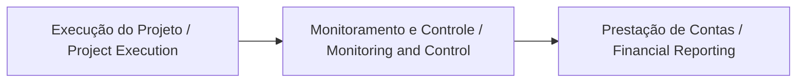

# Domain Overview

## 1. Overview

**Grant Management** (gestão de subsídios) é o processo de administração de recursos financeiros concedidos por financiadores — como governos, fundações ou agências de fomento — desde a **criação da oportunidade de financiamento até a execução e prestação de contas do projeto**. O ciclo de vida de um grant é normalmente dividido em **três fases principais**.

| Fase | Resumo | Entregáveis |
| :--- | :--- | :--- |
| **Pré-Concessão (Pre-Award)** | Planejamento da oportunidade, publicação de editais e submissão de propostas. | Edital (FOA) e Propostas de Projetos. |
| **Concessão (Award)** | Avaliação, seleção das propostas e formalização do financiamento. | Termo de Outorga / Contrato. |
| **Pós-Concessão (Post-Award)** | Execução do projeto, monitoramento e prestação de contas. | Relatórios de Progresso e Prestação de Contas. |

### 1.1 Pré-Concessão (Pre-Award)

A fase de **Pré-Concessão (Pre-Award)** compreende as etapas de **Planejamento da Oportunidade (Planning an Opportunity)**, **Anúncio da Oportunidade (Announcing an Opportunity)** e **Submissão de Propostas (Proposal Submission)**.

| Atividade | Resumo | Entregáveis |
| :--- | :--- | :--- |
| **Planejamento da Oportunidade** | Definição de prioridades estratégicas, orçamento e escopo do programa pela agência. | Plano de Trabalho Interno. |
| **Anúncio da Oportunidade** | Formalização e publicação oficial do edital ou chamada pública. | FOA (Funding Opportunity Announcement) / Edital. |
| **Submissão de Propostas** | Elaboração e envio dos projetos pelos candidatos (Applicants) via portal. | Propostas de Projetos. |

A **fase Pre-Award** corresponde ao período **antes da concessão do financiamento**, quando oportunidades são planejadas, publicadas e propostas são submetidas.

Na fase de **Planning an Opportunity**, a agência financiadora (**Grantor**) realiza o planejamento interno do programa de financiamento. Nesse momento são definidas as prioridades estratégicas da agência, o orçamento disponível e o escopo geral do programa. Essa etapa ocorre antes da publicação pública da oportunidade e prepara as bases para a criação do edital.

Em seguida ocorre **Announcing an Opportunity**, quando a agência formaliza e publica o **Funding Opportunity Announcement (FOA)** — conhecido no Brasil como **Edital ou Chamada Pública**. Esse documento oficial descreve a oportunidade de financiamento e apresenta informações essenciais, como objetivo do financiamento, critérios de elegibilidade, prazos, critérios de avaliação e valores disponíveis. A publicação do edital torna a oportunidade pública e inicia formalmente o processo de participação da comunidade científica ou institucional.

Após a divulgação do edital, inicia-se a etapa de **Submissão de Propostas**, na qual pesquisadores ou instituições (**Applicants**) elaboram e submetem suas propostas por meio de sistemas digitais, geralmente chamados de **Applicant Portal**. O objetivo é apresentar projetos alinhados aos critérios do edital e competitivos em relação às demais propostas submetidas.

Durante essas etapas do ciclo pré-award, diversos desafios podem surgir, como o uso de planilhas para gerenciar editais, dificuldade em acompanhar múltiplas oportunidades simultaneamente e erros ou atrasos na submissão das propostas.

Etapas da fase de pré-concessão (Pre-Award):

*   Planejamento da Oportunidade (Interno do Grantor)
*   Anúncio da Oportunidade (Divulgação oficial)
*   Publicação do Edital (FOA)
*   Submissão de Propostas (Participação dos candidatos)
*   Validação da Submissão (Checklist documental)
*   Avaliação das Propostas (Seleção técnica)

### 1.2 Concessão (Award)

A fase de **Concessão (Award)** compreende as etapas de **Notificação de Seleção**, **Negociação e Revisão** e **Formalização da Concessão**.

| Atividade | Resumo | Entregáveis |
| :--- | :--- | :--- |
| **Notificação de Seleção** | Comunicação oficial aos proponentes selecionados sobre a aprovação da proposta após o processo de avaliação. | Carta de Intenção / Notificação de Seleção. |
| **Negociação e Revisão** | Ajustes finais no escopo, cronograma e orçamento detalhado entre a agência e a instituição beneficiária. | Plano de Trabalho e Orçamento Final. |
| **Formalização da Concessão** | Assinatura do instrumento jurídico e emissão do aviso oficial de concessão de recursos. | Termo de Outorga / NoA (Notice of Award). |

Na fase de **concessão (award)** do ciclo de grant management, ocorre a formalização do financiamento após a seleção das propostas aprovadas. Nesse momento são realizadas atividades essenciais como a negociação dos termos e condições entre a agência financiadora e a instituição beneficiária, a definição detalhada do orçamento do projeto e a formalização do acordo por meio da assinatura de contratos ou instrumentos jurídicos equivalentes.

O objetivo principal dessa etapa é estabelecer de forma clara e formal as regras para a utilização dos recursos concedidos, definir as responsabilidades de cada parte envolvida, estruturar o cronograma de execução do projeto e determinar as obrigações relacionadas à prestação de contas técnica e financeira.

Entretanto, essa fase também apresenta desafios importantes. Entre os problemas mais comuns estão a categorização incorreta de despesas no orçamento, processos de aprovação complexos e a necessidade de atender a requisitos legais e financeiros rigorosos.

Etapas da fase de concessão (Award):

*   Avaliação das Propostas
*   Seleção das Propostas Aprovadas
*   Negociação de Termos e Condições
*   Definição de Responsabilidades e Regras de Uso dos Recursos
*   Definição das Obrigações de Prestação de Contas
*   Formalização do Acordo
*   Concessão do Grant (Award)

### 1.3 Pós-Concessão (Post-Award)

A fase de **Pós-Concessão (Post-Award)** compreende as etapas de **Execução do Projeto (Project Execution)**, **Monitoramento e Controle (Monitoring and Control)** e **Prestação de Contas (Financial Reporting)**.

| Atividade | Resumo | Entregáveis |
| :--- | :--- | :--- |
| **Execução do Projeto** | Realização das atividades previstas no projeto, rastreamento e controle das despesas, monitoramento contínuo do desempenho e progresso das metas estabelecidas. | Relatórios Técnicos e Financeiros. |
| **Monitoramento e Controle** | Avaliação contínua do desempenho do projeto, ajustes necessários e acompanhamento das despesas. | Relatórios de Monitoramento e Controle. |
| **Prestação de Contas** | Elaboração e submissão de relatórios financeiros e técnicos periódicos, auditoria e verificação de compliance. | Relatórios de Prestação de Contas. |

Na fase de **pós-concessão (post-award)** do ciclo de grant management ocorre a execução efetiva do projeto financiado. Nesse período são realizadas atividades fundamentais como a execução das atividades previstas no projeto, o rastreamento e controle das despesas realizadas, o monitoramento contínuo do desempenho e do progresso das metas estabelecidas, além da elaboração de relatórios técnicos e financeiros periódicos. Também fazem parte dessa etapa processos de auditoria e verificação de compliance, garantindo que todas as regras e condições estabelecidas no acordo de financiamento estejam sendo cumpridas.

O objetivo central dessa fase é assegurar que os recursos concedidos sejam utilizados de forma adequada, que os objetivos do projeto sejam efetivamente alcançados e que todas as exigências regulatórias sejam atendidas. Além disso, é necessário garantir uma prestação de contas clara e transparente para a agência financiadora. Caso as regras estabelecidas no grant não sejam cumpridas, pode ocorrer o **clawback**, que é a exigência de devolução parcial ou total dos recursos concedidos.

Entretanto, essa fase também apresenta desafios relevantes. Entre os problemas mais comuns estão controles financeiros insuficientes, relatórios incompletos ou inconsistentes, erros de faturamento ou categorização de despesas, conflitos de interesse e processos manuais que dificultam ou atrasam o cumprimento das exigências de compliance. 

Etapas da fase de pós-concessão (Post-Award):

*   Início da Execução do Projeto
*   Rastreamento e Controle de Despesas
*   Monitoramento de Desempenho
*   Elaboração de Relatórios Técnicos
*   Elaboração de Relatórios Financeiros
*   Auditoria e Verificação de Compliance
*   Prestação de Contas à Agência Financiadora
*   Conformidade com as Regras?
    *   Sim: Continuidade ou Encerramento do Grant
    *   Não: Ações Corretivas ou Clawback

## Papéis no Ecossistema de Grant Management

| Papel | Nível no Ecossistema | Definição | Exemplos | Responsabilidades Principais |
|------|----------------------|-----------|----------|-------------------------------|
| **Grantor** | Externo (Agência Financiadora) | Organização que financia e supervisiona programas de grants. | FAPES, CNPq, CAPES, agências governamentais, fundações | Planejar programas de financiamento, criar editais (FOA/RFP), avaliar propostas, aprovar awards, liberar recursos e monitorar resultados através do Grantor Portal. |
| **Grantee Institution** | Instituição Receptora | Organização que recebe o financiamento e administra o grant institucionalmente. | Universidades, institutos de pesquisa, empresas | Administrar projetos financiados, alocar recursos, garantir compliance institucional e apoiar execução e prestação de contas. |
| **Sponsored Programs Manager / Grants Officer** | Gestão Institucional Interna | Área ou profissional responsável por gerenciar grants dentro da instituição. | Coordenadorias de pesquisa, escritórios de projetos, programas de pós-graduação | Apoiar submissões de propostas, orientar pesquisadores, monitorar execução de múltiplos grants, gerar dashboards institucionais e garantir conformidade regulatória. |
| **Applicant / Principal Investigator (PI)** | Projeto Individual | Pesquisador ou coordenador responsável pela proposta e execução do projeto financiado. | Professores, pesquisadores, coordenadores de projetos | Elaborar e submeter propostas, liderar execução do projeto, gerenciar orçamento e equipe, produzir resultados e relatórios técnicos e financeiros. |
| **Subrecipient / Recipient (Bolsista ou Colaborador)** | Equipe do Projeto | Participante do projeto que recebe recursos ou bolsas vinculadas ao grant. | Alunos, bolsistas, pesquisadores associados, técnicos | Executar atividades específicas do projeto, apoiar entregas técnicas e relatórios sob supervisão do coordenador (PI). |
