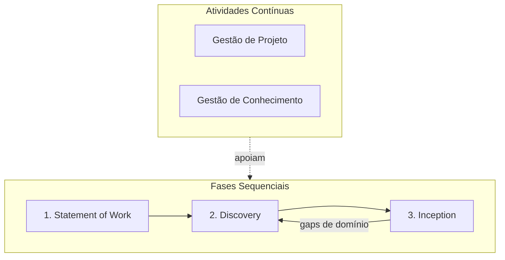

# Visão Geral do SDLC

O Ciclo de Vida de Desenvolvimento de Software (**SDLC**) do LEDS é baseado em metodologias ágeis e focado na entrega contínua de valor.

## Fases do Processo

As **fases sequenciais** avançam da esquerda para a direita. Discovery e Inception formam um **ciclo evolutivo e incremental** — a Inception pode revelar lacunas de entendimento que demandam uma nova rodada de Discovery, repetindo-se até que a equipe tenha confiança suficiente para iniciar o desenvolvimento.

As **atividades contínuas** correm em paralelo a todas as fases, do início ao fim do projeto.

### Fases Sequenciais

1. **Statement of Work (SOW)**: Responsável por apresentar uma visão de alto nível dos objetivos e entregas do projeto tanto para a equipe quanto para o cliente. O resultado dessa fase é o SOW (Statement of Work), contendo os objetivos do projeto, restrições e expectativas do cliente.

2. **Discovery**: Responsável por entender o problema a ser resolvido, buscando compreender o domínio do problema e verificando na literatura se existem documentos que descrevam o problema do cliente e soluções existentes. O resultado dessa fase é a base de conhecimento do projeto — Product Vision, Personas, Domínios de Referência, Dicionário de Termos, DSM, Benchmarking e o SOW Revisado. Pode ser retomado sempre que a Inception identificar gaps de entendimento.

3. **Inception**: Responsável por traduzir o entendimento do Discovery em decisões concretas sobre o que será construído. Define os produtos (módulos e funcionalidades), a arquitetura de referência, as decisões técnicas críticas e o roadmap de entregas. O resultado dessa fase é o backlog inicial priorizado, o Story Map, os ADRs fundamentais, o MVP e o Roadmap de Releases. Quando surgem dúvidas que o Discovery ainda não respondeu, um novo ciclo de Discovery é iniciado antes de prosseguir.

### Atividades Contínuas

**Gestão de Projeto**: Acompanhamento contínuo do progresso, riscos, cronograma e comunicação com stakeholders ao longo de todas as fases. Garante que o projeto avance dentro do escopo, prazo e custo acordados no SOW, ajustando o plano quando o ciclo Discovery ↔ Inception gera novas informações. Responsável: **Product Manager (PM)**.

**Gestão de Conhecimento**: Manutenção e evolução da base de conhecimento do projeto — glossário, domínios, personas, ADRs e demais artefatos gerados nas fases. Garante que o aprendizado acumulado esteja acessível, atualizado e consistente para toda a equipe a cada iteração do ciclo evolutivo. Responsável: **Product Owner (PO) Técnico**.

