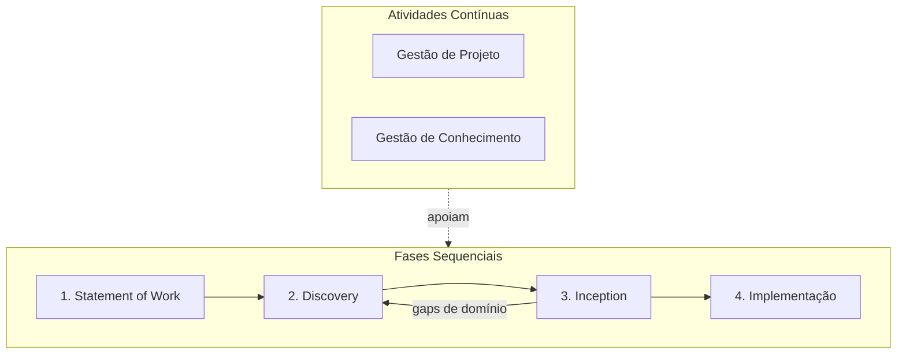

# Visão Geral do SDLC

O Ciclo de Vida de Desenvolvimento de Software (**SDLC**) do LEDS é baseado em metodologias ágeis e focado na entrega contínua de valor.

## Fases do Processo

As **fases sequenciais** avançam da esquerda para a direita. Discovery e Inception formam um **ciclo evolutivo e incremental** — a Inception pode revelar lacunas de entendimento que demandam uma nova rodada de Discovery, repetindo-se até que a equipe tenha confiança suficiente para iniciar o desenvolvimento.

As **atividades contínuas** correm em paralelo a todas as fases, do início ao fim do projeto.

### Fases Sequenciais

1. **Statement of Work (SOW)**: Responsável por apresentar uma visão de alto nível dos objetivos e entregas do projeto tanto para a equipe quanto para o cliente. O resultado dessa fase é o SOW (Statement of Work), contendo os objetivos do projeto, restrições e expectativas do cliente.

2. **Discovery**: Responsável por entender o problema a ser resolvido, buscando compreender o domínio do problema e verificando na literatura se existem documentos que descrevam o problema do cliente e soluções existentes. O resultado dessa fase é a base de conhecimento do projeto — Product Vision, Personas, Domínios de Referência, Dicionário de Termos, DSM, Benchmarking e o SOW Revisado. Pode ser retomado sempre que a Inception identificar gaps de entendimento.

3. **Inception**: Responsável por traduzir o entendimento do Discovery em decisões concretas sobre o que será construído. Define os produtos (módulos e funcionalidades), a arquitetura de referência, as decisões técnicas críticas e o roadmap de entregas. O resultado dessa fase é o backlog inicial priorizado, o Story Map, os ADRs fundamentais, o MVP e o Roadmap de Releases. Quando surgem dúvidas que o Discovery ainda não respondeu, um novo ciclo de Discovery é iniciado antes de prosseguir.

4. **Implementação**: Responsável por construir os produtos definidos na Inception em ciclos iterativos e incrementais (sprints). Cada sprint entrega incrementos funcionais validados pelo PO, seguindo o backlog priorizado, a arquitetura de referência e os critérios da Definition of Ready / Done.

### Atividades Contínuas

**Gestão de Projeto**: Acompanhamento contínuo do progresso, riscos, cronograma e comunicação com stakeholders ao longo de todas as fases. Garante que o projeto avance dentro do escopo, prazo e custo acordados no SOW, ajustando o plano quando o ciclo Discovery ↔ Inception gera novas informações. Responsável: **Product Manager (PM)**.

**Gestão de Conhecimento**: Manutenção e evolução da base de conhecimento do projeto — glossário, domínios, personas, ADRs e demais artefatos gerados nas fases. Garante que o aprendizado acumulado esteja acessível, atualizado e consistente para toda a equipe a cada iteração do ciclo evolutivo. Responsável: **Product Owner (PO) Técnico**.

---

## Papéis e Atribuições

| Papel | SOW | Discovery | Inception | Implementação | Gestão de Projeto | Gestão de Conhecimento |
|-------|:---:|:---------:|:---------:|:-------------:|:-----------------:|:----------------------:|
| Product Manager (PM) | Condutor | Participante | Participante | Participante | **Responsável** | — |
| Product Owner (PO) Técnico | Participante | **Condutor** | **Condutor** | **Condutor** | Participante | **Responsável** |
| Designer de UX de Produto | Participante | **Condutor** | Participante | Participante | — | Participante |
| Tech Lead | — | Participante | **Condutor** | **Condutor** | — | Participante |
| Equipe de Desenvolvimento | — | Participante | Participante | **Responsável** | Participante | Participante |

### Product Manager (PM)

Responsável por garantir que o projeto entregue valor dentro das restrições de escopo, prazo e custo.

- **SOW**: conduz a elaboração do documento com o cliente, definindo objetivos SMART, restrições e entregas.
- **Discovery**: acompanha o progresso e garante que o foco do Discovery esteja alinhado aos objetivos do SOW.
- **Inception**: valida que o backlog e o roadmap estejam coerentes com o SOW Revisado e as expectativas do cliente.
- **Implementação**: acompanha o progresso das sprints, valida que as entregas estejam alinhadas ao escopo do SOW e ao roadmap; comunica avanços e ajustes ao cliente.
- **Gestão de Projeto** *(contínua)*: monitora progresso, gerencia riscos, comunica status aos stakeholders e ajusta o plano quando o ciclo Discovery ↔ Inception gera novas informações.

### Product Owner (PO) Técnico

Responsável por conectar o entendimento do domínio às decisões de produto, com olhar técnico sobre viabilidade e arquitetura.

- **Discovery**: conduz a investigação do domínio com foco em entender como e qual tecnologia poderia atender às necessidades do cliente; produz e mantém os artefatos da base de conhecimento (Product Vision, Domínios de Referência, DSM).
- **Inception**: conduz a priorização do backlog e a definição do MVP, garantindo que as capacidades do Discovery se traduzam em features coerentes; valida o Story Map junto ao Designer e ao Tech Lead.
- **Implementação**: conduz as cerimônias ágeis (planning, review, retrospectiva); refina e prioriza o backlog sprint a sprint; aceita ou rejeita os incrementos entregues pela equipe com base nos critérios da Definition of Done.
- **Gestão de Conhecimento** *(contínua)*: mantém o glossário, os domínios de referência, os ADRs e os demais artefatos atualizados e consistentes a cada iteração do ciclo evolutivo.

### Designer de UX de Produto

Responsável por representar a perspectiva do usuário sem viés técnico, garantindo que a solução resolva o problema real.

- **Discovery**: conduz a investigação da jornada do usuário — mapeia dores, comportamentos e necessidades reais; produz e mantém as Personas e o Mapa de Empatia; complementa o olhar técnico do PO com foco em experiência.
- **Inception**: constrói o Story Map em colaboração com o PO Técnico, organizando as features pelas jornadas das Personas; contribui na definição da Definition of Ready com critérios de UX.
- **Implementação**: valida protótipos e fluxos de tela junto à equipe de desenvolvimento; garante que as interfaces implementadas estejam aderentes ao design e à experiência esperada pelo usuário.

### Tech Lead

Responsável pelas decisões técnicas e pela viabilidade da arquitetura proposta.

- **Discovery**: apoia na compreensão de integrações, restrições tecnológicas e domínios de referência técnica que influenciam a solução.
- **Inception**: conduz a definição da Arquitetura de Referência e a elaboração dos ADRs; avalia dependências entre módulos (a partir da DSM) para validar a ordem de entrega do roadmap.
- **Implementação**: conduz as decisões técnicas do dia a dia — revisão de código, resolução de dívidas técnicas, orientação à equipe sobre padrões e arquitetura definidos nos ADRs.
- **Gestão de Conhecimento** *(participante)*: garante que os ADRs e a documentação técnica reflitam as decisões reais tomadas ao longo do projeto.

### Equipe de Desenvolvimento

Responsável pela implementação das soluções definidas nas fases anteriores. Composta por desenvolvedores frontend, backend e/ou fullstack.

- **Discovery**: participa de sessões de leitura dos domínios de referência para construir entendimento do negócio antes de começar a desenvolver; pode contribuir identificando restrições técnicas de implementação.
- **Inception**: participa ativamente da estimativa das features do backlog, da construção da Definition of Ready / Done e das discussões de arquitetura — garantindo que as decisões sejam viáveis para quem vai implementar.
- **Implementação**: **responsável** pela construção dos incrementos de software; executa as histórias do backlog seguindo os padrões arquiteturais, escreve testes automatizados e entrega incrementos funcionais a cada sprint.
- **Gestão de Projeto** *(participante)*: reporta progresso nas cerimônias ágeis, sinaliza impedimentos e colabora na atualização do status das entregas.
- **Gestão de Conhecimento** *(participante)*: mantém a documentação técnica dos módulos atualizada (READMEs, modelos estruturais, regras de negócio implementadas) à medida que o desenvolvimento avança.

