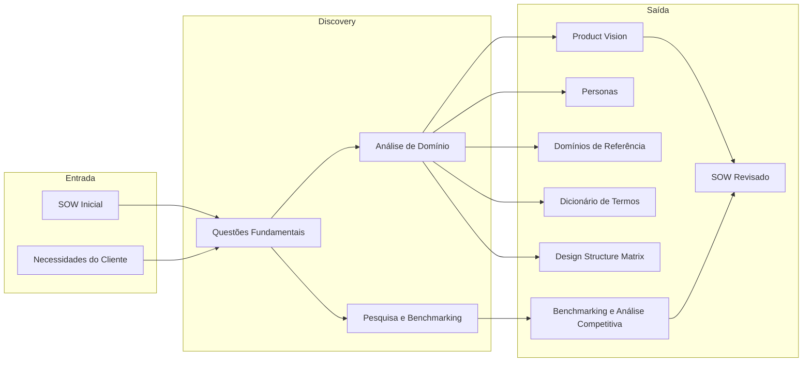
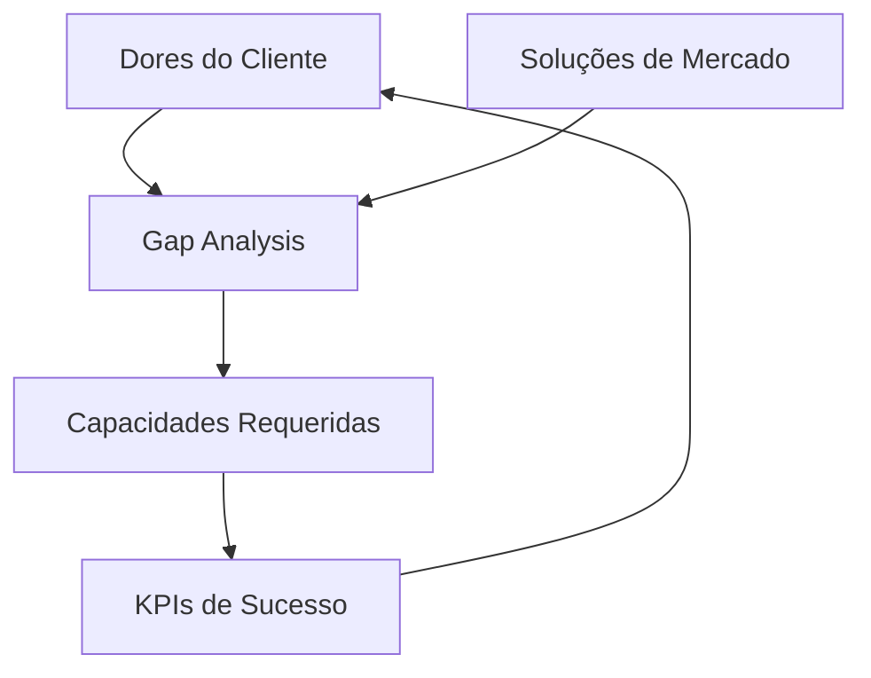

# Discovery

Responsável por entender o problema a ser resolvido, buscando compreender o domínio do problema e verificando na literatura se existem documentos que descrevam o problema do cliente e soluções existentes. O resultado dessa fase é o complemento do SOW, contendo o entendimento do problema, a revisão do SOW e as soluções existentes. Essa fase é mais densa e pode levar mais tempo dependendo do projeto.

Além do complemento do SOW, essa etapa gera uma **base de conhecimento** que será utilizada nas próximas etapas do processo e pode ser usada para treinar a equipe de desenvolvimento nos conceitos, domínios e jargões do projeto.

O **Product Owner (PO) Técnico** e o **Designer de UX de Produto** são os principais responsáveis por conduzir esta fase, garantindo o alinhamento entre as expectativas do cliente e o entendimento real do problema. O **Product Owner (PO) Técnico** tem um olhar técnico, focado em entender como e qual tecnologia poderia atender as necessidades do cliente enquanto o **Designer de UX de Produto** foca em entender e jornada do usuário e os problemas do cliente sem o viés técnico. 

## Questões Fundamentais do Discovery

* **Qual o domínio do problema e em qual categoria ele se encaixa?** Entender o domínio permite dominar conceitos, jargões e informações relevantes.
    * *Exemplo*: Se o projeto é sobre gestão de inventário, o domínio é "Logística/Patrimônio" e a categoria é "Gestão de Ativos".

* **Quais os benefícios que se esperam ao resolver esse problema?** O que a literatura ou soluções similares dizem sobre os ganhos obtidos?
    * *Exemplo*: Redução de 30% no extravio de peças e economia de 5 horas semanais em auditoria manual.

> [!TIP]
> Os benefícios identificados podem (e devem) ser usados como indicadores de sucesso (KPIs) do projeto. Eles serão formalizados no artefato de [Benchmarking e Análise Competitiva](#benchmarking-e-análise-competitiva).

* **Qual o público-alvo do projeto?** Identificar quem sentirá o impacto da solução e quais suas características.

    **Questões para ajudar na descoberta:**

    1. Quem são os usuários finais que interagem com o problema diariamente?
    2. Quais são as suas principais "dores" ou frustrações atuais?
    3. Qual o nível de afinidade tecnológica desse público? (Para definir a complexidade da interface).
    4. Em qual ambiente (escritório, campo, laboratório) a solução será mais utilizada?

    **Exemplo Prático (Sistema de Inventário):**

    *   **Usuários**: Alunos bolsistas do LEDS (nativos digitais, usam mobile e desktop) e Coordenadores (focam em relatórios gerenciais).
    *   **Dores**: Dificuldade em saber se um componente está disponível sem ir fisicamente ao laboratório.

* **Já existem soluções (comerciais ou acadêmicas) que resolvem este problema ou parte dele?** Essa investigação alimenta o artefato de [Benchmarking e Análise Competitiva](#benchmarking-e-análise-competitiva).

* **Quais dados qualitativos e quantitativos precisamos coletar diretamente com os envolvidos?** (Entrevistas e Questionários).

* **Quem são as pessoas reais por trás dos dados e quais seus comportamentos?** (Personas e Mapa de Empatia).

## Visão Geral do Processo



- **Entradas**: SOW inicial (visão de alto nível) e necessidades brutas do cliente.
- **Análise de Domínio** gera: Product Vision, Personas, Domínios de Referência, Dicionário de Termos e DSM.
- **Pesquisa e Benchmarking** gera: Benchmarking e Análise Competitiva (dores, soluções de mercado, KPIs, gaps).
- **SOW Revisado** consolida os achados da análise de domínio e do benchmarking.

## Artefatos Gerados

A fase de Discovery produz os seguintes artefatos, que formam a base para todas as etapas seguintes do processo:

| Artefato | O que faz | Template |
|----------|-----------|---------|
| **Product Vision** | Consolida propósito do produto, mapa de domínios com módulos, regras de negócio transversais e fundamentação legal | [product-vision.md](../modelos/discovery/product-vision.md) |
| **Personas** | Cataloga os atores do sistema com rastreabilidade por domínio e módulo | [personas.md](../modelos/discovery/personas.md) |
| **Domínios de Referência** | Detalha cada domínio com funcionalidades numeradas, persona responsável e fundamentação legal | [domains/NN-dominio-exemplo.md](../modelos/discovery/domains/NN-dominio-exemplo.md) |
| **Dicionário de Termos** | Padroniza a linguagem com seções temáticas indexadas e rastreabilidade para a fonte canônica | [glossario.md](../modelos/discovery/glossario.md) |
| **Design Structure Matrix (DSM)** | Mapeia dependências entre domínios, orientando a ordem de desenvolvimento | [dsm.md](../modelos/knowledge/dsm.md) |
| **Benchmarking e Análise Competitiva** | Identifica dores do cliente, soluções de mercado, KPIs de sucesso e capacidades requeridas | [benchmarking_template.md](../modelos/benchmarking_template.md) |
| **SOW Revisado** | Atualiza o Statement of Work com o entendimento adquirido no Discovery | [sow_template.md](../modelos/sow_template.md) |

> [!TIP]
> Os templates dos artefatos estão em [`docs/modelos/discovery/`](../modelos/discovery/). Cada projeto deve gerar seus próprios arquivos seguindo esses formatos, adaptando os placeholders `{...}` para o contexto específico.

Os artefatos de Product Vision, Personas, Domínios de Referência, Dicionário de Termos e DSM compõem a **Base de Conhecimento** do projeto — documentação que treina a equipe nos conceitos, domínios e jargões do projeto.

---

### Product Vision

Documento central que consolida o propósito do produto, o mapa de domínios com os módulos que os implementam, as regras de negócio transversais e a fundamentação legal. Serve como ponto de partida para toda a equipe e referência de navegação para os demais artefatos da base de conhecimento. Template: **[Product Vision](../modelos/discovery/product-vision.md)**

O arquivo segue a estrutura:

- **Propósito**: descrição do problema que o sistema resolve e do seu objetivo central.
- **Referências rápidas**: links para `personas.md` e `glossario.md`.
- **Mapa de Domínios**: tabela numerada (`# / Domínio / Descrição / Módulos`) com link para cada arquivo `domains/NN-nome.md`.
- **Regras de Negócio Transversais**: regras que atravessam múltiplos domínios e não pertencem exclusivamente a nenhum.
- **Fundamentação Legal**: tabela `Artigo / Tema / Domínios Relacionados` referenciando a legislação base do projeto.

*Exemplo — Mapa de Domínios:*

| # | Domínio | Descrição | Módulos |
|---|---------|-----------|---------|
| 01 | [Corporativo e Administrativo](domains/01-corporativo.md) | Identidades, cadastros mestres e estrutura organizacional | M001, M005, M008 |
| 02 | [Planejamento e Estratégia](domains/02-planejamento.md) | Plano estratégico, parcerias e programas de fomento | M010 |
| 03 | [Fomento Pre-Award](domains/03-fomento-pre-award.md) | Captação, seleção e contratação de iniciativas | M011 |

### Personas

Catálogo dos atores do sistema, estruturado em duas camadas: uma **tabela de rastreabilidade** que cruza Persona × Domínios onde atua × Módulos principais, e **agrupamentos temáticos** que descrevem cada persona com suas responsabilidades. Template: **[Personas](../modelos/discovery/personas.md)**

Cada persona é definida uma única vez neste artefato e apenas referenciada nas tabelas de funcionalidades dos Domínios de Referência — eliminando duplicação de descrições.

*Exemplo — Tabela de Rastreabilidade:*

| Persona | Domínios onde atua | Módulos principais |
|---------|--------------------|--------------------|
| Coordenador | 03 (submissão), 04 (execução, prestação de contas) | M003, M009, M012 |
| Bolsista | 04 (bolsas, plano de trabalho) | M009 |
| Analista | 04 (gestão de projetos), 05 (pagamentos) | M004, M009 |

*Agrupamentos sugeridos:* Usuários Externos (proponentes, beneficiários), Instituições (dirigentes, unidades), Operadores Internos (analistas, áreas técnicas), Órgãos de Controle e Avaliadores Externos.

### Domínios de Referência

Catálogo de domínios do sistema. Cada domínio é descrito em um arquivo nomeado `NN-nome-do-dominio.md` (ex.: `01-corporativo.md`, `03-fomento-pre-award.md`), mantido na pasta `domains/` ao lado do `product-vision.md`. Template: **[NN-dominio-exemplo.md](../modelos/discovery/domains/NN-dominio-exemplo.md)**

Cada arquivo de domínio segue a estrutura:

- **Cabeçalho**: título `Domain NN — Nome`, descrição resumida e lista de módulos que o implementam (`**Módulos que implementam este domain:** MXxx, MYyy`).
- **Link para o glossário**: referência ao `glossario.md` para consulta de termos.
- **Subseções numeradas hierarquicamente** (`N.1`, `N.2`, …), cada uma descrevendo uma capacidade do domínio com parágrafo introdutório e, quando relevante, ciclo de vida (estados e transições) da entidade principal.
- **Tabela de funcionalidades** em cada subseção com as colunas: `# / Funcionalidade / Descrição / Persona / Fundamentação Legal`.

*Exemplo — cabeçalho e tabela de funcionalidades:*

```
# Domain 03 — Fomento Pre-Award (Captação e Seleção)

Fluxo desde a publicação do edital até a contratação da iniciativa.
Glossário dos conceitos centrais em [../glossario.md](../glossario.md).

**Módulos que implementam este domain:** M011, M002

## 3.1 Configuração da Captação

| # | Funcionalidade | Descrição | Persona | Fundamentação Legal |
|---|---------------|-----------|---------|---------------------|
| 3.1.1 | Criar Captação | Configurar nova captação definindo tipo, período e valor aportado | Analista | Art. 15, I |
```

### Dicionário de Termos

Glossário centralizado estruturado em **seções temáticas numeradas** (ex.: Personas, Instrumentos de Fomento, Vigência e Aditivos, Organizações, Enumerações Principais). Cada entrada inclui o termo, sua definição concisa e um campo **Definido em** que aponta para a fonte canônica (módulo, domínio ou ADR). Template: **[Glossário](../modelos/discovery/glossario.md)**

Regra de ouro: este arquivo **define e linka**, não reformula o conteúdo das fontes. Ao introduzir um novo conceito em um módulo, adiciona-se a entrada aqui com link canônico — nunca duplicando regras de negócio.

*Exemplo — seção temática:*

| Termo | Definição | Definido em |
| :--- | :--- | :--- |
| **Edital** | Documento público que formaliza uma Captação, com regras, cronograma e requisitos | [Domain 03](domains/03-nome.md) |
| **Projeto Contratado** | Iniciativa aprovada, formalizada por Termo de Outorga, em execução | [M003](../../implementation/modules/M003/README.md) |
| **Termo de Outorga** | Instrumento formal de fomento assinado pelo Coordenador | [M003](../../implementation/modules/M003/README.md) |

### Design Structure Matrix (DSM)

Matriz de modelagem de dependências que analisa as relações estruturais e a complexidade entre os domínios identificados. Template: **[DSM](../modelos/knowledge/dsm.md)**

O **DSM** é uma ferramenta para modelar e analisar dependências dentro de um domínio. Originado por Don Steward em 1981, o DSM permite mapear como os componentes de um sistema se relacionam entre si.

Principais características:

- **Análise de Dependência**: Útil para entender como a mudança em um componente impacta outros (propagação de mudanças).
- **Tipos de DSM**: Podem ser **binários** (indicam apenas a existência de relação) ou **numéricos** (atribuem um peso à força da relação).
- **Direcionamento**: Podem ser direcionados ou não direcionados.
- **Não Reflexivo**: Uma relação de um elemento com ele mesmo não é permitida.

*Exemplo*:

| Domínios | Grantor | Financial | Grantee Inst. | Grantee | Subrecipient | Payments |
| :--- | :---: | :---: | :---: | :---: | :---: | :---: |
| **Financial** | X | - | | | | |
| **Grantee Inst.** | X | | - | | | |
| **Grantee** | X | | X | - | | |
| **Subrecipient** | | | | X | - | |
| **Payments** | | X | | X | X | - |
| **Compliance** | X | X | X | X | X | X |

> Leitura: um **X** na linha indica que o domínio depende do domínio da coluna. Grantor é a base (sem dependências). Compliance depende de todos.

### Benchmarking e Análise Competitiva

Artefato que mapeia o cenário atual do problema — as dores do cliente, as soluções de mercado, os indicadores de sucesso e as capacidades que o sistema deve oferecer. Conecta o "por quê" (dores) ao "o quê" (capacidades), passando pelo "como medir" (KPIs) e pelo "o que já existe" (mercado). Template: **[Benchmarking e Análise Competitiva](../modelos/benchmarking_template.md)**

*Exemplo — Mapa de Dores:*

| # | Dor | Impacto | Frequência | Quem sofre |
| :--- | :--- | :---: | :---: | :--- |
| D1 | Não há visibilidade do status de pagamento de bolsas | Alto | Diária | Bolsistas, Coordenadores |
| D2 | Prestação de contas feita manualmente em planilhas | Alto | Mensal | Coordenadores, FAPES |
| D3 | Impossível saber em tempo real o saldo disponível do projeto | Médio | Semanal | Coordenadores |

*Exemplo — Matriz de Benchmarking:*

| Capacidade / Produto | Produto A | Produto B | Produto C | Nosso Sistema |
| :--- | :---: | :---: | :---: | :---: |
| Gestão de editais (FOA) | Parcial | Sim | Não | **Previsto** |
| Acompanhamento de pagamentos | Sim | Não | Parcial | **Previsto** |
| Prestação de contas digital | Não | Parcial | Sim | **Previsto** |
| Integração bancária (EDI) | Não | Não | Não | **Previsto** |

*Exemplo — KPIs de Sucesso:*

| KPI | Dor | Meta | Como medir |
| :--- | :---: | :--- | :--- |
| Tempo médio de prestação de contas | D2 | De 5 dias para 1 dia | Tempo entre abertura e envio do relatório |
| % de bolsistas com visibilidade de pagamento | D1 | 100% | Acesso ao status no portal |
| Tempo para consultar saldo do projeto | D3 | < 5 segundos | Tempo de resposta do dashboard |

*Exemplo — Gap Analysis:*

| Lacuna | Dor | Mercado | Capacidade requerida |
| :--- | :---: | :--- | :--- |
| Nenhum produto integra pagamento via EDI bancário | D1 | Nenhum resolve | Gateway de pagamento com integração EDI |
| Prestação de contas exige exportação manual | D2 | Produto C resolve parcialmente | Prestação de contas digital com validação automática |
| Não há dashboard unificado por perfil | D3 | Produtos A e B têm dashboards isolados | Dashboard com visões por papel |



> O ciclo se retroalimenta: as capacidades implementadas são validadas pelos KPIs, que medem se as dores foram de fato resolvidas.

### SOW Revisado

Documento que atualiza o Statement of Work original com o entendimento adquirido durante o Discovery — incluindo os domínios mapeados, as dores identificadas, os KPIs de sucesso e as capacidades requeridas. Template: **[SOW (Statement of Work)](../modelos/sow_template.md)**

## Referências

- [Design Structure Matrix (DSM)](https://dsmweb.org/) — Ferramenta de modelagem de dependências entre componentes de um sistema.
- [Value Proposition Canvas](https://www.strategyzer.com/library/the-value-proposition-canvas) — Framework para mapear dores do cliente e proposta de valor.
- [Benchmarking: A Method for Continuous Quality Improvement](https://doi.org/10.1108/09526869510089849) — Fundamentos de análise competitiva e benchmarking.
- [Domain-Driven Design (Eric Evans)](https://www.domainlanguage.com/ddd/) — Abordagem para modelagem de domínios complexos e linguagem ubíqua.
