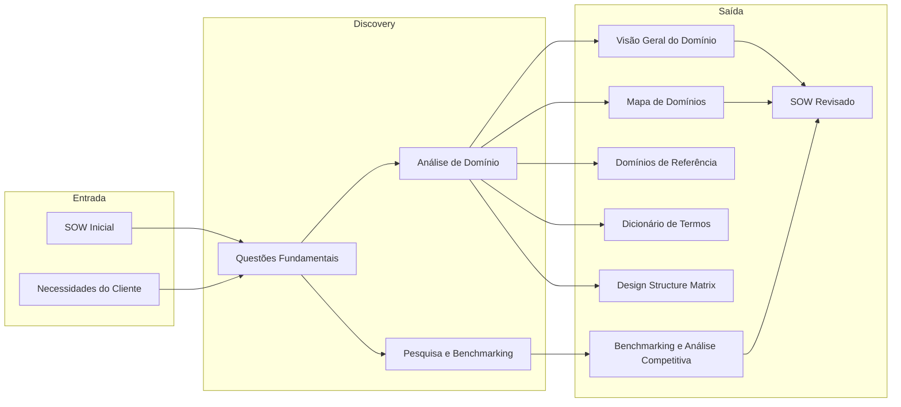
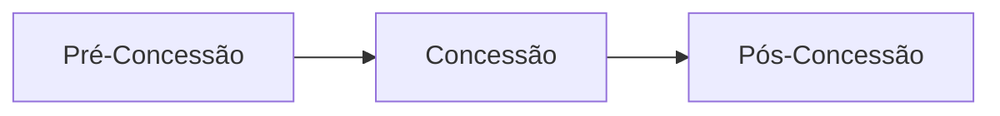
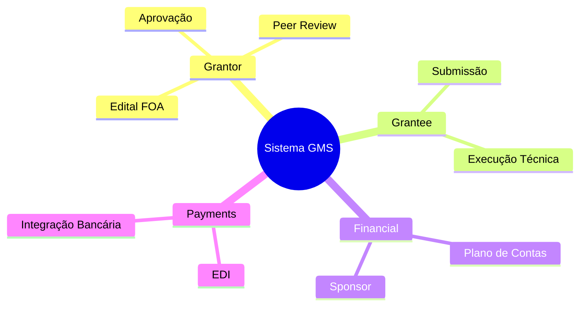
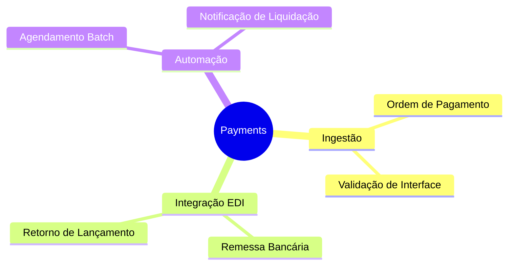
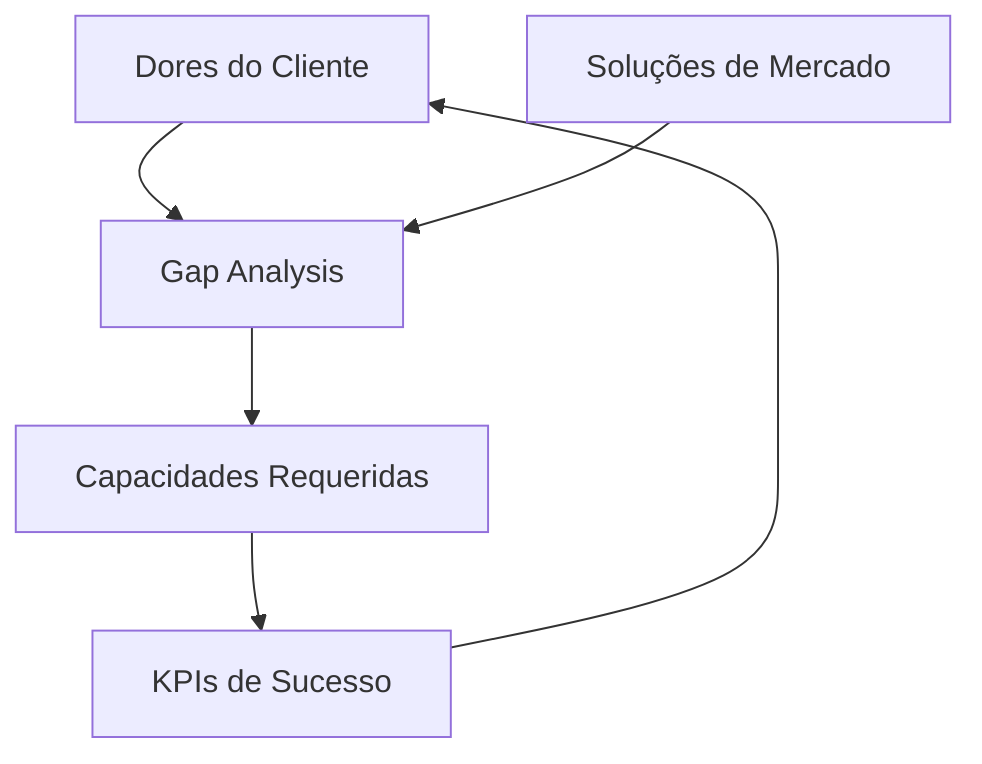

# Discovery

Responsável por entender o problema a ser resolvido, buscando compreender o domínio do problema e verificando na literatura se existem documentos que descrevam o problema do cliente e soluções existentes. O resultado dessa fase é o complemento do SOW, contendo o entendimento do problema, a revisão do SOW e as soluções existentes. Essa fase é mais densa e pode levar mais tempo dependendo do projeto.

Além do complemento do SOW, essa etapa gera uma **base de conhecimento** que será utilizada nas próximas etapas do processo e pode ser usada para treinar a equipe de desenvolvimento nos conceitos, domínios e jargões do projeto.

O **Product Owner (PO) Técnico** e o **Designer de UX de Produto** são os principais responsáveis por conduzir esta fase, garantindo o alinhamento entre as expectativas do cliente e o entendimento real do problema. O **Product Owner (PO) Técnico** tem um olhar técnico, focado em entender como e qual tecnologia poderia atender as necessidades do cliente enquanto o **Designer de UX de Produto** foca em entender e jornada do usuário e os problemas do cliente sem o viés técnico. 

## Questões Fundamentais do Discovery

* **Qual o domínio do problema e em qual categoria ele se encaixa?** Entender o domínio permite dominar conceitos, jargões e informações relevantes.
    * *Exemplo*: Se o projeto é sobre gestão de inventário, o domínio é "Logística/Patrimônio" e a categoria é "Gestão de Ativos".

* **Quais os benefícios que se esperam ao resolver esse problema?** O que a literatura ou soluções similares dizem sobre os ganhos obtidos?
    * *Exemplo*: Redução de 30% no extravio de peças e economia de 5 horas semanais em auditoria manual.

> [!TIP]
> Os benefícios identificados podem (e devem) ser usados como indicadores de sucesso (KPIs) do projeto. Eles serão formalizados no artefato de [Benchmarking e Análise Competitiva](#benchmarking-e-análise-competitiva).

* **Qual o público-alvo do projeto?** Identificar quem sentirá o impacto da solução e quais suas características.

    **Questões para ajudar na descoberta:**

    1. Quem são os usuários finais que interagem com o problema diariamente?
    2. Quais são as suas principais "dores" ou frustrações atuais?
    3. Qual o nível de afinidade tecnológica desse público? (Para definir a complexidade da interface).
    4. Em qual ambiente (escritório, campo, laboratório) a solução será mais utilizada?

    **Exemplo Prático (Sistema de Inventário):**

    *   **Usuários**: Alunos bolsistas do LEDS (nativos digitais, usam mobile e desktop) e Coordenadores (focam em relatórios gerenciais).
    *   **Dores**: Dificuldade em saber se um componente está disponível sem ir fisicamente ao laboratório.

* **Já existem soluções (comerciais ou acadêmicas) que resolvem este problema ou parte dele?** Essa investigação alimenta o artefato de [Benchmarking e Análise Competitiva](#benchmarking-e-análise-competitiva).

* **Quais dados qualitativos e quantitativos precisamos coletar diretamente com os envolvidos?** (Entrevistas e Questionários).

* **Quem são as pessoas reais por trás dos dados e quais seus comportamentos?** (Personas e Mapa de Empatia).

## Visão Geral do Processo

- **Entradas**: SOW inicial (visão de alto nível) e necessidades brutas do cliente.
- **Análise de Domínio** gera: Visão Geral, Mapa de Domínios, Domínios de Referência, Dicionário de Termos e DSM.
- **Pesquisa e Benchmarking** gera: Benchmarking e Análise Competitiva (dores, soluções de mercado, KPIs, gaps).
- **SOW Revisado** consolida os achados da análise de domínio e do benchmarking.

## Artefatos Gerados

A fase de Discovery produz os seguintes artefatos, que formam a base para todas as etapas seguintes do processo:

| Artefato | O que faz |
|----------|-----------|
| **Visão Geral da Base de Conhecimento** | Contextualiza o domínio de negócio, estabelecendo os fundamentos que a equipe precisa dominar |
| **Mapa de Domínios** | Visualiza as fronteiras e interações entre os subdomínios do produto |
| **Domínios de Referência** | Detalha cada domínio com conceitos, regras de negócio e responsabilidades |
| **Dicionário de Termos** | Padroniza a linguagem entre equipe técnica e stakeholders |
| **Design Structure Matrix (DSM)** | Mapeia dependências entre domínios, orientando a ordem de desenvolvimento |
| **Benchmarking e Análise Competitiva** | Identifica dores do cliente, soluções de mercado, KPIs de sucesso e capacidades requeridas |
| **SOW Revisado** | Atualiza o Statement of Work com o entendimento adquirido no Discovery |

Os artefatos de Visão Geral, Mapa de Domínios, Domínios de Referência, Dicionário de Termos e DSM compõem a **Base de Conhecimento** do projeto — documentação que treina a equipe nos conceitos, domínios e jargões do projeto.

---

### Visão Geral da Base de Conhecimento

Documento central que contextualiza o domínio de negócio do projeto, estabelecendo os fundamentos para o entendimento da equipe. Template: **[Visão Geral](../modelos/knowledge/overview.md)**

*Exemplo*: Para um sistema de gestão de fomento, a visão geral descreve o ciclo de vida de um grant, os papéis envolvidos e os entregáveis de cada fase:

| Fase | Resumo | Entregáveis |
| :--- | :--- | :--- |
| **Pré-Concessão** | Planejamento, publicação de editais e submissão de propostas | Edital (FOA) e Propostas |
| **Concessão** | Avaliação, seleção e formalização do financiamento | Termo de Outorga |
| **Pós-Concessão** | Execução, monitoramento e prestação de contas | Relatórios de Progresso |

### Mapa de Domínios

Visualização estratégica que delimita as fronteiras e interações entre os diferentes subdomínios mapeados. Template: **[Mapa de Domínios](../modelos/knowledge/domain-map.md)**

*Exemplo*:

### Domínios de Referência

Catálogo de detalhamento técnico e de negócio para áreas específicas (ex: [Pagamentos](../modelos/knowledge/domains/payments.md), [Compliance](../modelos/knowledge/domains/compliance.md), [Gestão Financeira](../modelos/knowledge/domains/financial-management.md)), que servem como guia para o desenvolvimento e treinamento.

*Exemplo*: O documento do domínio de Pagamentos detalha a estrutura e responsabilidades da área:

### Dicionário de Termos

Glossário padronizado com jargões e conceitos fundamentais, garantindo uma linguagem onipresente entre stakeholders e a equipe técnica. Template: **[Dicionário de Termos](../modelos/knowledge/dictionary.md)**

*Exemplo*:

| Termo | Definição |
| :--- | :--- |
| **Applicant** | Proponente que submete propostas para financiamento |
| **Grantor** | Concedente/agência que aloca e supervisiona fundos |
| **Grantee** | Receptor principal que recebe o award e executa o projeto |
| **Subrecipient** | Sub-receptor que recebe subaward para parte específica do projeto |
| **FOA/RFP** | Funding Opportunity Announcement — documento que anuncia oportunidades de financiamento (ex: "Edital FAPES Nº 13/2025") |
| **Coordenador** | Líder responsável pelo projeto aprovado (mapeia para Grantee) |

### Design Structure Matrix (DSM)

Matriz de modelagem de dependências que analisa as relações estruturais e a complexidade entre os domínios identificados. Template: **[DSM](../modelos/knowledge/dsm.md)**

O **DSM** é uma ferramenta para modelar e analisar dependências dentro de um domínio. Originado por Don Steward em 1981, o DSM permite mapear como os componentes de um sistema se relacionam entre si.

Principais características:

- **Análise de Dependência**: Útil para entender como a mudança em um componente impacta outros (propagação de mudanças).
- **Tipos de DSM**: Podem ser **binários** (indicam apenas a existência de relação) ou **numéricos** (atribuem um peso à força da relação).
- **Direcionamento**: Podem ser direcionados ou não direcionados.
- **Não Reflexivo**: Uma relação de um elemento com ele mesmo não é permitida.

*Exemplo*:

| Domínios | Grantor | Financial | Grantee Inst. | Grantee | Subrecipient | Payments |
| :--- | :---: | :---: | :---: | :---: | :---: | :---: |
| **Financial** | X | - | | | | |
| **Grantee Inst.** | X | | - | | | |
| **Grantee** | X | | X | - | | |
| **Subrecipient** | | | | X | - | |
| **Payments** | | X | | X | X | - |
| **Compliance** | X | X | X | X | X | X |

> Leitura: um **X** na linha indica que o domínio depende do domínio da coluna. Grantor é a base (sem dependências). Compliance depende de todos.

### Benchmarking e Análise Competitiva

Artefato que mapeia o cenário atual do problema — as dores do cliente, as soluções de mercado, os indicadores de sucesso e as capacidades que o sistema deve oferecer. Conecta o "por quê" (dores) ao "o quê" (capacidades), passando pelo "como medir" (KPIs) e pelo "o que já existe" (mercado). Template: **[Benchmarking e Análise Competitiva](../modelos/benchmarking_template.md)**

*Exemplo — Mapa de Dores:*

| # | Dor | Impacto | Frequência | Quem sofre |
| :--- | :--- | :---: | :---: | :--- |
| D1 | Não há visibilidade do status de pagamento de bolsas | Alto | Diária | Bolsistas, Coordenadores |
| D2 | Prestação de contas feita manualmente em planilhas | Alto | Mensal | Coordenadores, FAPES |
| D3 | Impossível saber em tempo real o saldo disponível do projeto | Médio | Semanal | Coordenadores |

*Exemplo — Matriz de Benchmarking:*

| Capacidade / Produto | Produto A | Produto B | Produto C | Nosso Sistema |
| :--- | :---: | :---: | :---: | :---: |
| Gestão de editais (FOA) | Parcial | Sim | Não | **Previsto** |
| Acompanhamento de pagamentos | Sim | Não | Parcial | **Previsto** |
| Prestação de contas digital | Não | Parcial | Sim | **Previsto** |
| Integração bancária (EDI) | Não | Não | Não | **Previsto** |

*Exemplo — KPIs de Sucesso:*

| KPI | Dor | Meta | Como medir |
| :--- | :---: | :--- | :--- |
| Tempo médio de prestação de contas | D2 | De 5 dias para 1 dia | Tempo entre abertura e envio do relatório |
| % de bolsistas com visibilidade de pagamento | D1 | 100% | Acesso ao status no portal |
| Tempo para consultar saldo do projeto | D3 | < 5 segundos | Tempo de resposta do dashboard |

*Exemplo — Gap Analysis:*

| Lacuna | Dor | Mercado | Capacidade requerida |
| :--- | :---: | :--- | :--- |
| Nenhum produto integra pagamento via EDI bancário | D1 | Nenhum resolve | Gateway de pagamento com integração EDI |
| Prestação de contas exige exportação manual | D2 | Produto C resolve parcialmente | Prestação de contas digital com validação automática |
| Não há dashboard unificado por perfil | D3 | Produtos A e B têm dashboards isolados | Dashboard com visões por papel |

> O ciclo se retroalimenta: as capacidades implementadas são validadas pelos KPIs, que medem se as dores foram de fato resolvidas.

### SOW Revisado

Documento que atualiza o Statement of Work original com o entendimento adquirido durante o Discovery — incluindo os domínios mapeados, as dores identificadas, os KPIs de sucesso e as capacidades requeridas. Template: **[SOW (Statement of Work)](../modelos/sow_template.md)**

## Referências

- [Design Structure Matrix (DSM)](https://dsmweb.org/) — Ferramenta de modelagem de dependências entre componentes de um sistema.
- [Value Proposition Canvas](https://www.strategyzer.com/library/the-value-proposition-canvas) — Framework para mapear dores do cliente e proposta de valor.
- [Benchmarking: A Method for Continuous Quality Improvement](https://doi.org/10.1108/09526869510089849) — Fundamentos de análise competitiva e benchmarking.
- [Domain-Driven Design (Eric Evans)](https://www.domainlanguage.com/ddd/) — Abordagem para modelagem de domínios complexos e linguagem ubíqua.
