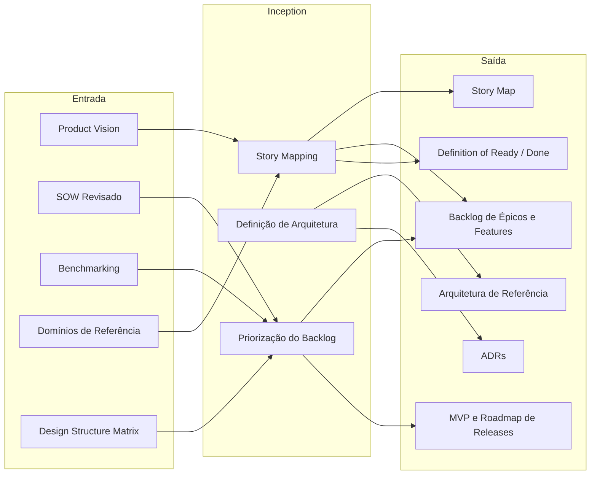

# Inception

Responsável por traduzir o entendimento construído no Discovery em decisões concretas sobre o que será construído, em que ordem e com qual arquitetura. Enquanto o Discovery responde ao "por quê" e "o quê do problema", a Inception responde ao "o quê da solução" e ao "como começar".

O principal resultado dessa fase é o **Backlog Inicial** — um conjunto priorizado de épicos e features que representam os produtos a serem desenvolvidos —, acompanhado do **Story Map**, da **Arquitetura de Referência**, dos **ADRs** das decisões técnicas críticas e do **Roadmap de Releases** com o MVP definido.

O **Product Owner (PO) Técnico** e o **Tech Lead** são os principais responsáveis por conduzir esta fase. O **PO Técnico** garante o alinhamento entre as capacidades definidas no Discovery e as funcionalidades priorizadas no backlog. O **Tech Lead** conduz as decisões de arquitetura e os ADRs. O **Designer de UX de Produto** contribui na construção do Story Map, conectando as jornadas de usuário às features.

## Questões Fundamentais da Inception

* **Quais produtos (módulos/componentes) devem ser construídos para resolver os problemas identificados no Discovery?** Os domínios e capacidades do Discovery são o ponto de partida — cada domínio geralmente se traduz em um ou mais módulos de software.

* **O que compõe o MVP?** Das capacidades levantadas, quais são as essenciais para validar a proposta de valor com o cliente no menor tempo possível?
    * *Exemplo*: Em um sistema de gestão de fomento, o MVP pode ser o fluxo completo de Captação (edital → submissão → seleção), deixando relatórios e BI para releases posteriores.

* **Qual a ordem de construção dos módulos?** A DSM do Discovery indica dependências entre domínios — módulos de base devem ser entregues antes dos que dependem deles.

* **Quais são as decisões técnicas críticas que precisam ser tomadas agora?** Tecnologias, padrões de integração, estratégia de autenticação, armazenamento — decisões que impactam múltiplos módulos e cujo adiamento geraria retrabalho.

* **Como as jornadas dos usuários (Personas) se conectam às features?** O Story Map organiza as funcionalidades pela perspectiva do usuário, revelando dependências horizontais que o backlog plano não mostra.

* **Quais são os critérios de aceite para o time começar e terminar uma história?** A Definition of Ready e a Definition of Done alinham expectativas antes do início do desenvolvimento.

## Visão Geral do Processo



- **Entradas**: Product Vision e Domínios de Referência (o quê do problema), SOW Revisado e Benchmarking (contexto e restrições), DSM (ordem de dependências entre domínios).
- **Story Mapping** gera: Story Map e Backlog de Épicos e Features.
- **Definição de Arquitetura** gera: Arquitetura de Referência e ADRs.
- **Priorização do Backlog** define: MVP, Roadmap de Releases e Definition of Ready / Done.

## Artefatos Gerados

| Artefato | O que faz |
|----------|-----------|
| **Story Map** | Organiza as funcionalidades pelas jornadas dos usuários, revelando dependências horizontais e o escopo de cada release |
| **Backlog de Épicos e Features** | Lista priorizada dos produtos a construir, com épicos decompostos em features e critérios de aceite de alto nível |
| **Arquitetura de Referência** | Diagrama e descrição da estrutura técnica do sistema: camadas, componentes, integrações e padrões adotados |
| **ADRs (Architecture Decision Records)** | Registra as decisões técnicas críticas com contexto, alternativas consideradas e justificativa da escolha |
| **MVP e Roadmap de Releases** | Define o escopo mínimo para validação de valor e o plano de entregas incrementais subsequentes |
| **Definition of Ready / Done** | Estabelece os critérios que uma história deve atender antes de entrar no sprint (Ready) e para ser considerada concluída (Done) |

---

### Story Map

Visualização das funcionalidades organizada por **jornadas de usuário** (linhas) e **releases** (colunas verticais). Permite enxergar o escopo do MVP e das releases futuras de forma intuitiva, evitando a visão de "lista plana" do backlog.

A construção segue a ordem:
1. Listar as **atividades principais** de cada Persona (o que o usuário faz no sistema, do início ao fim).
2. Decompor cada atividade em **tarefas** (passos específicos).
3. Decompor cada tarefa em **histórias de usuário** candidatas.
4. Organizar horizontalmente por prioridade e agrupar verticalmente em releases.

*Exemplo — extrato de Story Map para um sistema de fomento:*

| Atividade | Publicar Edital | Submeter Proposta | Avaliar Proposta | Contratar Iniciativa |
| :--- | :--- | :--- | :--- | :--- |
| **MVP** | Criar e publicar captação | Submeter proposta via formulário | Avaliação documental | Gerar Termo de Outorga |
| **Release 2** | Parametrizar edital avançado | Upload de documentos complementares | Avaliação de mérito (Ad Hoc) | Aditivos ao contrato |
| **Release 3** | — | Acompanhamento de status | Dashboard do revisor | Gestão de bolsistas |

### Backlog de Épicos e Features

Lista estruturada em dois níveis: **Épicos** (grandes entregas de valor, geralmente alinhados aos domínios do Discovery) e **Features** (capacidades específicas dentro de cada épico). As histórias de usuário são escritas nas sprints — a Inception trabalha no nível de features.

*Exemplo:*

| Épico | Feature | Prioridade | Release |
| :--- | :--- | :---: | :---: |
| E01 — Gestão de Captação | F01.1 — Criar e publicar edital | Alta | MVP |
| E01 — Gestão de Captação | F01.2 — Configurar avaliadores Ad Hoc | Média | R2 |
| E02 — Submissão de Propostas | F02.1 — Portal de submissão com formulário dinâmico | Alta | MVP |
| E02 — Submissão de Propostas | F02.2 — Notificação de prazo por e-mail | Baixa | R3 |
| E03 — Gestão Financeira | F03.1 — Cadastro de contas bancárias de projetos | Alta | MVP |

### Arquitetura de Referência

Documento que descreve a estrutura técnica do sistema: camadas, componentes, padrões de integração, tecnologias adotadas e princípios arquiteturais. Não é um design detalhado — é a **visão de alto nível** que orienta todos os ADRs e serve de onboarding técnico para novos membros.

*Exemplo — estrutura típica:*

```
Frontend (SPA / Next.js)
        |
    BFF (Backend for Frontend)
        |
    API Gateway
   /    |     \
Serv.A  Serv.B  Serv.C   ← microserviços ou módulos por domínio
        |
    Banco de Dados (PostgreSQL)
        |
Integrações externas (SERPRO, Acesso Cidadão, Banco EDI)
```

### ADRs (Architecture Decision Records)

Cada ADR registra uma decisão técnica relevante no formato:

- **Contexto**: qual problema ou força motivou a decisão.
- **Decisão**: o que foi decidido.
- **Alternativas consideradas**: o que mais foi avaliado e por quê foi descartado.
- **Consequências**: trade-offs e impactos esperados.

*Exemplo — cabeçalhos de ADRs típicos de uma Inception:*

| # | Decisão | Status |
| :--- | :--- | :---: |
| ADR-001 | Adotar autenticação via Acesso Cidadão (SSO estadual) | Aceito |
| ADR-002 | Usar formulários dinâmicos via integração com Dynamic Forms | Aceito |
| ADR-003 | Separar backend em módulos independentes por domínio | Aceito |
| ADR-004 | Armazenar arquivos comprobatórios no MinIO (S3-compatible) | Aceito |

### MVP e Roadmap de Releases

Define o escopo do **Minimum Viable Product** — o menor conjunto de features que entrega valor real ao usuário e valida as hipóteses centrais do projeto — e o plano incremental de releases subsequentes.

*Exemplo:*

| Release | Escopo | Objetivo de Validação | Estimativa |
| :--- | :--- | :--- | :--- |
| **MVP** | Captação (edital + submissão + seleção) + Cadastros básicos | Validar fluxo completo de captação com usuários reais | 3 meses |
| **R2** | Gestão de Contratos + Bolsistas + Orçamento | Validar execução e acompanhamento de projetos | +2 meses |
| **R3** | Prestação de Contas + Pagamentos | Validar fechamento do ciclo financeiro | +2 meses |
| **R4** | BI, Transparência, Portal Público | Validar relatórios e conformidade | +1 mês |

> [!TIP]
> O MVP não é a versão "pequena" do produto — é a versão que aprende mais rápido. Prefira um fluxo completo e simples a vários fluxos incompletos.

### Definition of Ready / Definition of Done

Acordos do time que definem quando uma história está pronta para entrar no sprint (Ready) e quando pode ser considerada concluída (Done). Escritos uma vez na Inception e revisitados ao início de cada projeto.

*Exemplo — Definition of Ready:*
- A história tem critérios de aceite escritos em linguagem de negócio.
- Os wireframes ou protótipos de baixa fidelidade foram aprovados pelo PO.
- As dependências com outras histórias estão identificadas.
- A história foi estimada pelo time.

*Exemplo — Definition of Done:*
- Código revisado por pelo menos um membro do time (code review).
- Testes automatizados escritos e passando (cobertura mínima de 80%).
- Documentação de API atualizada (quando aplicável).
- Deploy realizado no ambiente de homologação.
- Critérios de aceite validados pelo PO.

## Referências

- [Story Mapping (Jeff Patton)](https://www.jpattonassociates.com/story-mapping/) — técnica de organização de backlog por jornadas de usuário.
- [Architecture Decision Records (Michael Nygard)](https://cognitect.com/blog/2011/11/15/documenting-architecture-decisions) — formato canônico para registro de decisões arquiteturais.
- [Lean Inception (Paulo Caroli)](https://caroli.org/lean-inception/) — workshop colaborativo para definição de MVP.
- [User Story Mapping (O'Reilly)](https://www.oreilly.com/library/view/user-story-mapping/9781491904893/) — referência completa sobre Story Mapping.
