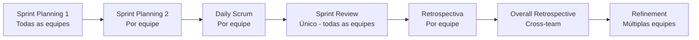

# Organização de Equipes 

Para facilitar a organização das equipes adotamos o **LeSS (Large-Scale Scrum)** como framework de organização. LeSS não é um "novo Scrum" — é Scrum aplicado em larga escala. A premissa é simples: múltiplas equipes trabalhando juntas em um único produto, e não múltiplos Scrums isolados.

## Princípios

- **Um único produto**: todas as equipes contribuem para o mesmo projeto, não para módulos independentes.
- **Um único Product Backlog**: priorizado por um único Product Owner, garantindo visão unificada do produto.
- **Uma Definition of Done**: comum a todas as equipes, podendo ser expandida individualmente.
- **Um Sprint comum**: todas as equipes trabalham no mesmo ciclo, entregando um incremento de produto integrado a cada Sprint.
- **Equipes auto-gerenciáveis**: multifuncionais, duradouras e responsáveis por entregar valor de ponta a ponta.

## Papéis

| Papel | Responsabilidade |
|-------|-----------------|
| **Product Owner** | Único para todo o produto. Define a visão, prioriza o Product Backlog e trabalha apoiado pelas equipes, que interagem diretamente com clientes e usuários. |
| **Scrum Master** | Dedicado em tempo integral. Serve de 1 a 3 equipes e atua no sistema organizacional como um todo, não apenas em equipes individuais. |
| **Board (Gestores)** | Atuam como facilitadores e educadores, não como controladores. Focam em melhorar a capacidade de entrega de valor, seguindo o princípio Lean de *Go See* (observação direta) e *Managers as Teachers*. |

## Eventos do Sprint

- **Sprint Planning 1** — Todas as equipes juntas. O Product Owner apresenta os itens prioritários e as equipes se auto-organizam para selecionar o trabalho.
- **Sprint Planning 2** — Cada equipe define como executará os itens selecionados, criando seu próprio Sprint Backlog.
- **Daily Scrum** — Descentralizado, cada equipe realiza o seu.
- **Sprint Review** — Único, em formato *bazaar*: todas as equipes apresentam o incremento integrado aos stakeholders.
- **Retrospectiva de Equipe** — Cada equipe reflete sobre seu processo.
- **Overall Retrospective** — Discussão de problemas cross-team e sistêmicos, com foco na melhoria do sistema como um todo.
- **Refinement** — Preferencialmente com múltiplas equipes juntas, para aumentar o aprendizado compartilhado.

## Coordenação entre Equipes

A coordenação é **descentralizada**, decidida pelas próprias equipes. Os mecanismos utilizados incluem:

- **Just Talk** — Comunicação direta e informal entre membros de equipes diferentes.
- **Comunicar em código** — Integração contínua como mecanismo de coordenação.
- **Cross-team meetings** — Reuniões pontuais quando necessário.
- **Travelers e Scouts** — Membros que visitam outras equipes para compartilhar conhecimento.
- **Open Spaces e Communities** — Espaços abertos para discussão de temas transversais.

## Escalando para Múltiplas Equipes (LeSS Huge)

Quando o produto cresce a ponto de envolver mais de 8 equipes, a dinâmica e a organização se transformam. O LeSS Huge é a configuração do framework para essa realidade — podendo suportar centenas ou até milhares de pessoas trabalhando em um único produto.

A mudança fundamental é a introdução das **Áreas de Requisitos**.

### Áreas de Requisitos

Uma Área de Requisito é um agrupamento de itens do Product Backlog que representam uma grande fatia funcional do produto, definida sempre pela **perspectiva do cliente** — nunca pela arquitetura técnica ou pela estrutura organizacional. Por exemplo, em um sistema de gestão de fomento, áreas de requisitos poderiam ser "Publicação de Editais", "Acompanhamento de Projetos" ou "Prestação de Contas", e não "Backend", "Frontend" ou "Banco de Dados".

Cada Área de Requisito:

- Agrupa itens relacionados dentro do **único Product Backlog** do produto.
- É atendida por **4 a 8 equipes** que se especializam naquela fatia do produto.
- Possui um **Area Product Owner** dedicado, responsável por priorizar e esclarecer os itens da área.
- Funciona internamente como um **LeSS básico** — com seus próprios eventos de Sprint Planning 1, Refinement e Overall Retrospective.

As fronteiras entre áreas não são fixas. Conforme o produto evolui e as prioridades mudam, o Product Owner pode realocar equipes entre áreas ou até redefinir as próprias áreas. O objetivo é manter cada área com um tamanho gerenciável, preservando o foco no produto como um todo.

### O que muda na estrutura

| Aspecto | LeSS (até 8 equipes) | LeSS Huge (8+ equipes) |
|---------|----------------------|------------------------|
| **Product Owner** | Único, atuação direta com todas as equipes | Único, apoiado por **Area Product Owners** |
| **Product Backlog** | Único, gerenciado diretamente pelo PO | Único, organizado em **Áreas de Requisitos** |
| **Coordenação** | Direta entre todas as equipes | Dentro de cada área e entre áreas via o Product Owner |

### Area Product Owners

Os Area Product Owners não são intermediários — são **Product Owners de verdade** dentro da sua área. Eles priorizam, esclarecem requisitos e trabalham diretamente com as equipes e stakeholders da área. O Product Owner geral mantém a visão do produto e decide a alocação de equipes entre as áreas conforme as prioridades estratégicas mudam.

### O que muda nas cerimônias

No LeSS Huge, as cerimônias do Sprint se adaptam para funcionar dentro das Áreas de Requisitos:

- **Sprint Planning 1** — Realizada **por Área de Requisito**, não mais com todas as equipes do produto. O Area Product Owner apresenta os itens prioritários da área e as equipes da área se auto-organizam para selecionar o trabalho. Isso mantém a reunião produtiva mesmo com dezenas de equipes no produto.

- **Sprint Planning 2** — Cada equipe continua definindo individualmente como executará seus itens, sem mudança em relação ao LeSS básico.

- **Daily Scrum** — Permanece descentralizado, por equipe.

- **Refinement** — Realizado com múltiplas equipes **da mesma área** juntas. O Area Product Owner conduz o refinamento, esclarecendo requisitos diretamente com as equipes e stakeholders. Equipes de áreas diferentes podem participar quando há itens que cruzam fronteiras.

- **Sprint Review** — Pode ser realizada **por área**, com cada área apresentando seu incremento aos stakeholders relevantes. Porém, o incremento do produto continua sendo **único e integrado** — as áreas não entregam partes isoladas.

- **Retrospectiva de Equipe** — Cada equipe reflete sobre seu processo, sem mudança.

- **Overall Retrospective** — Acontece em **dois níveis**: dentro de cada área (problemas cross-team da área) e no nível do produto (problemas cross-área e sistêmicos), envolvendo o Product Owner, Area Product Owners e Scrum Masters.

### O princípio permanece o mesmo

Independentemente da escala, o objetivo não muda: entregar **um produto integrado a cada Sprint**. A complexidade organizacional cresce, mas o LeSS Huge combate a tendência natural de fragmentação mantendo o foco no produto como um todo, não em partes isoladas.

## Referências

- [LeSS Framework](https://less.works/less/framework)
- [LeSS Rules](https://less.works/less/rules)
- [LeSS Management](https://less.works/less/management)
